# Face Generation
In this project, I'll use generative adversarial networks to generate new images of faces.
### Get the Data
I'll use two datasets in this project:
- MNIST
- CelebA

Since the celebA dataset is complex and I'm doing GANs in a project for the first time, we want I to test my neural network on MNIST before CelebA.  Running the GANs on MNIST will allow me to see how well my model trains sooner.


```python
data_dir = './data'

import helper
helper.download_extract('mnist', data_dir)
helper.download_extract('celeba', data_dir)
```

    Found mnist Data
    Found celeba Data


## Explore the Data
### MNIST
The [MNIST](http://yann.lecun.com/exdb/mnist/) dataset contains images of handwritten digits. I can view the first number of examples by changing `show_n_images`. 


```python
show_n_images = 25

%matplotlib inline
import os
from glob import glob
from matplotlib import pyplot

mnist_images = helper.get_batch(glob(os.path.join(data_dir, 'mnist/*.jpg'))[:show_n_images], 28, 28, 'L')
pyplot.imshow(helper.images_square_grid(mnist_images, 'L'), cmap='gray')
```


    <matplotlib.image.AxesImage at 0x10978ef98>


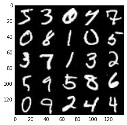


### CelebA
The [CelebFaces Attributes Dataset (CelebA)](http://mmlab.ie.cuhk.edu.hk/projects/CelebA.html) dataset contains over 200,000 celebrity images with annotations.  Since I'm going to be generating faces, I won't need the annotations.  I can view the first number of examples by changing `show_n_images`.


```python
show_n_images = 25

mnist_images = helper.get_batch(glob(os.path.join(data_dir, 'img_align_celeba/*.jpg'))[:show_n_images], 28, 28, 'RGB')
pyplot.imshow(helper.images_square_grid(mnist_images, 'RGB'))
```


    <matplotlib.image.AxesImage at 0x10c1c42e8>


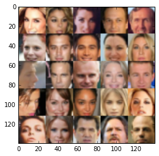


## Preprocess the Data
The values of the MNIST and CelebA dataset will be in the range of -0.5 to 0.5 of 28x28 dimensional images.  The CelebA images will be cropped to remove parts of the image that don't include a face, then resized down to 28x28.

The MNIST images are black and white images with a single [color channel](https://en.wikipedia.org/wiki/Channel_(digital_image%29) )while the CelebA images have [3 color channels (RGB color channel)](https://en.wikipedia.org/wiki/Channel_(digital_image%29#RGB_Images)).
## Build the Neural Network
I'll build the components necessary to build a GANs by implementing the following functions below:
- `model_inputs`
- `discriminator`
- `generator`
- `model_loss`
- `model_opt`
- `train`

### Check the Version of TensorFlow and Access to GPU
This will check to make sure I have the correct version of TensorFlow and access to a GPU


```python
from distutils.version import LooseVersion
import warnings
import tensorflow as tf

# Check TensorFlow Version
assert LooseVersion(tf.__version__) >= LooseVersion('1.0'), 'Please use TensorFlow version 1.0 or newer.  I are using {}'.format(tf.__version__)
print('TensorFlow Version: {}'.format(tf.__version__))

# Check for a GPU
if not tf.test.gpu_device_name():
    warnings.warn('No GPU found. Please use a GPU to train my neural network.')
else:
    print('Default GPU Device: {}'.format(tf.test.gpu_device_name()))
```

    TensorFlow Version: 1.0.0
    Default GPU Device: /gpu:0


### Input
Implement the `model_inputs` function to create TF Placeholders for the Neural Network. It should create the following placeholders:
- Real input images placeholder with rank 4 using `image_width`, `image_height`, and `image_channels`.
- Z input placeholder with rank 2 using `z_dim`.
- Learning rate placeholder with rank 0.

Return the placeholders in the following the tuple (tensor of real input images, tensor of z data)


```python
import problem_unittests as tests

def model_inputs(image_width, image_height, image_channels, z_dim):
    """
    Create the model inputs
    :param image_width: The input image width
    :param image_height: The input image height
    :param image_channels: The number of image channels
    :param z_dim: The dimension of Z
    :return: Tuple of (tensor of real input images, tensor of z data, learning rate)
    """
    # TODO: Implement Function
    image = tf.placeholder(tf.float32, (None, image_width, image_height, image_channels), name='image')
    z_dim = tf.placeholder(tf.float32, (None, z_dim), name='z_dim')
    learning_rate = tf.placeholder(tf.float32, None, name='learning_rate')
    
    return (image, z_dim, learning_rate)

tests.test_model_inputs(model_inputs)
```

    Tests Passed


### Discriminator
Implement `discriminator` to create a discriminator neural network that discriminates on `images`.  This function should be able to reuse the variabes in the neural network.  Use [`tf.variable_scope`](https://www.tensorflow.org/api_docs/python/tf/variable_scope) with a scope name of "discriminator" to allow the variables to be reused.  The function should return a tuple of (tensor output of the generator, tensor logits of the generator).


```python
def discriminator(images, reuse=False):
    """
    Create the discriminator network
    :param image: Tensor of input image(s)
    :param reuse: Boolean if the weights should be reused
    :return: Tuple of (tensor output of the discriminator, tensor logits of the discriminator)
    """
    # TODO: Implement Function
    alpha = 0.2
    
    with tf.variable_scope('discriminator' ,reuse=reuse):
        x1 = tf.layers.conv2d(images, 64, 5, strides=2, padding='same',
                             kernel_initializer=tf.random_normal_initializer(stddev=0.02))
        x1 = tf.maximum(alpha*x1, x1)
        
        x2 = tf.layers.conv2d(x1, 128, 5, strides=2, padding='same',
                             kernel_initializer=tf.random_normal_initializer(stddev=0.02))
        x2 = tf.layers.batch_normalization(x2, training=True)
        x2 = tf.maximum(alpha*x2, x2)
        
        x3 = tf.layers.conv2d(x1, 256, 5, strides=2, padding='same',
                             kernel_initializer=tf.random_normal_initializer(stddev=0.02))
        x3 = tf.layers.batch_normalization(x3, training=True)
        x3 = tf.maximum(alpha*x3, x3)
        
        flat = tf.reshape(x3, (-1, 7*7*256))
        logits = tf.layers.dense(flat, 1, 
                                kernel_initializer=tf.random_normal_initializer(stddev=0.02))
        out = tf.sigmoid(logits)
        
    return out, logits

tests.test_discriminator(discriminator, tf)
```

    Tests Passed


### Generator
Implement `generator` to generate an image using `z`. This function should be able to reuse the variabes in the neural network.  Use [`tf.variable_scope`](https://www.tensorflow.org/api_docs/python/tf/variable_scope) with a scope name of "generator" to allow the variables to be reused. The function should return the generated 28 x 28 x `out_channel_dim` images.


```python
def generator(z, out_channel_dim, is_train=True):
    """
    Create the generator network
    :param z: Input z
    :param out_channel_dim: The number of channels in the output image
    :param is_train: Boolean if generator is being used for training
    :return: The tensor output of the generator
    """
    # TODO: Implement Function
    alpha = 0.2
    
    with tf.variable_scope('generator', reuse= not is_train):
        # First fully connected layer
        x1 = tf.layers.dense(z, 7*7*512)
        x1 = tf.reshape(x1, (-1,7,7,512))
        x1 = tf.layers.batch_normalization(x1, training=is_train)
        x1 = tf.maximum(alpha*x1, x1)
        # 7x7x512 now
        
        x2 = tf.layers.conv2d_transpose(x1, 256, 5, strides=2, padding='same',
                                           kernel_initializer=tf.random_normal_initializer(stddev=0.02))
        x2 = tf.layers.batch_normalization(x2, training=is_train)
        x2 = tf.maximum(alpha*x2, x2)
        # 14x14 now
        
        x3 = tf.layers.conv2d_transpose(x2, 128, 5, strides=2, padding='same',
                                           kernel_initializer=tf.random_normal_initializer(stddev=0.02))
        x3 = tf.layers.batch_normalization(x3, training=is_train)
        x3 = tf.maximum(alpha*x3, x3)
        # 28x28 now
        
        logits = tf.layers.conv2d_transpose(x3, out_channel_dim, 5, strides=1, padding='same',
                                           kernel_initializer=tf.random_normal_initializer(stddev=0.02))
        out = tf.tanh(logits)
    return out

tests.test_generator(generator, tf)
```

    Tests Passed


### Loss
Implement `model_loss` to build the GANs for training and calculate the loss.  The function should return a tuple of (discriminator loss, generator loss).  Use the following functions I implemented:
- `discriminator(images, reuse=False)`
- `generator(z, out_channel_dim, is_train=True)`


```python
def model_loss(input_real, input_z, out_channel_dim):
    """
    Get the loss for the discriminator and generator
    :param input_real: Images from the real dataset
    :param input_z: Z input
    :param out_channel_dim: The number of channels in the output image
    :return: A tuple of (discriminator loss, generator loss)
    """
    # TODO: Implement Function
    g_model = generator(input_z, out_channel_dim)
    d_model_real, d_logits_real = discriminator(input_real)
    d_model_fake, d_logits_fake = discriminator(g_model, reuse=True)

    d_loss_real = tf.reduce_mean(
        tf.nn.sigmoid_cross_entropy_with_logits(logits=d_logits_real, labels=tf.ones_like(d_model_real)))
    d_loss_fake = tf.reduce_mean(
        tf.nn.sigmoid_cross_entropy_with_logits(logits=d_logits_fake, labels=tf.zeros_like(d_model_fake)))
    g_loss = tf.reduce_mean(
        tf.nn.sigmoid_cross_entropy_with_logits(logits=d_logits_fake, labels=tf.ones_like(d_model_fake)))

    d_loss = d_loss_real + d_loss_fake
    
    return d_loss, g_loss

tests.test_model_loss(model_loss)
```

    Tests Passed


### Optimization
Implement `model_opt` to create the optimization operations for the GANs. Use [`tf.trainable_variables`](https://www.tensorflow.org/api_docs/python/tf/trainable_variables) to get all the trainable variables.  Filter the variables with names that are in the discriminator and generator scope names.  The function should return a tuple of (discriminator training operation, generator training operation).


```python
def model_opt(d_loss, g_loss, learning_rate, beta1):
    """
    Get optimization operations
    :param d_loss: Discriminator loss Tensor
    :param g_loss: Generator loss Tensor
    :param learning_rate: Learning Rate Placeholder
    :param beta1: The exponential decay rate for the 1st moment in the optimizer
    :return: A tuple of (discriminator training operation, generator training operation)
    """
    # TODO: Implement Function
    t_vars = tf.trainable_variables()
    d_vars = [var for var in t_vars if var.name.startswith('discriminator')]
    g_vars = [var for var in t_vars if var.name.startswith('generator')]

    # Optimize
    with tf.control_dependencies(tf.get_collection(tf.GraphKeys.UPDATE_OPS)):
        d_train_opt = tf.train.AdamOptimizer(learning_rate, beta1=beta1).minimize(d_loss, var_list=d_vars)
        g_train_opt = tf.train.AdamOptimizer(learning_rate, beta1=beta1).minimize(g_loss, var_list=g_vars)
    
    return d_train_opt, g_train_opt

tests.test_model_opt(model_opt, tf)
```

    Tests Passed


## Neural Network Training
### Show Output
This function will show the current output of the generator during training. It will help me determine how well the GANs is training.


```python
import numpy as np

def show_generator_output(sess, n_images, input_z, out_channel_dim, image_mode):
    """
    Show example output for the generator
    :param sess: TensorFlow session
    :param n_images: Number of Images to display
    :param input_z: Input Z Tensor
    :param out_channel_dim: The number of channels in the output image
    :param image_mode: The mode to use for images ("RGB" or "L")
    """
    cmap = None if image_mode == 'RGB' else 'gray'
    z_dim = input_z.get_shape().as_list()[-1]
    example_z = np.random.uniform(-1, 1, size=[n_images, z_dim])

    samples = sess.run(
        generator(input_z, out_channel_dim, False),
        feed_dict={input_z: example_z})

    images_grid = helper.images_square_grid(samples, image_mode)
    pyplot.imshow(images_grid, cmap=cmap)
    pyplot.show()
```

### Train
Implement `train` to build and train the GANs.  Use the following functions I implemented:
- `model_inputs(image_width, image_height, image_channels, z_dim)`
- `model_loss(input_real, input_z, out_channel_dim)`
- `model_opt(d_loss, g_loss, learning_rate, beta1)`

Use the `show_generator_output` to show `generator` output while I train. Running `show_generator_output` for every batch will drastically increase training time and increase the size of the notebook.  It's recommended to print the `generator` output every 100 batches.


```python
def train(epoch_count, batch_size, z_dim, learning_rate, beta1, get_batches, data_shape, data_image_mode):
    """
    Train the GAN
    :param epoch_count: Number of epochs
    :param batch_size: Batch Size
    :param z_dim: Z dimension
    :param learning_rate: Learning Rate
    :param beta1: The exponential decay rate for the 1st moment in the optimizer
    :param get_batches: Function to get batches
    :param data_shape: Shape of the data
    :param data_image_mode: The image mode to use for images ("RGB" or "L")
    """
    # TODO: Build Model
    samples, losses = [], []
    steps = 0

    input_real, input_z, l_rate = model_inputs(data_shape[1], data_shape[2], data_shape[3], z_dim)
    d_loss, g_loss = model_loss(input_real, input_z, data_shape[3])
    d_train_opt, g_train_opt = model_opt(d_loss, g_loss, l_rate, beta1)
    
    
    with tf.Session() as sess:
        sess.run(tf.global_variables_initializer())
        for epoch_i in range(epoch_count):
            for batch_images in get_batches(batch_size):
                # TODO: Train Model
                steps += 1
                
                batch_z = np.random.uniform(-1, 1, size=(batch_size, z_dim))
                batch_images *= 2
                
                # Run optimizers
                _ = sess.run(d_train_opt, feed_dict={
                                                input_real: batch_images, 
                                                input_z: batch_z, 
                                                l_rate: learning_rate})
                _ = sess.run(g_train_opt, feed_dict={
                                                input_real: batch_images, 
                                                input_z: batch_z, 
                                                l_rate: learning_rate})
                
                if steps % 10 == 0:
                    # At the end of each epoch, get the losses and print them out
                    train_loss_d = d_loss.eval({input_z: batch_z, input_real: batch_images})
                    train_loss_g = g_loss.eval({input_z: batch_z})

                    print("Epoch {}/{}...".format(epoch_i+1, epochs),
                          "Discriminator Loss: {:.4f}...".format(train_loss_d),
                          "Generator Loss: {:.4f}".format(train_loss_g))
                    # Save losses to view after training
                    losses.append((train_loss_d, train_loss_g))
                    
                if steps % 100 == 0:
                    show_generator_output(sess, 10, input_z, data_shape[3], data_image_mode)
```

### MNIST
Test my GANs architecture on MNIST.  After 2 epochs, the GANs should be able to generate images that look like handwritten digits.  Make sure the loss of the generator is lower than the loss of the discriminator or close to 0.


```python
batch_size = 128
z_dim = 100
learning_rate = 0.0001
beta1 = 0.5

epochs = 2

mnist_dataset = helper.Dataset('mnist', glob(os.path.join(data_dir, 'mnist/*.jpg')))
with tf.Graph().as_default():
    train(epochs, batch_size, z_dim, learning_rate, beta1, mnist_dataset.get_batches,
          mnist_dataset.shape, mnist_dataset.image_mode)
```

    Epoch 1/2... Discriminator Loss: 2.7740... Generator Loss: 0.0990
    Epoch 1/2... Discriminator Loss: 2.0910... Generator Loss: 0.2449
    Epoch 1/2... Discriminator Loss: 1.2122... Generator Loss: 0.6562
    Epoch 1/2... Discriminator Loss: 2.0562... Generator Loss: 0.4142
    Epoch 1/2... Discriminator Loss: 1.7730... Generator Loss: 0.5220
    Epoch 1/2... Discriminator Loss: 1.7134... Generator Loss: 0.6226
    Epoch 1/2... Discriminator Loss: 1.5791... Generator Loss: 0.5817
    Epoch 1/2... Discriminator Loss: 1.5021... Generator Loss: 0.6303
    Epoch 1/2... Discriminator Loss: 1.6479... Generator Loss: 0.5717
    Epoch 1/2... Discriminator Loss: 1.5728... Generator Loss: 0.5600


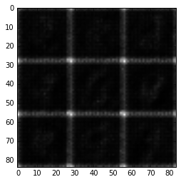


    Epoch 1/2... Discriminator Loss: 1.5673... Generator Loss: 0.6370
    Epoch 1/2... Discriminator Loss: 1.5371... Generator Loss: 0.6263
    Epoch 1/2... Discriminator Loss: 1.5618... Generator Loss: 0.6088
    Epoch 1/2... Discriminator Loss: 1.5820... Generator Loss: 0.5520
    Epoch 1/2... Discriminator Loss: 1.4903... Generator Loss: 0.6139
    Epoch 1/2... Discriminator Loss: 1.5569... Generator Loss: 0.5506
    Epoch 1/2... Discriminator Loss: 1.4616... Generator Loss: 0.7208
    Epoch 1/2... Discriminator Loss: 1.4873... Generator Loss: 0.7869
    Epoch 1/2... Discriminator Loss: 1.3048... Generator Loss: 0.7036
    Epoch 1/2... Discriminator Loss: 1.4109... Generator Loss: 0.6384


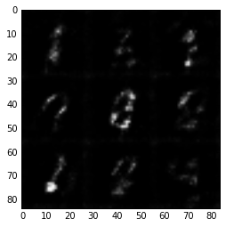


    Epoch 1/2... Discriminator Loss: 1.3733... Generator Loss: 0.7942
    Epoch 1/2... Discriminator Loss: 1.3315... Generator Loss: 0.7703
    Epoch 1/2... Discriminator Loss: 1.3270... Generator Loss: 0.6692
    Epoch 1/2... Discriminator Loss: 1.2175... Generator Loss: 0.7887
    Epoch 1/2... Discriminator Loss: 1.3860... Generator Loss: 0.6915
    Epoch 1/2... Discriminator Loss: 1.3737... Generator Loss: 0.7992
    Epoch 1/2... Discriminator Loss: 1.2984... Generator Loss: 0.9677
    Epoch 1/2... Discriminator Loss: 1.2619... Generator Loss: 0.7424
    Epoch 1/2... Discriminator Loss: 1.2252... Generator Loss: 0.9085
    Epoch 1/2... Discriminator Loss: 1.2603... Generator Loss: 0.6814


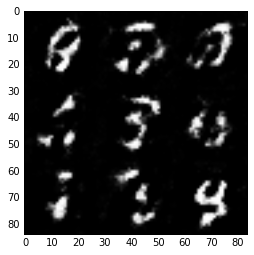


    Epoch 1/2... Discriminator Loss: 1.1921... Generator Loss: 0.7579
    Epoch 1/2... Discriminator Loss: 1.1209... Generator Loss: 0.8538
    Epoch 1/2... Discriminator Loss: 1.2100... Generator Loss: 0.9101
    Epoch 1/2... Discriminator Loss: 1.3197... Generator Loss: 0.7301
    Epoch 1/2... Discriminator Loss: 1.1562... Generator Loss: 0.9891
    Epoch 1/2... Discriminator Loss: 1.1901... Generator Loss: 0.6731
    Epoch 1/2... Discriminator Loss: 1.1376... Generator Loss: 1.1205
    Epoch 1/2... Discriminator Loss: 1.1369... Generator Loss: 0.8112
    Epoch 1/2... Discriminator Loss: 1.2048... Generator Loss: 0.7849
    Epoch 1/2... Discriminator Loss: 1.0883... Generator Loss: 0.8357


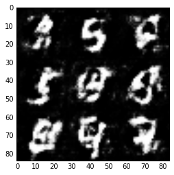


    Epoch 1/2... Discriminator Loss: 1.2215... Generator Loss: 1.1843
    Epoch 1/2... Discriminator Loss: 1.2119... Generator Loss: 0.5103
    Epoch 1/2... Discriminator Loss: 1.1941... Generator Loss: 1.3781
    Epoch 1/2... Discriminator Loss: 1.0470... Generator Loss: 0.8592
    Epoch 1/2... Discriminator Loss: 1.0883... Generator Loss: 1.0074
    Epoch 1/2... Discriminator Loss: 1.0364... Generator Loss: 1.0766
    Epoch 2/2... Discriminator Loss: 1.1248... Generator Loss: 0.9414
    Epoch 2/2... Discriminator Loss: 1.0288... Generator Loss: 1.1284
    Epoch 2/2... Discriminator Loss: 1.1208... Generator Loss: 0.8236
    Epoch 2/2... Discriminator Loss: 1.1463... Generator Loss: 0.8992


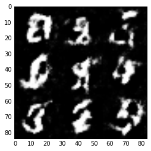


    Epoch 2/2... Discriminator Loss: 0.9329... Generator Loss: 0.9231
    Epoch 2/2... Discriminator Loss: 1.0590... Generator Loss: 0.7585
    Epoch 2/2... Discriminator Loss: 1.0125... Generator Loss: 1.0348
    Epoch 2/2... Discriminator Loss: 1.0318... Generator Loss: 0.8235
    Epoch 2/2... Discriminator Loss: 0.9921... Generator Loss: 1.2455
    Epoch 2/2... Discriminator Loss: 0.9969... Generator Loss: 1.1584
    Epoch 2/2... Discriminator Loss: 1.0654... Generator Loss: 0.8465
    Epoch 2/2... Discriminator Loss: 1.0616... Generator Loss: 1.3033
    Epoch 2/2... Discriminator Loss: 1.1260... Generator Loss: 0.7645
    Epoch 2/2... Discriminator Loss: 1.0283... Generator Loss: 0.8238


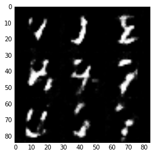


    Epoch 2/2... Discriminator Loss: 1.0874... Generator Loss: 0.7727
    Epoch 2/2... Discriminator Loss: 0.9706... Generator Loss: 0.8419
    Epoch 2/2... Discriminator Loss: 1.1577... Generator Loss: 0.6857
    Epoch 2/2... Discriminator Loss: 1.0483... Generator Loss: 0.9119
    Epoch 2/2... Discriminator Loss: 1.1059... Generator Loss: 0.9469
    Epoch 2/2... Discriminator Loss: 1.2354... Generator Loss: 0.8357
    Epoch 2/2... Discriminator Loss: 1.1104... Generator Loss: 0.9788
    Epoch 2/2... Discriminator Loss: 1.1221... Generator Loss: 0.9167
    Epoch 2/2... Discriminator Loss: 1.0539... Generator Loss: 0.9723
    Epoch 2/2... Discriminator Loss: 1.3109... Generator Loss: 0.5800


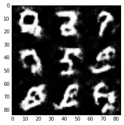


    Epoch 2/2... Discriminator Loss: 1.2059... Generator Loss: 0.6358
    Epoch 2/2... Discriminator Loss: 1.1505... Generator Loss: 0.9845
    Epoch 2/2... Discriminator Loss: 1.2769... Generator Loss: 0.7937
    Epoch 2/2... Discriminator Loss: 1.2127... Generator Loss: 0.9567
    Epoch 2/2... Discriminator Loss: 1.1126... Generator Loss: 0.9030
    Epoch 2/2... Discriminator Loss: 1.1432... Generator Loss: 0.8282
    Epoch 2/2... Discriminator Loss: 1.1874... Generator Loss: 0.8498
    Epoch 2/2... Discriminator Loss: 1.2898... Generator Loss: 0.9111
    Epoch 2/2... Discriminator Loss: 1.2660... Generator Loss: 0.7550
    Epoch 2/2... Discriminator Loss: 1.2182... Generator Loss: 0.8309


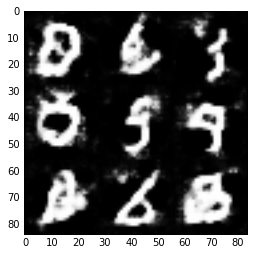


    Epoch 2/2... Discriminator Loss: 1.1572... Generator Loss: 0.7782
    Epoch 2/2... Discriminator Loss: 1.2331... Generator Loss: 0.8662
    Epoch 2/2... Discriminator Loss: 1.1925... Generator Loss: 0.7273
    Epoch 2/2... Discriminator Loss: 1.1887... Generator Loss: 1.1182
    Epoch 2/2... Discriminator Loss: 1.2572... Generator Loss: 0.6536
    Epoch 2/2... Discriminator Loss: 1.2573... Generator Loss: 0.6106
    Epoch 2/2... Discriminator Loss: 1.2711... Generator Loss: 0.7495
    Epoch 2/2... Discriminator Loss: 1.2364... Generator Loss: 0.8400
    Epoch 2/2... Discriminator Loss: 1.2824... Generator Loss: 0.7633
    Epoch 2/2... Discriminator Loss: 1.2257... Generator Loss: 1.0152


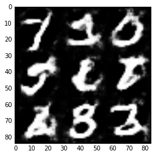


    Epoch 2/2... Discriminator Loss: 1.3447... Generator Loss: 0.5532
    Epoch 2/2... Discriminator Loss: 1.2111... Generator Loss: 0.9382
    Epoch 2/2... Discriminator Loss: 1.2045... Generator Loss: 1.0283


### CelebA
Run my GANs on CelebA.  It will take around 20 minutes on the average GPU to run one epoch.


```python
batch_size = 128
z_dim = 100
learning_rate = 0.0001
beta1 = 0.5


"""
DON'T MODIFY ANYTHING IN THIS CELL THAT IS BELOW THIS LINE
"""
epochs = 1

celeba_dataset = helper.Dataset('celeba', glob(os.path.join(data_dir, 'img_align_celeba/*.jpg')))
with tf.Graph().as_default():
    train(epochs, batch_size, z_dim, learning_rate, beta1, celeba_dataset.get_batches,
          celeba_dataset.shape, celeba_dataset.image_mode)
```

    Epoch 1/1... Discriminator Loss: 4.2661... Generator Loss: 0.0273
    Epoch 1/1... Discriminator Loss: 3.8075... Generator Loss: 0.0516
    Epoch 1/1... Discriminator Loss: 3.2488... Generator Loss: 0.1114
    Epoch 1/1... Discriminator Loss: 2.4097... Generator Loss: 0.3618
    Epoch 1/1... Discriminator Loss: 2.2643... Generator Loss: 0.4033
    Epoch 1/1... Discriminator Loss: 1.7471... Generator Loss: 0.6269
    Epoch 1/1... Discriminator Loss: 1.9321... Generator Loss: 0.5908
    Epoch 1/1... Discriminator Loss: 1.6503... Generator Loss: 0.6891
    Epoch 1/1... Discriminator Loss: 1.9401... Generator Loss: 0.5242
    Epoch 1/1... Discriminator Loss: 1.8074... Generator Loss: 0.6926


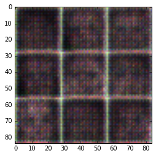


    Epoch 1/1... Discriminator Loss: 1.8295... Generator Loss: 0.6796
    Epoch 1/1... Discriminator Loss: 1.3729... Generator Loss: 0.6983
    Epoch 1/1... Discriminator Loss: 1.6642... Generator Loss: 0.5724
    Epoch 1/1... Discriminator Loss: 1.7339... Generator Loss: 0.6238
    Epoch 1/1... Discriminator Loss: 1.4132... Generator Loss: 0.9095
    Epoch 1/1... Discriminator Loss: 1.2516... Generator Loss: 0.9262
    Epoch 1/1... Discriminator Loss: 1.2840... Generator Loss: 1.1352
    Epoch 1/1... Discriminator Loss: 1.1474... Generator Loss: 1.0810
    Epoch 1/1... Discriminator Loss: 1.4024... Generator Loss: 0.7118
    Epoch 1/1... Discriminator Loss: 1.1474... Generator Loss: 0.9014


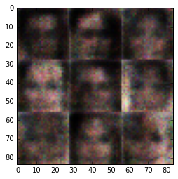


    Epoch 1/1... Discriminator Loss: 0.7097... Generator Loss: 1.6447
    Epoch 1/1... Discriminator Loss: 0.8300... Generator Loss: 1.4604
    Epoch 1/1... Discriminator Loss: 1.3040... Generator Loss: 0.8235
    Epoch 1/1... Discriminator Loss: 1.5676... Generator Loss: 1.5938
    Epoch 1/1... Discriminator Loss: 0.5069... Generator Loss: 2.8812
    Epoch 1/1... Discriminator Loss: 1.6735... Generator Loss: 0.4473
    Epoch 1/1... Discriminator Loss: 1.0140... Generator Loss: 0.9065
    Epoch 1/1... Discriminator Loss: 0.9473... Generator Loss: 1.7918
    Epoch 1/1... Discriminator Loss: 1.1553... Generator Loss: 1.1484
    Epoch 1/1... Discriminator Loss: 1.5336... Generator Loss: 0.7840


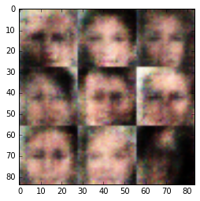


    Epoch 1/1... Discriminator Loss: 0.7006... Generator Loss: 2.9765
    Epoch 1/1... Discriminator Loss: 1.6912... Generator Loss: 0.8777
    Epoch 1/1... Discriminator Loss: 1.1319... Generator Loss: 0.7020
    Epoch 1/1... Discriminator Loss: 0.7880... Generator Loss: 1.5321
    Epoch 1/1... Discriminator Loss: 1.3303... Generator Loss: 0.6338
    Epoch 1/1... Discriminator Loss: 1.5237... Generator Loss: 0.4631
    Epoch 1/1... Discriminator Loss: 1.3734... Generator Loss: 1.1397
    Epoch 1/1... Discriminator Loss: 0.9978... Generator Loss: 2.2498
    Epoch 1/1... Discriminator Loss: 1.3562... Generator Loss: 1.2219
    Epoch 1/1... Discriminator Loss: 2.1036... Generator Loss: 0.1613


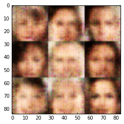


    Epoch 1/1... Discriminator Loss: 1.3778... Generator Loss: 0.4633
    Epoch 1/1... Discriminator Loss: 0.9103... Generator Loss: 1.1067
    Epoch 1/1... Discriminator Loss: 0.9325... Generator Loss: 1.1513
    Epoch 1/1... Discriminator Loss: 1.1266... Generator Loss: 1.4718
    Epoch 1/1... Discriminator Loss: 1.4801... Generator Loss: 0.3649
    Epoch 1/1... Discriminator Loss: 1.2886... Generator Loss: 1.1252
    Epoch 1/1... Discriminator Loss: 0.7579... Generator Loss: 1.6670
    Epoch 1/1... Discriminator Loss: 1.3359... Generator Loss: 0.9385
    Epoch 1/1... Discriminator Loss: 0.7792... Generator Loss: 1.3402
    Epoch 1/1... Discriminator Loss: 1.0334... Generator Loss: 1.0905


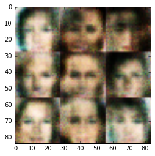


    Epoch 1/1... Discriminator Loss: 1.0909... Generator Loss: 1.5321
    Epoch 1/1... Discriminator Loss: 1.4709... Generator Loss: 0.3755
    Epoch 1/1... Discriminator Loss: 0.4610... Generator Loss: 3.5844
    Epoch 1/1... Discriminator Loss: 1.0234... Generator Loss: 0.8991
    Epoch 1/1... Discriminator Loss: 0.5437... Generator Loss: 1.2813
    Epoch 1/1... Discriminator Loss: 1.3773... Generator Loss: 1.5888
    Epoch 1/1... Discriminator Loss: 0.4241... Generator Loss: 1.6940
    Epoch 1/1... Discriminator Loss: 1.7973... Generator Loss: 0.3244
    Epoch 1/1... Discriminator Loss: 1.7478... Generator Loss: 0.3294
    Epoch 1/1... Discriminator Loss: 1.0355... Generator Loss: 3.8269


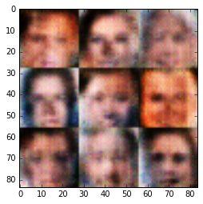


    Epoch 1/1... Discriminator Loss: 1.3845... Generator Loss: 0.5247
    Epoch 1/1... Discriminator Loss: 0.9186... Generator Loss: 3.3910
    Epoch 1/1... Discriminator Loss: 1.5080... Generator Loss: 0.3768
    Epoch 1/1... Discriminator Loss: 0.8171... Generator Loss: 1.7712
    Epoch 1/1... Discriminator Loss: 0.7052... Generator Loss: 2.9652
    Epoch 1/1... Discriminator Loss: 0.6540... Generator Loss: 1.0980
    Epoch 1/1... Discriminator Loss: 2.0839... Generator Loss: 0.1682
    Epoch 1/1... Discriminator Loss: 1.5422... Generator Loss: 0.4850
    Epoch 1/1... Discriminator Loss: 1.1107... Generator Loss: 2.1458
    Epoch 1/1... Discriminator Loss: 0.6179... Generator Loss: 1.6852

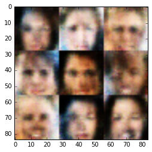


    Epoch 1/1... Discriminator Loss: 1.0638... Generator Loss: 0.5777
    Epoch 1/1... Discriminator Loss: 1.4883... Generator Loss: 0.4692
    Epoch 1/1... Discriminator Loss: 1.2007... Generator Loss: 3.7967
    Epoch 1/1... Discriminator Loss: 0.6975... Generator Loss: 2.4965
    Epoch 1/1... Discriminator Loss: 1.1636... Generator Loss: 0.5314
    Epoch 1/1... Discriminator Loss: 1.4768... Generator Loss: 0.4916
    Epoch 1/1... Discriminator Loss: 1.8275... Generator Loss: 0.2777
    Epoch 1/1... Discriminator Loss: 1.2256... Generator Loss: 0.9264
    Epoch 1/1... Discriminator Loss: 1.0115... Generator Loss: 2.9648
    Epoch 1/1... Discriminator Loss: 0.7732... Generator Loss: 3.9150

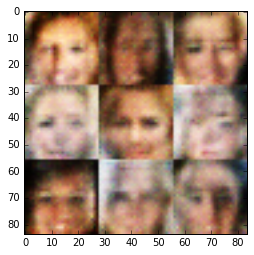


    Epoch 1/1... Discriminator Loss: 0.9042... Generator Loss: 2.3492
    Epoch 1/1... Discriminator Loss: 0.5562... Generator Loss: 3.2802
    Epoch 1/1... Discriminator Loss: 0.6197... Generator Loss: 1.1977
    Epoch 1/1... Discriminator Loss: 1.5099... Generator Loss: 0.3840
    Epoch 1/1... Discriminator Loss: 1.5953... Generator Loss: 0.2967
    Epoch 1/1... Discriminator Loss: 1.6328... Generator Loss: 0.3487
    Epoch 1/1... Discriminator Loss: 0.9134... Generator Loss: 2.6462
    Epoch 1/1... Discriminator Loss: 0.5086... Generator Loss: 2.9580
    Epoch 1/1... Discriminator Loss: 0.8257... Generator Loss: 1.3416
    Epoch 1/1... Discriminator Loss: 1.9813... Generator Loss: 0.1879

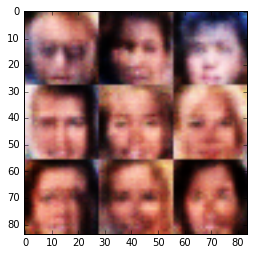


    Epoch 1/1... Discriminator Loss: 1.2717... Generator Loss: 0.5587
    Epoch 1/1... Discriminator Loss: 0.9633... Generator Loss: 1.8146
    Epoch 1/1... Discriminator Loss: 0.8742... Generator Loss: 4.1931
    Epoch 1/1... Discriminator Loss: 0.3760... Generator Loss: 1.8641
    Epoch 1/1... Discriminator Loss: 1.0233... Generator Loss: 0.5817
    Epoch 1/1... Discriminator Loss: 1.8259... Generator Loss: 0.2164
    Epoch 1/1... Discriminator Loss: 1.1376... Generator Loss: 0.5788
    Epoch 1/1... Discriminator Loss: 1.7036... Generator Loss: 0.2956
    Epoch 1/1... Discriminator Loss: 1.0084... Generator Loss: 0.8447
    Epoch 1/1... Discriminator Loss: 1.4101... Generator Loss: 0.5223

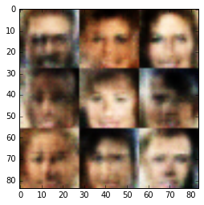


    Epoch 1/1... Discriminator Loss: 1.2189... Generator Loss: 1.0803
    Epoch 1/1... Discriminator Loss: 0.6699... Generator Loss: 2.9942
    Epoch 1/1... Discriminator Loss: 0.5848... Generator Loss: 1.2063
    Epoch 1/1... Discriminator Loss: 0.8446... Generator Loss: 0.7342
    Epoch 1/1... Discriminator Loss: 0.4575... Generator Loss: 1.3690
    Epoch 1/1... Discriminator Loss: 0.7307... Generator Loss: 0.8091
    Epoch 1/1... Discriminator Loss: 0.8418... Generator Loss: 0.7870
    Epoch 1/1... Discriminator Loss: 1.3943... Generator Loss: 0.4392
    Epoch 1/1... Discriminator Loss: 1.2739... Generator Loss: 0.5560
    Epoch 1/1... Discriminator Loss: 0.9649... Generator Loss: 1.7812

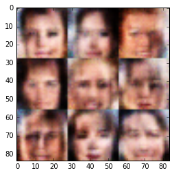


    Epoch 1/1... Discriminator Loss: 1.1984... Generator Loss: 0.8842
    Epoch 1/1... Discriminator Loss: 0.9827... Generator Loss: 2.9186
    Epoch 1/1... Discriminator Loss: 0.6903... Generator Loss: 4.8183
    Epoch 1/1... Discriminator Loss: 0.6437... Generator Loss: 1.0648
    Epoch 1/1... Discriminator Loss: 1.3501... Generator Loss: 0.4442
    Epoch 1/1... Discriminator Loss: 1.9954... Generator Loss: 0.1742
    Epoch 1/1... Discriminator Loss: 1.8308... Generator Loss: 0.2556
    Epoch 1/1... Discriminator Loss: 1.7376... Generator Loss: 0.2834
    Epoch 1/1... Discriminator Loss: 0.8742... Generator Loss: 1.0492
    Epoch 1/1... Discriminator Loss: 1.6828... Generator Loss: 0.3019

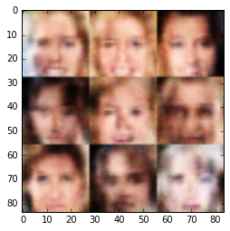


    Epoch 1/1... Discriminator Loss: 1.3146... Generator Loss: 0.4240
    Epoch 1/1... Discriminator Loss: 1.5910... Generator Loss: 0.3129
    Epoch 1/1... Discriminator Loss: 1.0991... Generator Loss: 1.8223
    Epoch 1/1... Discriminator Loss: 0.6365... Generator Loss: 2.6557
    Epoch 1/1... Discriminator Loss: 0.6234... Generator Loss: 3.4842
    Epoch 1/1... Discriminator Loss: 0.9652... Generator Loss: 1.0963
    Epoch 1/1... Discriminator Loss: 0.7562... Generator Loss: 0.7923
    Epoch 1/1... Discriminator Loss: 1.5246... Generator Loss: 0.3469
    Epoch 1/1... Discriminator Loss: 1.5043... Generator Loss: 0.4056
    Epoch 1/1... Discriminator Loss: 0.9934... Generator Loss: 1.7119

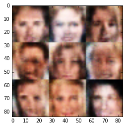


    Epoch 1/1... Discriminator Loss: 0.4044... Generator Loss: 2.9583
    Epoch 1/1... Discriminator Loss: 1.3073... Generator Loss: 0.5888
    Epoch 1/1... Discriminator Loss: 1.3157... Generator Loss: 0.5960
    Epoch 1/1... Discriminator Loss: 1.1416... Generator Loss: 0.9476
    Epoch 1/1... Discriminator Loss: 0.6123... Generator Loss: 3.4026
    Epoch 1/1... Discriminator Loss: 0.9966... Generator Loss: 0.7748
    Epoch 1/1... Discriminator Loss: 0.6774... Generator Loss: 1.6858
    Epoch 1/1... Discriminator Loss: 1.0903... Generator Loss: 1.7578
    Epoch 1/1... Discriminator Loss: 1.8431... Generator Loss: 0.2372
    Epoch 1/1... Discriminator Loss: 1.4237... Generator Loss: 0.6893


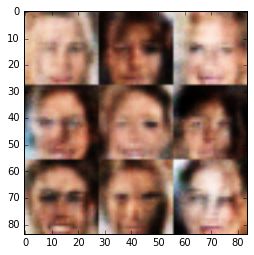


    Epoch 1/1... Discriminator Loss: 0.5304... Generator Loss: 2.7645
    Epoch 1/1... Discriminator Loss: 1.1052... Generator Loss: 0.6201
    Epoch 1/1... Discriminator Loss: 0.8788... Generator Loss: 1.7897
    Epoch 1/1... Discriminator Loss: 1.2321... Generator Loss: 0.6008
    Epoch 1/1... Discriminator Loss: 0.8970... Generator Loss: 2.3249
    Epoch 1/1... Discriminator Loss: 0.8997... Generator Loss: 0.8817
    Epoch 1/1... Discriminator Loss: 0.9773... Generator Loss: 0.7222
    Epoch 1/1... Discriminator Loss: 1.5607... Generator Loss: 1.0103
    Epoch 1/1... Discriminator Loss: 0.8082... Generator Loss: 0.9861
    Epoch 1/1... Discriminator Loss: 0.8658... Generator Loss: 0.7501

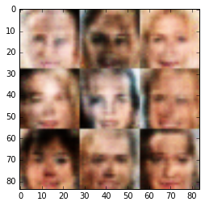


    Epoch 1/1... Discriminator Loss: 1.4936... Generator Loss: 0.3661
    Epoch 1/1... Discriminator Loss: 0.6228... Generator Loss: 1.7822
    Epoch 1/1... Discriminator Loss: 1.1989... Generator Loss: 0.8270
    Epoch 1/1... Discriminator Loss: 1.0564... Generator Loss: 0.9021
    Epoch 1/1... Discriminator Loss: 1.1886... Generator Loss: 1.0330
    Epoch 1/1... Discriminator Loss: 0.8775... Generator Loss: 1.1058
    Epoch 1/1... Discriminator Loss: 1.0101... Generator Loss: 0.7843
    Epoch 1/1... Discriminator Loss: 0.9291... Generator Loss: 1.0799
