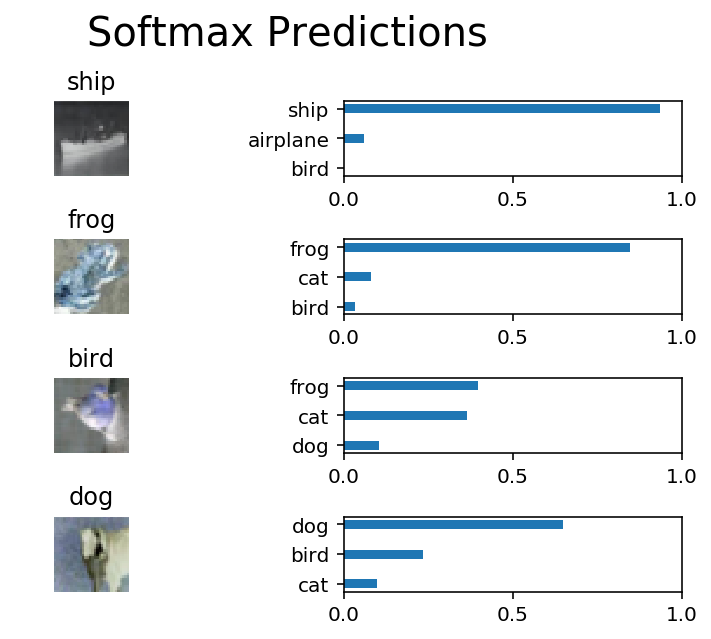

# Image Classification
**Goal**: In this project, I'll classify images from the [CIFAR-10 dataset](https://www.cs.toronto.edu/~kriz/cifar.html).  The dataset consists of airplanes, dogs, cats, and other objects. I'll preprocess the images, then train a convolutional neural network on all the samples. The images need to be normalized and the labels need to be one-hot encoded.  I'll get to apply what I learned and build a convolutional, max pooling, dropout, and fully connected layers.  At the end, You'll get to see my neural network's predictions on the sample images.
## Get the Data
Run the following cell to download the [CIFAR-10 dataset for python](https://www.cs.toronto.edu/~kriz/cifar-10-python.tar.gz).


```python
from urllib.request import urlretrieve
from os.path import isfile, isdir
from tqdm import tqdm
import problem_unittests as tests
import tarfile

cifar10_dataset_folder_path = 'cifar-10-batches-py'

class DLProgress(tqdm):
    last_block = 0

    def hook(self, block_num=1, block_size=1, total_size=None):
        self.total = total_size
        self.update((block_num - self.last_block) * block_size)
        self.last_block = block_num

if not isfile('cifar-10-python.tar.gz'):
    with DLProgress(unit='B', unit_scale=True, miniters=1, desc='CIFAR-10 Dataset') as pbar:
        urlretrieve(
            'https://www.cs.toronto.edu/~kriz/cifar-10-python.tar.gz',
            'cifar-10-python.tar.gz',
            pbar.hook)

if not isdir(cifar10_dataset_folder_path):
    with tarfile.open('cifar-10-python.tar.gz') as tar:
        tar.extractall()
        tar.close()


tests.test_folder_path(cifar10_dataset_folder_path)
```

    All files found!


## Explore the Data
The dataset is broken into batches to prevent my machine from running out of memory.  The CIFAR-10 dataset consists of 5 batches, named `data_batch_1`, `data_batch_2`, etc.. Each batch contains the labels and images that are one of the following:
* airplane
* automobile
* bird
* cat
* deer
* dog
* frog
* horse
* ship
* truck

Understanding a dataset is part of making predictions on the data.  Play around with the code cell below by changing the `batch_id` and `sample_id`. The `batch_id` is the id for a batch (1-5). The `sample_id` is the id for a image and label pair in the batch.

Ask myself "What are all possible labels?", "What is the range of values for the image data?", "Are the labels in order or random?".  Answers to questions like these will help me preprocess the data and end up with better predictions.


```python
%matplotlib inline
%config InlineBackend.figure_format = 'retina'

import helper
import numpy as np

# Explore the dataset
batch_id = 1
sample_id = 5
helper.display_stats(cifar10_dataset_folder_path, batch_id, sample_id)
```


    Stats of batch 1:
    Samples: 10000
    Label Counts: {0: 1005, 1: 974, 2: 1032, 3: 1016, 4: 999, 5: 937, 6: 1030, 7: 1001, 8: 1025, 9: 981}
    First 20 Labels: [6, 9, 9, 4, 1, 1, 2, 7, 8, 3, 4, 7, 7, 2, 9, 9, 9, 3, 2, 6]

    Example of Image 5:
    Image - Min Value: 0 Max Value: 252
    Image - Shape: (32, 32, 3)
    Label - Label Id: 1 Name: automobile


## Implement Preprocess Functions
### Normalize
In the cell below, implement the `normalize` function to take in image data, `x`, and return it as a normalized Numpy array. The values should be in the range of 0 to 1, inclusive.  The return object should be the same shape as `x`.


```python
def normalize(x):
    """
    Normalize a list of sample image data in the range of 0 to 1
    : x: List of image data.  The image shape is (32, 32, 3)
    : return: Numpy array of normalize data
    """
    # TODO: Implement Function

    x = x.astype(np.float)
    x = np.multiply(x,1/255)

    return x

tests.test_normalize(normalize)
```

    Tests Passed


### One-hot encode
Just like the previous code cell, I'll be implementing a function for preprocessing.  This time, I'll implement the `one_hot_encode` function. The input, `x`, are a list of labels.  Implement the function to return the list of labels as One-Hot encoded Numpy array.  The possible values for labels are 0 to 9. The one-hot encoding function should return the same encoding for each value between each call to `one_hot_encode`.  Make sure to save the map of encodings outside the function.

Hint: Don't reinvent the wheel.


```python
def one_hot_encode(x):
    """
    One hot encode a list of sample labels. Return a one-hot encoded vector for each label.
    : x: List of sample Labels
    : return: Numpy array of one-hot encoded labels
    """
    # TODO: Implement Function
    length = len(x)
    one_hot = []
    for i in range(length):
        labels = np.array(np.zeros((10)))
        labels[x[i]] = 1
        one_hot.append(labels)
    one_hot = np.array(one_hot)
    return one_hot

tests.test_one_hot_encode(one_hot_encode)
```

    Tests Passed


### Randomize Data
As I saw from exploring the data above, the order of the samples are randomized.  It doesn't hurt to randomize it again, but I don't need to for this dataset.

## Preprocess all the data and save it
Running the code cell below will preprocess all the CIFAR-10 data and save it to file. The code below also uses 10% of the training data for validation.


```python
# Preprocess Training, Validation, and Testing Data
helper.preprocess_and_save_data(cifar10_dataset_folder_path, normalize, one_hot_encode)
```

# Check Point
This is my first checkpoint.  If I ever decide to come back to this notebook or have to restart the notebook, I can start from here.  The preprocessed data has been saved to disk.


```python
"""
DON'T MODIFY ANYTHING IN THIS CELL
"""
import pickle
import problem_unittests as tests
import helper

# Load the Preprocessed Validation data
valid_features, valid_labels = pickle.load(open('preprocess_validation.p', mode='rb'))
```

## Build the network
For the neural network, I'll build each layer into a function.  Most of the code I've seen has been outside of functions. To test my code more thoroughly, I'll first put each layer in a function.  This allows me to give me better feedback and test for simple mistakes using unittests.

### Input
The neural network needs to read the image data, one-hot encoded labels, and dropout keep probability. Implement the following functions
* Implement `neural_net_image_input`
 * Return a [TF Placeholder](https://www.tensorflow.org/api_docs/python/tf/placeholder)
 * Set the shape using `image_shape` with batch size set to `None`.
 * Name the TensorFlow placeholder "x" using the TensorFlow `name` parameter in the [TF Placeholder](https://www.tensorflow.org/api_docs/python/tf/placeholder).
* Implement `neural_net_label_input`
 * Return a [TF Placeholder](https://www.tensorflow.org/api_docs/python/tf/placeholder)
 * Set the shape using `n_classes` with batch size set to `None`.
 * Name the TensorFlow placeholder "y" using the TensorFlow `name` parameter in the [TF Placeholder](https://www.tensorflow.org/api_docs/python/tf/placeholder).
* Implement `neural_net_keep_prob_input`
 * Return a [TF Placeholder](https://www.tensorflow.org/api_docs/python/tf/placeholder) for dropout keep probability.
 * Name the TensorFlow placeholder "keep_prob" using the TensorFlow `name` parameter in the [TF Placeholder](https://www.tensorflow.org/api_docs/python/tf/placeholder).

These names will be used at the end of the project to load my saved model.

Note: `None` for shapes in TensorFlow allow for a dynamic size.


```python
import tensorflow as tf

def neural_net_image_input(image_shape):
    """
    Return a Tensor for a bach of image input
    : image_shape: Shape of the images
    : return: Tensor for image input.
    """
    # TODO: Implement Function
    return tf.placeholder(tf.float32, [None, image_shape[0], image_shape[1], image_shape[2]], name = 'x')


def neural_net_label_input(n_classes):
    """
    Return a Tensor for a batch of label input
    : n_classes: Number of classes
    : return: Tensor for label input.
    """
    # TODO: Implement Function
    return tf.placeholder(tf.float32, [None, n_classes], name = 'y')


def neural_net_keep_prob_input():
    """
    Return a Tensor for keep probability
    : return: Tensor for keep probability.
    """
    # TODO: Implement Function
    return tf.placeholder(tf.float32, name = 'keep_prob')

tf.reset_default_graph()
tests.test_nn_image_inputs(neural_net_image_input)
tests.test_nn_label_inputs(neural_net_label_input)
tests.test_nn_keep_prob_inputs(neural_net_keep_prob_input)
```

    Image Input Tests Passed.
    Label Input Tests Passed.
    Keep Prob Tests Passed.


### Convolution and Max Pooling Layer
Convolution layers have a lot of success with images. For this code cell, I'll implement the function `conv2d_maxpool` to apply convolution then max pooling:
* Create the weight and bias using `conv_ksize`, `conv_num_outputs` and the shape of `x_tensor`.
* Apply a convolution to `x_tensor` using weight and `conv_strides`.
 * We recommend I use same padding, but I're welcome to use any padding.
* Add bias
* Add a nonlinear activation to the convolution.
* Apply Max Pooling using `pool_ksize` and `pool_strides`.


```python
def conv2d_maxpool(x_tensor, conv_num_outputs, conv_ksize, conv_strides, pool_ksize, pool_strides):
    """
    Apply convolution then max pooling to x_tensor
    :param x_tensor: TensorFlow Tensor
    :param conv_num_outputs: Number of outputs for the convolutional layer
    :param conv_strides: Stride 2-D Tuple for convolution
    :param pool_ksize: kernal size 2-D Tuple for pool
    :param pool_strides: Stride 2-D Tuple for pool
    : return: A tensor that represents convolution and max pooling of x_tensor
    """
    # TODO: Implement Function

    # Creat Weights and Bias
    conv_x = x_tensor
    weights = tf.Variable(tf.truncated_normal([conv_ksize[0], conv_ksize[1], int(conv_x.shape[3]), conv_num_outputs], stddev=0.01))
    bias = tf.Variable(tf.zeros(conv_num_outputs))
    # Other Variables
    strides = [1, conv_strides[0], conv_strides[1], 1]
    padding = 'SAME'
    # conv_2d
    conv_layer = tf.nn.conv2d(conv_x, weights, strides, padding)
    conv_layer = tf.nn.bias_add(conv_layer, bias)
    conv_layer = tf.nn.relu(conv_layer)

    # max_pool
    maxpool_x = conv_layer
    maxpool_ksize = [1, pool_ksize[0], pool_ksize[1] ,1]
    maxpool_strides = [1, pool_strides[0], pool_strides[1], 1]
    maxpool_padding = 'VALID'
    conv_layer = tf.nn.max_pool(maxpool_x, maxpool_ksize, maxpool_strides, maxpool_padding)
    return conv_layer

tests.test_con_pool(conv2d_maxpool)
```

    Tests Passed


### Flatten Layer
Implement the `flatten` function to change the dimension of `x_tensor` from a 4-D tensor to a 2-D tensor.  The output should be the shape (*Batch Size*, *Flattened Image Size*).


```python
def flatten(x_tensor):
    """
    Flatten x_tensor to (Batch Size, Flattened Image Size)
    : x_tensor: A tensor of size (Batch Size, ...), where ... are the image dimensions.
    : return: A tensor of size (Batch Size, Flattened Image Size).
    """
    # TODO: Implement Function
    return tf.reshape(x_tensor, [-1, int(x_tensor.shape[1]*x_tensor.shape[2]*x_tensor.shape[3])])

tests.test_flatten(flatten)
```

    Tests Passed


### Fully-Connected Layer
Implement the `fully_conn` function to apply a fully connected layer to `x_tensor` with the shape (*Batch Size*, *num_outputs*).


```python
def fully_conn(x_tensor, num_outputs):
    """
    Apply a fully connected layer to x_tensor using weight and bias
    : x_tensor: A 2-D tensor where the first dimension is batch size.
    : num_outputs: The number of output that the new tensor should be.
    : return: A 2-D tensor where the second dimension is num_outputs.
    """
    # TODO: Implement Function
    weights = tf.Variable(tf.truncated_normal([x_tensor.get_shape().as_list()[1], num_outputs], stddev=0.01))
    bias = tf.Variable(tf.zeros(num_outputs))
    output = tf.add(tf.matmul(x_tensor, weights), bias)
    output = tf.nn.relu(output)
    return output

tests.test_fully_conn(fully_conn)
```

    Tests Passed


### Output Layer
Implement the `output` function to apply a fully connected layer to `x_tensor` with the shape (*Batch Size*, *num_outputs*).

Note: Activation, softmax, or cross entropy shouldn't be applied to this.


```python
def output(x_tensor, num_outputs):
    """
    Apply a output layer to x_tensor using weight and bias
    : x_tensor: A 2-D tensor where the first dimension is batch size.
    : num_outputs: The number of output that the new tensor should be.
    : return: A 2-D tensor where the second dimension is num_outputs.
    """
    # TODO: Implement Function
    weights = tf.Variable(tf.truncated_normal([int(x_tensor.shape[1]), num_outputs], stddev=0.01))
    bias = tf.Variable(tf.zeros(num_outputs))
    output = tf.add(tf.matmul(x_tensor, weights), bias)
    return output

tests.test_output(output)
```

    Tests Passed


### Create Convolutional Model
Implement the function `conv_net` to create a convolutional neural network model. The function takes in a batch of images, `x`, and outputs logits.  I'll use the layers I created above to create this model:

* Apply 1, 2, or 3 Convolution and Max Pool layers
* Apply a Flatten Layer
* Apply 1, 2, or 3 Fully Connected Layers
* Apply an Output Layer
* Return the output
* Apply [TensorFlow's Dropout](https://www.tensorflow.org/api_docs/python/tf/nn/dropout) to one or more layers in the model using `keep_prob`.


```python
def conv_net(x, keep_prob):
    """
    Create a convolutional neural network model
    : x: Placeholder tensor that holds image data.
    : keep_prob: Placeholder tensor that hold dropout keep probability.
    : return: Tensor that represents logits
    """
    # TODO: Apply 1, 2, or 3 Convolution and Max Pool layers
    #    Play around with different number of outputs, kernel size and stride
    # Function Definition from Above:
    #    conv2d_maxpool(x_tensor, conv_num_outputs, conv_ksize, conv_strides, pool_ksize, pool_strides)
    layer_inputs = x

    # Layer1
    layer_conv1 = conv2d_maxpool(layer_inputs, 32, [2,2], [1,1], [2,2], [2,2])

    # Layer2
    layer_conv2 = conv2d_maxpool(layer_conv1, 32, [3,3], [1,1], [2,2], [2,2])

    # Layer3
    layer_conv3 = conv2d_maxpool(layer_conv2, 64, [3,3], [1,1], [2,2], [2,2])


    # TODO: Apply a Flatten Layer
    # Function Definition from Above:
    #   flatten(x_tensor)
    layer_flatten = flatten(layer_conv3)

    # TODO: Apply 1, 2, or 3 Fully Connected Layers
    #    Play around with different number of outputs
    # Function Definition from Above:
    #   fully_conn(x_tensor, num_outputs)
    layer_fc = fully_conn(layer_flatten, 64)
    layer_fc = tf.nn.dropout(layer_fc, keep_prob)

    # TODO: Apply an Output Layer
    #    Set this to the number of classes
    # Function Definition from Above:
    #   output(x_tensor, num_outputs)
    output_ = output(layer_fc, 10)

    # TODO: return output
    return output_

##############################
## Build the Neural Network ##
##############################

# Remove previous weights, bias, inputs, etc..
tf.reset_default_graph()

# Inputs
x = neural_net_image_input((32, 32, 3))
y = neural_net_label_input(10)
keep_prob = neural_net_keep_prob_input()

# Model
logits = conv_net(x, keep_prob)

# Name logits Tensor, so that is can be loaded from disk after training
logits = tf.identity(logits, name='logits')

# Loss and Optimizer
cost = tf.reduce_mean(tf.nn.softmax_cross_entropy_with_logits(logits=logits, labels=y))
optimizer = tf.train.AdamOptimizer().minimize(cost)

# Accuracy
correct_pred = tf.equal(tf.argmax(logits, 1), tf.argmax(y, 1))
accuracy = tf.reduce_mean(tf.cast(correct_pred, tf.float32), name='accuracy')

tests.test_conv_net(conv_net)
```

    Neural Network Built!


## Train the Neural Network
### Single Optimization
Implement the function `train_neural_network` to do a single optimization.  The optimization should use `optimizer` to optimize in `session` with a `feed_dict` of the following:
* `x` for image input
* `y` for labels
* `keep_prob` for keep probability for dropout

This function will be called for each batch, so `tf.global_variables_initializer()` has already been called.

Note: Nothing needs to be returned. This function is only optimizing the neural network.


```python
def train_neural_network(session, optimizer, keep_probability, feature_batch, label_batch):
    """
    Optimize the session on a batch of images and labels
    : session: Current TensorFlow session
    : optimizer: TensorFlow optimizer function
    : keep_probability: keep probability
    : feature_batch: Batch of Numpy image data
    : label_batch: Batch of Numpy label data
    """
    # TODO: Implement Function
    session.run(optimizer, feed_dict={x: feature_batch, y: label_batch, keep_prob: keep_probability})

tests.test_train_nn(train_neural_network)
```

    Tests Passed


### Show Stats
Implement the function `print_stats` to print loss and validation accuracy.  Use the global variables `valid_features` and `valid_labels` to calculate validation accuracy.  Use a keep probability of `1.0` to calculate the loss and validation accuracy.


```python
def print_stats(session, feature_batch, label_batch, cost, accuracy):
    """
    Print information about loss and validation accuracy
    : session: Current TensorFlow session
    : feature_batch: Batch of Numpy image data
    : label_batch: Batch of Numpy label data
    : cost: TensorFlow cost function
    : accuracy: TensorFlow accuracy function
    """
    # TODO: Implement Function
    loss = session.run(cost, feed_dict={x: feature_batch, y: label_batch, keep_prob: 1.0})
    accuracy = session.run(accuracy, feed_dict={x: valid_features, y: valid_labels, keep_prob: 1.0})
    print('Loss: {}'.format(loss))
    print('Accuracy: {}'.format(accuracy))

```

### Hyperparameters
Tune the following parameters:
* Set `epochs` to the number of iterations until the network stops learning or start overfitting
* Set `batch_size` to the highest number that my machine has memory for.  Most people set them to common sizes of memory:
 * 64
 * 128
 * 256
 * ...
* Set `keep_probability` to the probability of keeping a node using dropout


```python
# TODO: Tune Parameters
epochs = 100
batch_size = 64
keep_probability = 0.5
```

### Train on a Single CIFAR-10 Batch
Instead of training the neural network on all the CIFAR-10 batches of data, let's use a single batch. This should save time while I iterate on the model to get a better accuracy.  Once the final validation accuracy is 50% or greater, run the model on all the data in the next section.


```python
print('Checking the Training on a Single Batch...')
with tf.Session() as sess:
    # Initializing the variables
    sess.run(tf.global_variables_initializer())

    # Training cycle
    for epoch in range(epochs):
        batch_i = 1
        for batch_features, batch_labels in helper.load_preprocess_training_batch(batch_i, batch_size):
            train_neural_network(sess, optimizer, keep_probability, batch_features, batch_labels)
        print('Epoch {:>2}, CIFAR-10 Batch {}:  '.format(epoch + 1, batch_i), end='')
        print_stats(sess, batch_features, batch_labels, cost, accuracy)
```

    Checking the Training on a Single Batch...
    Epoch  1, CIFAR-10 Batch 1:  Loss: 2.2213780879974365
    Accuracy: 0.20899997651576996
    Epoch  2, CIFAR-10 Batch 1:  Loss: 2.1737608909606934
    Accuracy: 0.2523999810218811
    Epoch  3, CIFAR-10 Batch 1:  Loss: 2.164125442504883
    Accuracy: 0.26660001277923584
    Epoch  4, CIFAR-10 Batch 1:  Loss: 2.1366348266601562
    Accuracy: 0.2837999761104584
    Epoch  5, CIFAR-10 Batch 1:  Loss: 2.1272692680358887
    Accuracy: 0.30219998955726624
    Epoch  6, CIFAR-10 Batch 1:  Loss: 2.095137357711792
    Accuracy: 0.29899999499320984
    Epoch  7, CIFAR-10 Batch 1:  Loss: 2.074615240097046
    Accuracy: 0.311599999666214
    Epoch  8, CIFAR-10 Batch 1:  Loss: 2.114842653274536
    Accuracy: 0.3139999806880951
    Epoch  9, CIFAR-10 Batch 1:  Loss: 2.0559468269348145
    Accuracy: 0.33879998326301575
    Epoch 10, CIFAR-10 Batch 1:  Loss: 1.9731152057647705
    Accuracy: 0.3529999852180481
    Epoch 11, CIFAR-10 Batch 1:  Loss: 1.9982311725616455
    Accuracy: 0.36180001497268677
    Epoch 12, CIFAR-10 Batch 1:  Loss: 1.958385705947876
    Accuracy: 0.3643999695777893
    Epoch 13, CIFAR-10 Batch 1:  Loss: 1.9147692918777466
    Accuracy: 0.366599977016449
    Epoch 14, CIFAR-10 Batch 1:  Loss: 1.9272230863571167
    Accuracy: 0.37439996004104614
    Epoch 15, CIFAR-10 Batch 1:  Loss: 1.909288763999939
    Accuracy: 0.38759997487068176
    Epoch 16, CIFAR-10 Batch 1:  Loss: 1.8297460079193115
    Accuracy: 0.38439998030662537
    Epoch 17, CIFAR-10 Batch 1:  Loss: 1.85906982421875
    Accuracy: 0.39480000734329224
    Epoch 18, CIFAR-10 Batch 1:  Loss: 1.8307150602340698
    Accuracy: 0.4017999768257141
    Epoch 19, CIFAR-10 Batch 1:  Loss: 1.7937499284744263
    Accuracy: 0.39899998903274536
    Epoch 20, CIFAR-10 Batch 1:  Loss: 1.817542552947998
    Accuracy: 0.40939995646476746
    Epoch 21, CIFAR-10 Batch 1:  Loss: 1.8412328958511353
    Accuracy: 0.4108000099658966
    Epoch 22, CIFAR-10 Batch 1:  Loss: 1.792984962463379
    Accuracy: 0.41839998960494995
    Epoch 23, CIFAR-10 Batch 1:  Loss: 1.7970020771026611
    Accuracy: 0.41599997878074646
    Epoch 24, CIFAR-10 Batch 1:  Loss: 1.8102240562438965
    Accuracy: 0.4253999888896942
    Epoch 25, CIFAR-10 Batch 1:  Loss: 1.7930428981781006
    Accuracy: 0.4342000186443329
    Epoch 26, CIFAR-10 Batch 1:  Loss: 1.7862377166748047
    Accuracy: 0.43039995431900024
    Epoch 27, CIFAR-10 Batch 1:  Loss: 1.8051340579986572
    Accuracy: 0.4339999556541443
    Epoch 28, CIFAR-10 Batch 1:  Loss: 1.7968401908874512
    Accuracy: 0.4363999664783478
    Epoch 29, CIFAR-10 Batch 1:  Loss: 1.727900505065918
    Accuracy: 0.43879997730255127
    Epoch 30, CIFAR-10 Batch 1:  Loss: 1.7885675430297852
    Accuracy: 0.43939998745918274
    Epoch 31, CIFAR-10 Batch 1:  Loss: 1.7349259853363037
    Accuracy: 0.4281999468803406
    Epoch 32, CIFAR-10 Batch 1:  Loss: 1.713361382484436
    Accuracy: 0.44119998812675476
    Epoch 33, CIFAR-10 Batch 1:  Loss: 1.783461570739746
    Accuracy: 0.43939998745918274
    Epoch 34, CIFAR-10 Batch 1:  Loss: 1.7146034240722656
    Accuracy: 0.4503999948501587
    Epoch 35, CIFAR-10 Batch 1:  Loss: 1.7742044925689697
    Accuracy: 0.43619996309280396
    Epoch 36, CIFAR-10 Batch 1:  Loss: 1.7197074890136719
    Accuracy: 0.4469999670982361
    Epoch 37, CIFAR-10 Batch 1:  Loss: 1.7705228328704834
    Accuracy: 0.44099992513656616
    Epoch 38, CIFAR-10 Batch 1:  Loss: 1.6693882942199707
    Accuracy: 0.4591999650001526
    Epoch 39, CIFAR-10 Batch 1:  Loss: 1.694097638130188
    Accuracy: 0.4575999975204468
    Epoch 40, CIFAR-10 Batch 1:  Loss: 1.6742026805877686
    Accuracy: 0.45100000500679016
    Epoch 41, CIFAR-10 Batch 1:  Loss: 1.6624972820281982
    Accuracy: 0.4617999792098999
    Epoch 42, CIFAR-10 Batch 1:  Loss: 1.6836438179016113
    Accuracy: 0.4601999819278717
    Epoch 43, CIFAR-10 Batch 1:  Loss: 1.6259928941726685
    Accuracy: 0.4639999568462372
    Epoch 44, CIFAR-10 Batch 1:  Loss: 1.6398541927337646
    Accuracy: 0.4625999927520752
    Epoch 45, CIFAR-10 Batch 1:  Loss: 1.6396631002426147
    Accuracy: 0.46119996905326843
    Epoch 46, CIFAR-10 Batch 1:  Loss: 1.6333670616149902
    Accuracy: 0.46699997782707214
    Epoch 47, CIFAR-10 Batch 1:  Loss: 1.5938763618469238
    Accuracy: 0.4655999541282654
    Epoch 48, CIFAR-10 Batch 1:  Loss: 1.5364733934402466
    Accuracy: 0.464199960231781
    Epoch 49, CIFAR-10 Batch 1:  Loss: 1.5643150806427002
    Accuracy: 0.46879997849464417
    Epoch 50, CIFAR-10 Batch 1:  Loss: 1.4758424758911133
    Accuracy: 0.4697999954223633
    Epoch 51, CIFAR-10 Batch 1:  Loss: 1.5074882507324219
    Accuracy: 0.46939998865127563
    Epoch 52, CIFAR-10 Batch 1:  Loss: 1.506036400794983
    Accuracy: 0.47119995951652527
    Epoch 53, CIFAR-10 Batch 1:  Loss: 1.4674434661865234
    Accuracy: 0.4719999432563782
    Epoch 54, CIFAR-10 Batch 1:  Loss: 1.4786617755889893
    Accuracy: 0.48319992423057556
    Epoch 55, CIFAR-10 Batch 1:  Loss: 1.3996984958648682
    Accuracy: 0.4697999954223633
    Epoch 56, CIFAR-10 Batch 1:  Loss: 1.4326372146606445
    Accuracy: 0.48079997301101685
    Epoch 57, CIFAR-10 Batch 1:  Loss: 1.4317724704742432
    Accuracy: 0.47739994525909424
    Epoch 58, CIFAR-10 Batch 1:  Loss: 1.416452169418335
    Accuracy: 0.4837999939918518
    Epoch 59, CIFAR-10 Batch 1:  Loss: 1.4112799167633057
    Accuracy: 0.48260000348091125
    Epoch 60, CIFAR-10 Batch 1:  Loss: 1.4384117126464844
    Accuracy: 0.4851999580860138
    Epoch 61, CIFAR-10 Batch 1:  Loss: 1.4022533893585205
    Accuracy: 0.48420000076293945
    Epoch 62, CIFAR-10 Batch 1:  Loss: 1.3668478727340698
    Accuracy: 0.4887999892234802
    Epoch 63, CIFAR-10 Batch 1:  Loss: 1.3570494651794434
    Accuracy: 0.48639997839927673
    Epoch 64, CIFAR-10 Batch 1:  Loss: 1.3607572317123413
    Accuracy: 0.4835999608039856
    Epoch 65, CIFAR-10 Batch 1:  Loss: 1.3438940048217773
    Accuracy: 0.4859999716281891
    Epoch 66, CIFAR-10 Batch 1:  Loss: 1.2948806285858154
    Accuracy: 0.49439990520477295
    Epoch 67, CIFAR-10 Batch 1:  Loss: 1.322627305984497
    Accuracy: 0.48579996824264526
    Epoch 68, CIFAR-10 Batch 1:  Loss: 1.2728102207183838
    Accuracy: 0.4939999580383301
    Epoch 69, CIFAR-10 Batch 1:  Loss: 1.2963896989822388
    Accuracy: 0.49619996547698975
    Epoch 70, CIFAR-10 Batch 1:  Loss: 1.3015000820159912
    Accuracy: 0.4973999261856079
    Epoch 71, CIFAR-10 Batch 1:  Loss: 1.3218119144439697
    Accuracy: 0.4923999309539795
    Epoch 72, CIFAR-10 Batch 1:  Loss: 1.2855340242385864
    Accuracy: 0.4891999363899231
    Epoch 73, CIFAR-10 Batch 1:  Loss: 1.276242971420288
    Accuracy: 0.4853999614715576
    Epoch 74, CIFAR-10 Batch 1:  Loss: 1.3083972930908203
    Accuracy: 0.49299997091293335
    Epoch 75, CIFAR-10 Batch 1:  Loss: 1.3058433532714844
    Accuracy: 0.5025999546051025
    Epoch 76, CIFAR-10 Batch 1:  Loss: 1.276452660560608
    Accuracy: 0.4925999641418457
    Epoch 77, CIFAR-10 Batch 1:  Loss: 1.2790948152542114
    Accuracy: 0.49139997363090515
    Epoch 78, CIFAR-10 Batch 1:  Loss: 1.2137728929519653
    Accuracy: 0.4849999248981476
    Epoch 79, CIFAR-10 Batch 1:  Loss: 1.2338017225265503
    Accuracy: 0.5001999735832214
    Epoch 80, CIFAR-10 Batch 1:  Loss: 1.2343733310699463
    Accuracy: 0.4981999397277832
    Epoch 81, CIFAR-10 Batch 1:  Loss: 1.191495656967163
    Accuracy: 0.49299997091293335
    Epoch 82, CIFAR-10 Batch 1:  Loss: 1.2203197479248047
    Accuracy: 0.4975999593734741
    Epoch 83, CIFAR-10 Batch 1:  Loss: 1.2409257888793945
    Accuracy: 0.496599942445755
    Epoch 84, CIFAR-10 Batch 1:  Loss: 1.2405340671539307
    Accuracy: 0.495199978351593
    Epoch 85, CIFAR-10 Batch 1:  Loss: 1.2353993654251099
    Accuracy: 0.5053999423980713
    Epoch 86, CIFAR-10 Batch 1:  Loss: 1.196634292602539
    Accuracy: 0.49699991941452026
    Epoch 87, CIFAR-10 Batch 1:  Loss: 1.234811782836914
    Accuracy: 0.4941999316215515
    Epoch 88, CIFAR-10 Batch 1:  Loss: 1.1778699159622192
    Accuracy: 0.4957999587059021
    Epoch 89, CIFAR-10 Batch 1:  Loss: 1.2271392345428467
    Accuracy: 0.5039999485015869
    Epoch 90, CIFAR-10 Batch 1:  Loss: 1.1992563009262085
    Accuracy: 0.5021999478340149
    Epoch 91, CIFAR-10 Batch 1:  Loss: 1.1845711469650269
    Accuracy: 0.5025999546051025
    Epoch 92, CIFAR-10 Batch 1:  Loss: 1.1558825969696045
    Accuracy: 0.49859997630119324
    Epoch 93, CIFAR-10 Batch 1:  Loss: 1.1213611364364624
    Accuracy: 0.49699994921684265
    Epoch 94, CIFAR-10 Batch 1:  Loss: 1.115433931350708
    Accuracy: 0.49939996004104614
    Epoch 95, CIFAR-10 Batch 1:  Loss: 1.146200180053711
    Accuracy: 0.49459993839263916
    Epoch 96, CIFAR-10 Batch 1:  Loss: 1.0991978645324707
    Accuracy: 0.5029999017715454
    Epoch 97, CIFAR-10 Batch 1:  Loss: 1.1223499774932861
    Accuracy: 0.49679994583129883
    Epoch 98, CIFAR-10 Batch 1:  Loss: 1.1359977722167969
    Accuracy: 0.5007999539375305
    Epoch 99, CIFAR-10 Batch 1:  Loss: 1.141098976135254
    Accuracy: 0.4986000061035156
    Epoch 100, CIFAR-10 Batch 1:  Loss: 1.1249034404754639
    Accuracy: 0.5009999871253967


### Fully Train the Model
Now that I got a good accuracy with a single CIFAR-10 batch, try it with all five batches.


```python
save_model_path = './image_classification'

print('Training...')
with tf.Session() as sess:
    # Initializing the variables
    sess.run(tf.global_variables_initializer())

    # Training cycle
    for epoch in range(epochs):
        # Loop over all batches
        n_batches = 5
        for batch_i in range(1, n_batches + 1):
            for batch_features, batch_labels in helper.load_preprocess_training_batch(batch_i, batch_size):
                train_neural_network(sess, optimizer, keep_probability, batch_features, batch_labels)
            print('Epoch {:>2}, CIFAR-10 Batch {}:  '.format(epoch + 1, batch_i), end='')
            print_stats(sess, batch_features, batch_labels, cost, accuracy)

    # Save Model
    saver = tf.train.Saver()
    save_path = saver.save(sess, save_model_path)
```

    Training...
    Epoch  1, CIFAR-10 Batch 1:  Loss: 2.1748886108398438
    Accuracy: 0.2279999852180481
    Epoch  1, CIFAR-10 Batch 2:  Loss: 2.0898780822753906
    Accuracy: 0.2683999836444855
    Epoch  1, CIFAR-10 Batch 3:  Loss: 1.8242107629776
    Accuracy: 0.26099997758865356
    Epoch  1, CIFAR-10 Batch 4:  Loss: 1.9004323482513428
    Accuracy: 0.28780001401901245
    Epoch  1, CIFAR-10 Batch 5:  Loss: 2.0095713138580322
    Accuracy: 0.31940001249313354
    Epoch  2, CIFAR-10 Batch 1:  Loss: 2.171612501144409
    Accuracy: 0.31039997935295105
    Epoch  2, CIFAR-10 Batch 2:  Loss: 1.9078010320663452
    Accuracy: 0.36059999465942383
    Epoch  2, CIFAR-10 Batch 3:  Loss: 1.6026920080184937
    Accuracy: 0.34539997577667236
    Epoch  2, CIFAR-10 Batch 4:  Loss: 1.761971116065979
    Accuracy: 0.3522000014781952
    Epoch  2, CIFAR-10 Batch 5:  Loss: 1.8967618942260742
    Accuracy: 0.3779999911785126
    Epoch  3, CIFAR-10 Batch 1:  Loss: 2.018904685974121
    Accuracy: 0.39559999108314514
    Epoch  3, CIFAR-10 Batch 2:  Loss: 1.778611183166504
    Accuracy: 0.38819998502731323
    Epoch  3, CIFAR-10 Batch 3:  Loss: 1.4788155555725098
    Accuracy: 0.3776000142097473
    Epoch  3, CIFAR-10 Batch 4:  Loss: 1.6532140970230103
    Accuracy: 0.4039999842643738
    Epoch  3, CIFAR-10 Batch 5:  Loss: 1.801192283630371
    Accuracy: 0.4139999747276306
    Epoch  4, CIFAR-10 Batch 1:  Loss: 1.9898264408111572
    Accuracy: 0.41279998421669006
    Epoch  4, CIFAR-10 Batch 2:  Loss: 1.7813783884048462
    Accuracy: 0.41519999504089355
    Epoch  4, CIFAR-10 Batch 3:  Loss: 1.4235652685165405
    Accuracy: 0.4081999659538269
    Epoch  4, CIFAR-10 Batch 4:  Loss: 1.5928393602371216
    Accuracy: 0.4131999909877777
    Epoch  4, CIFAR-10 Batch 5:  Loss: 1.705147624015808
    Accuracy: 0.4315999746322632
    Epoch  5, CIFAR-10 Batch 1:  Loss: 1.9637446403503418
    Accuracy: 0.44019997119903564
    Epoch  5, CIFAR-10 Batch 2:  Loss: 1.7012702226638794
    Accuracy: 0.420199990272522
    Epoch  5, CIFAR-10 Batch 3:  Loss: 1.3857061862945557
    Accuracy: 0.415800005197525
    Epoch  5, CIFAR-10 Batch 4:  Loss: 1.518444538116455
    Accuracy: 0.4307999610900879
    Epoch  5, CIFAR-10 Batch 5:  Loss: 1.6685090065002441
    Accuracy: 0.4461999535560608
    Epoch  6, CIFAR-10 Batch 1:  Loss: 1.9270280599594116
    Accuracy: 0.4323999881744385
    Epoch  6, CIFAR-10 Batch 2:  Loss: 1.6995408535003662
    Accuracy: 0.44760000705718994
    Epoch  6, CIFAR-10 Batch 3:  Loss: 1.3119454383850098
    Accuracy: 0.4405999779701233
    Epoch  6, CIFAR-10 Batch 4:  Loss: 1.471455693244934
    Accuracy: 0.44099995493888855
    Epoch  6, CIFAR-10 Batch 5:  Loss: 1.594625473022461
    Accuracy: 0.4583999514579773
    Epoch  7, CIFAR-10 Batch 1:  Loss: 1.8325380086898804
    Accuracy: 0.4607999920845032
    Epoch  7, CIFAR-10 Batch 2:  Loss: 1.6832542419433594
    Accuracy: 0.4599999785423279
    Epoch  7, CIFAR-10 Batch 3:  Loss: 1.2609014511108398
    Accuracy: 0.45239996910095215
    Epoch  7, CIFAR-10 Batch 4:  Loss: 1.3996373414993286
    Accuracy: 0.45619997382164
    Epoch  7, CIFAR-10 Batch 5:  Loss: 1.6143999099731445
    Accuracy: 0.4691999554634094
    Epoch  8, CIFAR-10 Batch 1:  Loss: 1.779997706413269
    Accuracy: 0.47439998388290405
    Epoch  8, CIFAR-10 Batch 2:  Loss: 1.595243215560913
    Accuracy: 0.47819995880126953
    Epoch  8, CIFAR-10 Batch 3:  Loss: 1.2337775230407715
    Accuracy: 0.47339993715286255
    Epoch  8, CIFAR-10 Batch 4:  Loss: 1.3884034156799316
    Accuracy: 0.4729999601840973
    Epoch  8, CIFAR-10 Batch 5:  Loss: 1.5304831266403198
    Accuracy: 0.4795999526977539
    Epoch  9, CIFAR-10 Batch 1:  Loss: 1.7025985717773438
    Accuracy: 0.4909999668598175
    Epoch  9, CIFAR-10 Batch 2:  Loss: 1.6053032875061035
    Accuracy: 0.48259997367858887
    Epoch  9, CIFAR-10 Batch 3:  Loss: 1.192187786102295
    Accuracy: 0.486799955368042
    Epoch  9, CIFAR-10 Batch 4:  Loss: 1.3943079710006714
    Accuracy: 0.478799968957901
    Epoch  9, CIFAR-10 Batch 5:  Loss: 1.5540134906768799
    Accuracy: 0.491799920797348
    Epoch 10, CIFAR-10 Batch 1:  Loss: 1.6679166555404663
    Accuracy: 0.5013999342918396
    Epoch 10, CIFAR-10 Batch 2:  Loss: 1.5376163721084595
    Accuracy: 0.4987999498844147
    Epoch 10, CIFAR-10 Batch 3:  Loss: 1.1623005867004395
    Accuracy: 0.49299997091293335
    Epoch 10, CIFAR-10 Batch 4:  Loss: 1.3545281887054443
    Accuracy: 0.4967999756336212
    Epoch 10, CIFAR-10 Batch 5:  Loss: 1.4946527481079102
    Accuracy: 0.5037999153137207
    Epoch 11, CIFAR-10 Batch 1:  Loss: 1.6729389429092407
    Accuracy: 0.512999951839447
    Epoch 11, CIFAR-10 Batch 2:  Loss: 1.467319130897522
    Accuracy: 0.502799928188324
    Epoch 11, CIFAR-10 Batch 3:  Loss: 1.165916085243225
    Accuracy: 0.5131999850273132
    Epoch 11, CIFAR-10 Batch 4:  Loss: 1.2962197065353394
    Accuracy: 0.5095999240875244
    Epoch 11, CIFAR-10 Batch 5:  Loss: 1.4165265560150146
    Accuracy: 0.5143998861312866
    Epoch 12, CIFAR-10 Batch 1:  Loss: 1.5913015604019165
    Accuracy: 0.5201999545097351
    Epoch 12, CIFAR-10 Batch 2:  Loss: 1.4275333881378174
    Accuracy: 0.5239999294281006
    Epoch 12, CIFAR-10 Batch 3:  Loss: 1.0746138095855713
    Accuracy: 0.5281999111175537
    Epoch 12, CIFAR-10 Batch 4:  Loss: 1.2545393705368042
    Accuracy: 0.5131999254226685
    Epoch 12, CIFAR-10 Batch 5:  Loss: 1.4042699337005615
    Accuracy: 0.5229998826980591
    Epoch 13, CIFAR-10 Batch 1:  Loss: 1.5861040353775024
    Accuracy: 0.5273998975753784
    Epoch 13, CIFAR-10 Batch 2:  Loss: 1.3586764335632324
    Accuracy: 0.5347999930381775
    Epoch 13, CIFAR-10 Batch 3:  Loss: 1.085874080657959
    Accuracy: 0.5305999517440796
    Epoch 13, CIFAR-10 Batch 4:  Loss: 1.2267377376556396
    Accuracy: 0.5315999388694763
    Epoch 13, CIFAR-10 Batch 5:  Loss: 1.2980544567108154
    Accuracy: 0.5379999279975891
    Epoch 14, CIFAR-10 Batch 1:  Loss: 1.5466654300689697
    Accuracy: 0.535599946975708
    Epoch 14, CIFAR-10 Batch 2:  Loss: 1.2634164094924927
    Accuracy: 0.5475999712944031
    Epoch 14, CIFAR-10 Batch 3:  Loss: 1.0458868741989136
    Accuracy: 0.5399999618530273
    Epoch 14, CIFAR-10 Batch 4:  Loss: 1.1490070819854736
    Accuracy: 0.5451999306678772
    Epoch 14, CIFAR-10 Batch 5:  Loss: 1.3423340320587158
    Accuracy: 0.5423999428749084
    Epoch 15, CIFAR-10 Batch 1:  Loss: 1.5386357307434082
    Accuracy: 0.5315999388694763
    Epoch 15, CIFAR-10 Batch 2:  Loss: 1.243467926979065
    Accuracy: 0.550599992275238
    Epoch 15, CIFAR-10 Batch 3:  Loss: 1.046321988105774
    Accuracy: 0.5539999008178711
    Epoch 15, CIFAR-10 Batch 4:  Loss: 1.1596447229385376
    Accuracy: 0.547999918460846
    Epoch 15, CIFAR-10 Batch 5:  Loss: 1.2767212390899658
    Accuracy: 0.5597999095916748
    Epoch 16, CIFAR-10 Batch 1:  Loss: 1.4663124084472656
    Accuracy: 0.5411999225616455
    Epoch 16, CIFAR-10 Batch 2:  Loss: 1.1936947107315063
    Accuracy: 0.553399920463562
    Epoch 16, CIFAR-10 Batch 3:  Loss: 1.0301094055175781
    Accuracy: 0.5619999170303345
    Epoch 16, CIFAR-10 Batch 4:  Loss: 1.1040655374526978
    Accuracy: 0.5689998865127563
    Epoch 16, CIFAR-10 Batch 5:  Loss: 1.2455039024353027
    Accuracy: 0.5659999251365662
    Epoch 17, CIFAR-10 Batch 1:  Loss: 1.3846967220306396
    Accuracy: 0.5637999176979065
    Epoch 17, CIFAR-10 Batch 2:  Loss: 1.134239912033081
    Accuracy: 0.5389999151229858
    Epoch 17, CIFAR-10 Batch 3:  Loss: 0.9846054315567017
    Accuracy: 0.5707999467849731
    Epoch 17, CIFAR-10 Batch 4:  Loss: 1.066746473312378
    Accuracy: 0.5719999074935913
    Epoch 17, CIFAR-10 Batch 5:  Loss: 1.1883809566497803
    Accuracy: 0.5707998871803284
    Epoch 18, CIFAR-10 Batch 1:  Loss: 1.3479399681091309
    Accuracy: 0.562999963760376
    Epoch 18, CIFAR-10 Batch 2:  Loss: 1.152475118637085
    Accuracy: 0.5733999013900757
    Epoch 18, CIFAR-10 Batch 3:  Loss: 1.002768874168396
    Accuracy: 0.5769999027252197
    Epoch 18, CIFAR-10 Batch 4:  Loss: 1.0484418869018555
    Accuracy: 0.5847999453544617
    Epoch 18, CIFAR-10 Batch 5:  Loss: 1.1635758876800537
    Accuracy: 0.5857998728752136
    Epoch 19, CIFAR-10 Batch 1:  Loss: 1.3680342435836792
    Accuracy: 0.5759999752044678
    Epoch 19, CIFAR-10 Batch 2:  Loss: 1.114668607711792
    Accuracy: 0.577799916267395
    Epoch 19, CIFAR-10 Batch 3:  Loss: 0.9774924516677856
    Accuracy: 0.585599958896637
    Epoch 19, CIFAR-10 Batch 4:  Loss: 1.037400722503662
    Accuracy: 0.5893999338150024
    Epoch 19, CIFAR-10 Batch 5:  Loss: 1.1150513887405396
    Accuracy: 0.5857999324798584
    Epoch 20, CIFAR-10 Batch 1:  Loss: 1.3016899824142456
    Accuracy: 0.5851999521255493
    Epoch 20, CIFAR-10 Batch 2:  Loss: 1.1170711517333984
    Accuracy: 0.5913998484611511
    Epoch 20, CIFAR-10 Batch 3:  Loss: 0.9791342616081238
    Accuracy: 0.5883998870849609
    Epoch 20, CIFAR-10 Batch 4:  Loss: 0.9985357522964478
    Accuracy: 0.5991999506950378
    Epoch 20, CIFAR-10 Batch 5:  Loss: 1.0400898456573486
    Accuracy: 0.5975999236106873
    Epoch 21, CIFAR-10 Batch 1:  Loss: 1.1502342224121094
    Accuracy: 0.5965999364852905
    Epoch 21, CIFAR-10 Batch 2:  Loss: 1.0226638317108154
    Accuracy: 0.6009998917579651
    Epoch 21, CIFAR-10 Batch 3:  Loss: 0.9996249079704285
    Accuracy: 0.5943999290466309
    Epoch 21, CIFAR-10 Batch 4:  Loss: 0.9440807104110718
    Accuracy: 0.605199933052063
    Epoch 21, CIFAR-10 Batch 5:  Loss: 1.0547808408737183
    Accuracy: 0.5919999480247498
    Epoch 22, CIFAR-10 Batch 1:  Loss: 1.2588624954223633
    Accuracy: 0.5943999886512756
    Epoch 22, CIFAR-10 Batch 2:  Loss: 1.0027925968170166
    Accuracy: 0.5997999310493469
    Epoch 22, CIFAR-10 Batch 3:  Loss: 0.9632654786109924
    Accuracy: 0.5983999371528625
    Epoch 22, CIFAR-10 Batch 4:  Loss: 0.9599586129188538
    Accuracy: 0.6025999188423157
    Epoch 22, CIFAR-10 Batch 5:  Loss: 1.0589975118637085
    Accuracy: 0.6033998727798462
    Epoch 23, CIFAR-10 Batch 1:  Loss: 1.1644084453582764
    Accuracy: 0.6037998795509338
    Epoch 23, CIFAR-10 Batch 2:  Loss: 1.1424256563186646
    Accuracy: 0.5827999114990234
    Epoch 23, CIFAR-10 Batch 3:  Loss: 0.9523357152938843
    Accuracy: 0.6041998863220215
    Epoch 23, CIFAR-10 Batch 4:  Loss: 0.9117063283920288
    Accuracy: 0.6047999262809753
    Epoch 23, CIFAR-10 Batch 5:  Loss: 1.0695704221725464
    Accuracy: 0.5829998850822449
    Epoch 24, CIFAR-10 Batch 1:  Loss: 1.1265106201171875
    Accuracy: 0.6019998788833618
    Epoch 24, CIFAR-10 Batch 2:  Loss: 1.040482997894287
    Accuracy: 0.6037999391555786
    Epoch 24, CIFAR-10 Batch 3:  Loss: 0.9269957542419434
    Accuracy: 0.609799861907959
    Epoch 24, CIFAR-10 Batch 4:  Loss: 0.9506087899208069
    Accuracy: 0.6157999038696289
    Epoch 24, CIFAR-10 Batch 5:  Loss: 1.0356435775756836
    Accuracy: 0.6037999391555786
    Epoch 25, CIFAR-10 Batch 1:  Loss: 1.086491584777832
    Accuracy: 0.6121999025344849
    Epoch 25, CIFAR-10 Batch 2:  Loss: 1.0269196033477783
    Accuracy: 0.608799934387207
    Epoch 25, CIFAR-10 Batch 3:  Loss: 0.9095504283905029
    Accuracy: 0.6179999113082886
    Epoch 25, CIFAR-10 Batch 4:  Loss: 0.9589509963989258
    Accuracy: 0.6161998510360718
    Epoch 25, CIFAR-10 Batch 5:  Loss: 1.0045117139816284
    Accuracy: 0.6161998510360718
    Epoch 26, CIFAR-10 Batch 1:  Loss: 1.0668175220489502
    Accuracy: 0.6169999837875366
    Epoch 26, CIFAR-10 Batch 2:  Loss: 0.9872922897338867
    Accuracy: 0.6173998713493347
    Epoch 26, CIFAR-10 Batch 3:  Loss: 0.9133794903755188
    Accuracy: 0.6119998693466187
    Epoch 26, CIFAR-10 Batch 4:  Loss: 0.8859522342681885
    Accuracy: 0.6193999648094177
    Epoch 26, CIFAR-10 Batch 5:  Loss: 0.9892279505729675
    Accuracy: 0.6197999119758606
    Epoch 27, CIFAR-10 Batch 1:  Loss: 0.9667060971260071
    Accuracy: 0.6209998726844788
    Epoch 27, CIFAR-10 Batch 2:  Loss: 0.9609856605529785
    Accuracy: 0.6203998923301697
    Epoch 27, CIFAR-10 Batch 3:  Loss: 0.8947759866714478
    Accuracy: 0.625999927520752
    Epoch 27, CIFAR-10 Batch 4:  Loss: 0.931807816028595
    Accuracy: 0.6219999194145203
    Epoch 27, CIFAR-10 Batch 5:  Loss: 1.0024433135986328
    Accuracy: 0.6135998964309692
    Epoch 28, CIFAR-10 Batch 1:  Loss: 0.9920958280563354
    Accuracy: 0.6085999011993408
    Epoch 28, CIFAR-10 Batch 2:  Loss: 1.013271689414978
    Accuracy: 0.6173998117446899
    Epoch 28, CIFAR-10 Batch 3:  Loss: 0.9008772969245911
    Accuracy: 0.621199905872345
    Epoch 28, CIFAR-10 Batch 4:  Loss: 0.9031625986099243
    Accuracy: 0.625999927520752
    Epoch 28, CIFAR-10 Batch 5:  Loss: 0.9745570421218872
    Accuracy: 0.6159998774528503
    Epoch 29, CIFAR-10 Batch 1:  Loss: 0.9985296726226807
    Accuracy: 0.6253998875617981
    Epoch 29, CIFAR-10 Batch 2:  Loss: 0.9972802400588989
    Accuracy: 0.6093998551368713
    Epoch 29, CIFAR-10 Batch 3:  Loss: 0.8755303621292114
    Accuracy: 0.6085999011993408
    Epoch 29, CIFAR-10 Batch 4:  Loss: 0.8852320909500122
    Accuracy: 0.630599856376648
    Epoch 29, CIFAR-10 Batch 5:  Loss: 1.0006303787231445
    Accuracy: 0.6221999526023865
    Epoch 30, CIFAR-10 Batch 1:  Loss: 0.9514529705047607
    Accuracy: 0.629599928855896
    Epoch 30, CIFAR-10 Batch 2:  Loss: 0.9755285978317261
    Accuracy: 0.6157999038696289
    Epoch 30, CIFAR-10 Batch 3:  Loss: 0.8862800598144531
    Accuracy: 0.6263999342918396
    Epoch 30, CIFAR-10 Batch 4:  Loss: 0.8836393356323242
    Accuracy: 0.6263998746871948
    Epoch 30, CIFAR-10 Batch 5:  Loss: 0.9640936255455017
    Accuracy: 0.6299998760223389
    Epoch 31, CIFAR-10 Batch 1:  Loss: 0.9274986386299133
    Accuracy: 0.6307998895645142
    Epoch 31, CIFAR-10 Batch 2:  Loss: 0.9723135232925415
    Accuracy: 0.626599907875061
    Epoch 31, CIFAR-10 Batch 3:  Loss: 0.8827500343322754
    Accuracy: 0.6241999268531799
    Epoch 31, CIFAR-10 Batch 4:  Loss: 0.8832060098648071
    Accuracy: 0.6273999214172363
    Epoch 31, CIFAR-10 Batch 5:  Loss: 0.9777978658676147
    Accuracy: 0.6161999702453613
    Epoch 32, CIFAR-10 Batch 1:  Loss: 0.9269925951957703
    Accuracy: 0.6311999559402466
    Epoch 32, CIFAR-10 Batch 2:  Loss: 0.9314383268356323
    Accuracy: 0.6261998414993286
    Epoch 32, CIFAR-10 Batch 3:  Loss: 0.8982399702072144
    Accuracy: 0.6343998908996582
    Epoch 32, CIFAR-10 Batch 4:  Loss: 0.8854644298553467
    Accuracy: 0.6317998766899109
    Epoch 32, CIFAR-10 Batch 5:  Loss: 0.963199257850647
    Accuracy: 0.6271999478340149
    Epoch 33, CIFAR-10 Batch 1:  Loss: 0.8884350061416626
    Accuracy: 0.6317998766899109
    Epoch 33, CIFAR-10 Batch 2:  Loss: 0.9446805715560913
    Accuracy: 0.6339998841285706
    Epoch 33, CIFAR-10 Batch 3:  Loss: 0.8690095543861389
    Accuracy: 0.6299998760223389
    Epoch 33, CIFAR-10 Batch 4:  Loss: 0.9139065742492676
    Accuracy: 0.6285998821258545
    Epoch 33, CIFAR-10 Batch 5:  Loss: 0.9245872497558594
    Accuracy: 0.6281998753547668
    Epoch 34, CIFAR-10 Batch 1:  Loss: 0.8683265447616577
    Accuracy: 0.6327999234199524
    Epoch 34, CIFAR-10 Batch 2:  Loss: 0.9365091323852539
    Accuracy: 0.6311999559402466
    Epoch 34, CIFAR-10 Batch 3:  Loss: 0.9451982975006104
    Accuracy: 0.635999858379364
    Epoch 34, CIFAR-10 Batch 4:  Loss: 0.8888512849807739
    Accuracy: 0.6333998441696167
    Epoch 34, CIFAR-10 Batch 5:  Loss: 0.9686506986618042
    Accuracy: 0.6121999621391296
    Epoch 35, CIFAR-10 Batch 1:  Loss: 0.8608036637306213
    Accuracy: 0.6361998915672302
    Epoch 35, CIFAR-10 Batch 2:  Loss: 0.9003090858459473
    Accuracy: 0.625999927520752
    Epoch 35, CIFAR-10 Batch 3:  Loss: 0.8285108804702759
    Accuracy: 0.6383998990058899
    Epoch 35, CIFAR-10 Batch 4:  Loss: 0.8728212118148804
    Accuracy: 0.6413999795913696
    Epoch 35, CIFAR-10 Batch 5:  Loss: 0.983083963394165
    Accuracy: 0.6243999004364014
    Epoch 36, CIFAR-10 Batch 1:  Loss: 0.8762016296386719
    Accuracy: 0.631399929523468
    Epoch 36, CIFAR-10 Batch 2:  Loss: 0.8998551368713379
    Accuracy: 0.6337998509407043
    Epoch 36, CIFAR-10 Batch 3:  Loss: 0.9162957072257996
    Accuracy: 0.6327999234199524
    Epoch 36, CIFAR-10 Batch 4:  Loss: 0.9265553951263428
    Accuracy: 0.63319993019104
    Epoch 36, CIFAR-10 Batch 5:  Loss: 0.9534156322479248
    Accuracy: 0.6237999200820923
    Epoch 37, CIFAR-10 Batch 1:  Loss: 0.8502695560455322
    Accuracy: 0.6439999341964722
    Epoch 37, CIFAR-10 Batch 2:  Loss: 0.8318495750427246
    Accuracy: 0.6367998719215393
    Epoch 37, CIFAR-10 Batch 3:  Loss: 0.8221063613891602
    Accuracy: 0.6381998658180237
    Epoch 37, CIFAR-10 Batch 4:  Loss: 0.8707000017166138
    Accuracy: 0.6433998346328735
    Epoch 37, CIFAR-10 Batch 5:  Loss: 0.9324252605438232
    Accuracy: 0.6323999166488647
    Epoch 38, CIFAR-10 Batch 1:  Loss: 0.944615364074707
    Accuracy: 0.6189999580383301
    Epoch 38, CIFAR-10 Batch 2:  Loss: 0.8621138334274292
    Accuracy: 0.6329998970031738
    Epoch 38, CIFAR-10 Batch 3:  Loss: 0.8211736083030701
    Accuracy: 0.6399999260902405
    Epoch 38, CIFAR-10 Batch 4:  Loss: 0.847857654094696
    Accuracy: 0.6399998664855957
    Epoch 38, CIFAR-10 Batch 5:  Loss: 0.8745087385177612
    Accuracy: 0.6261999607086182
    Epoch 39, CIFAR-10 Batch 1:  Loss: 0.8396511673927307
    Accuracy: 0.6457998752593994
    Epoch 39, CIFAR-10 Batch 2:  Loss: 0.8473901748657227
    Accuracy: 0.639799952507019
    Epoch 39, CIFAR-10 Batch 3:  Loss: 0.8451510071754456
    Accuracy: 0.6455998420715332
    Epoch 39, CIFAR-10 Batch 4:  Loss: 0.8197020888328552
    Accuracy: 0.6435999274253845
    Epoch 39, CIFAR-10 Batch 5:  Loss: 0.9174270629882812
    Accuracy: 0.6255999207496643
    Epoch 40, CIFAR-10 Batch 1:  Loss: 0.8345377445220947
    Accuracy: 0.6381999254226685
    Epoch 40, CIFAR-10 Batch 2:  Loss: 0.8718230724334717
    Accuracy: 0.6357998847961426
    Epoch 40, CIFAR-10 Batch 3:  Loss: 0.8078452348709106
    Accuracy: 0.6397998929023743
    Epoch 40, CIFAR-10 Batch 4:  Loss: 0.8366891145706177
    Accuracy: 0.6413999199867249
    Epoch 40, CIFAR-10 Batch 5:  Loss: 0.9578952789306641
    Accuracy: 0.615199863910675
    Epoch 41, CIFAR-10 Batch 1:  Loss: 0.8205153942108154
    Accuracy: 0.640799880027771
    Epoch 41, CIFAR-10 Batch 2:  Loss: 0.7880676984786987
    Accuracy: 0.6355999708175659
    Epoch 41, CIFAR-10 Batch 3:  Loss: 0.8482127785682678
    Accuracy: 0.6423999071121216
    Epoch 41, CIFAR-10 Batch 4:  Loss: 0.8165494203567505
    Accuracy: 0.6423999071121216
    Epoch 41, CIFAR-10 Batch 5:  Loss: 0.8707786798477173
    Accuracy: 0.6455998420715332
    Epoch 42, CIFAR-10 Batch 1:  Loss: 0.8646571636199951
    Accuracy: 0.6441999077796936
    Epoch 42, CIFAR-10 Batch 2:  Loss: 0.7536129951477051
    Accuracy: 0.6459998488426208
    Epoch 42, CIFAR-10 Batch 3:  Loss: 0.8220356106758118
    Accuracy: 0.6435999274253845
    Epoch 42, CIFAR-10 Batch 4:  Loss: 0.8150944113731384
    Accuracy: 0.6489998698234558
    Epoch 42, CIFAR-10 Batch 5:  Loss: 0.9639358520507812
    Accuracy: 0.6087998747825623
    Epoch 43, CIFAR-10 Batch 1:  Loss: 0.8596013784408569
    Accuracy: 0.6321998834609985
    Epoch 43, CIFAR-10 Batch 2:  Loss: 0.7636855244636536
    Accuracy: 0.6393998265266418
    Epoch 43, CIFAR-10 Batch 3:  Loss: 0.756578266620636
    Accuracy: 0.6427999138832092
    Epoch 43, CIFAR-10 Batch 4:  Loss: 0.8437480330467224
    Accuracy: 0.6393998861312866
    Epoch 43, CIFAR-10 Batch 5:  Loss: 0.8709887266159058
    Accuracy: 0.6275998950004578
    Epoch 44, CIFAR-10 Batch 1:  Loss: 0.8680659532546997
    Accuracy: 0.6433998942375183
    Epoch 44, CIFAR-10 Batch 2:  Loss: 0.7622840404510498
    Accuracy: 0.6447998881340027
    Epoch 44, CIFAR-10 Batch 3:  Loss: 0.7797648906707764
    Accuracy: 0.6375999450683594
    Epoch 44, CIFAR-10 Batch 4:  Loss: 0.8259857892990112
    Accuracy: 0.64739990234375
    Epoch 44, CIFAR-10 Batch 5:  Loss: 0.8850544691085815
    Accuracy: 0.6245999336242676
    Epoch 45, CIFAR-10 Batch 1:  Loss: 0.8119397163391113
    Accuracy: 0.6387998461723328
    Epoch 45, CIFAR-10 Batch 2:  Loss: 0.8011690378189087
    Accuracy: 0.6465998888015747
    Epoch 45, CIFAR-10 Batch 3:  Loss: 0.853937566280365
    Accuracy: 0.6467998623847961
    Epoch 45, CIFAR-10 Batch 4:  Loss: 0.8014262914657593
    Accuracy: 0.6525999307632446
    Epoch 45, CIFAR-10 Batch 5:  Loss: 0.8504509329795837
    Accuracy: 0.6321998834609985
    Epoch 46, CIFAR-10 Batch 1:  Loss: 0.7827746868133545
    Accuracy: 0.6541998982429504
    Epoch 46, CIFAR-10 Batch 2:  Loss: 0.7634233832359314
    Accuracy: 0.6459999084472656
    Epoch 46, CIFAR-10 Batch 3:  Loss: 0.801470160484314
    Accuracy: 0.64739990234375
    Epoch 46, CIFAR-10 Batch 4:  Loss: 0.7891480922698975
    Accuracy: 0.6465998291969299
    Epoch 46, CIFAR-10 Batch 5:  Loss: 0.8626748323440552
    Accuracy: 0.648399829864502
    Epoch 47, CIFAR-10 Batch 1:  Loss: 0.8447805643081665
    Accuracy: 0.6499998569488525
    Epoch 47, CIFAR-10 Batch 2:  Loss: 0.7426499128341675
    Accuracy: 0.6455999612808228
    Epoch 47, CIFAR-10 Batch 3:  Loss: 0.7730571031570435
    Accuracy: 0.6487998962402344
    Epoch 47, CIFAR-10 Batch 4:  Loss: 0.8071143627166748
    Accuracy: 0.6561998724937439
    Epoch 47, CIFAR-10 Batch 5:  Loss: 0.8595981597900391
    Accuracy: 0.6507998704910278
    Epoch 48, CIFAR-10 Batch 1:  Loss: 0.8249915838241577
    Accuracy: 0.6521998643875122
    Epoch 48, CIFAR-10 Batch 2:  Loss: 0.696709156036377
    Accuracy: 0.6429998874664307
    Epoch 48, CIFAR-10 Batch 3:  Loss: 0.7770326137542725
    Accuracy: 0.6433998942375183
    Epoch 48, CIFAR-10 Batch 4:  Loss: 0.7714611887931824
    Accuracy: 0.6479999423027039
    Epoch 48, CIFAR-10 Batch 5:  Loss: 0.8394860029220581
    Accuracy: 0.6309998631477356
    Epoch 49, CIFAR-10 Batch 1:  Loss: 0.7712204456329346
    Accuracy: 0.6559998989105225
    Epoch 49, CIFAR-10 Batch 2:  Loss: 0.7726523876190186
    Accuracy: 0.6543998718261719
    Epoch 49, CIFAR-10 Batch 3:  Loss: 0.7594605088233948
    Accuracy: 0.6475998759269714
    Epoch 49, CIFAR-10 Batch 4:  Loss: 0.8130661845207214
    Accuracy: 0.6535999178886414
    Epoch 49, CIFAR-10 Batch 5:  Loss: 0.8353150486946106
    Accuracy: 0.6375998854637146
    Epoch 50, CIFAR-10 Batch 1:  Loss: 0.773696780204773
    Accuracy: 0.6543999314308167
    Epoch 50, CIFAR-10 Batch 2:  Loss: 0.6710056066513062
    Accuracy: 0.648399829864502
    Epoch 50, CIFAR-10 Batch 3:  Loss: 0.7378913164138794
    Accuracy: 0.6485998630523682
    Epoch 50, CIFAR-10 Batch 4:  Loss: 0.7951685190200806
    Accuracy: 0.6469998955726624
    Epoch 50, CIFAR-10 Batch 5:  Loss: 0.8302275538444519
    Accuracy: 0.6307998895645142
    Epoch 51, CIFAR-10 Batch 1:  Loss: 0.7926552295684814
    Accuracy: 0.6497998833656311
    Epoch 51, CIFAR-10 Batch 2:  Loss: 0.6653035879135132
    Accuracy: 0.6485998630523682
    Epoch 51, CIFAR-10 Batch 3:  Loss: 0.713155210018158
    Accuracy: 0.6459999084472656
    Epoch 51, CIFAR-10 Batch 4:  Loss: 0.7558794617652893
    Accuracy: 0.6501999497413635
    Epoch 51, CIFAR-10 Batch 5:  Loss: 0.8031573295593262
    Accuracy: 0.6419999003410339
    Epoch 52, CIFAR-10 Batch 1:  Loss: 0.8108097314834595
    Accuracy: 0.658599853515625
    Epoch 52, CIFAR-10 Batch 2:  Loss: 0.6636612415313721
    Accuracy: 0.6525999307632446
    Epoch 52, CIFAR-10 Batch 3:  Loss: 0.7128777503967285
    Accuracy: 0.6455998420715332
    Epoch 52, CIFAR-10 Batch 4:  Loss: 0.7922865152359009
    Accuracy: 0.6555999517440796
    Epoch 52, CIFAR-10 Batch 5:  Loss: 0.8052579164505005
    Accuracy: 0.6483998894691467
    Epoch 53, CIFAR-10 Batch 1:  Loss: 0.7982473969459534
    Accuracy: 0.6561999320983887
    Epoch 53, CIFAR-10 Batch 2:  Loss: 0.6444345116615295
    Accuracy: 0.6485998630523682
    Epoch 53, CIFAR-10 Batch 3:  Loss: 0.7048740386962891
    Accuracy: 0.6537998914718628
    Epoch 53, CIFAR-10 Batch 4:  Loss: 0.8067888021469116
    Accuracy: 0.650399923324585
    Epoch 53, CIFAR-10 Batch 5:  Loss: 0.7869055271148682
    Accuracy: 0.63319993019104
    Epoch 54, CIFAR-10 Batch 1:  Loss: 0.8273686170578003
    Accuracy: 0.6531998515129089
    Epoch 54, CIFAR-10 Batch 2:  Loss: 0.6812966465950012
    Accuracy: 0.6553999185562134
    Epoch 54, CIFAR-10 Batch 3:  Loss: 0.693605899810791
    Accuracy: 0.6557998657226562
    Epoch 54, CIFAR-10 Batch 4:  Loss: 0.8122987747192383
    Accuracy: 0.656999945640564
    Epoch 54, CIFAR-10 Batch 5:  Loss: 0.8311256766319275
    Accuracy: 0.6497999429702759
    Epoch 55, CIFAR-10 Batch 1:  Loss: 0.8068239688873291
    Accuracy: 0.6519998908042908
    Epoch 55, CIFAR-10 Batch 2:  Loss: 0.7008537650108337
    Accuracy: 0.6493998765945435
    Epoch 55, CIFAR-10 Batch 3:  Loss: 0.7210277318954468
    Accuracy: 0.6511998772621155
    Epoch 55, CIFAR-10 Batch 4:  Loss: 0.7926321625709534
    Accuracy: 0.6475998163223267
    Epoch 55, CIFAR-10 Batch 5:  Loss: 0.783446729183197
    Accuracy: 0.6499998569488525
    Epoch 56, CIFAR-10 Batch 1:  Loss: 0.7969426512718201
    Accuracy: 0.6475999355316162
    Epoch 56, CIFAR-10 Batch 2:  Loss: 0.7495599985122681
    Accuracy: 0.6533998250961304
    Epoch 56, CIFAR-10 Batch 3:  Loss: 0.7017226219177246
    Accuracy: 0.6565998792648315
    Epoch 56, CIFAR-10 Batch 4:  Loss: 0.8044254779815674
    Accuracy: 0.6487998962402344
    Epoch 56, CIFAR-10 Batch 5:  Loss: 0.760860800743103
    Accuracy: 0.6541998982429504
    Epoch 57, CIFAR-10 Batch 1:  Loss: 0.7862752676010132
    Accuracy: 0.6461998224258423
    Epoch 57, CIFAR-10 Batch 2:  Loss: 0.6364420652389526
    Accuracy: 0.6553998589515686
    Epoch 57, CIFAR-10 Batch 3:  Loss: 0.6489046216011047
    Accuracy: 0.6569998860359192
    Epoch 57, CIFAR-10 Batch 4:  Loss: 0.7703524231910706
    Accuracy: 0.6573998928070068
    Epoch 57, CIFAR-10 Batch 5:  Loss: 0.7652326822280884
    Accuracy: 0.6411998867988586
    Epoch 58, CIFAR-10 Batch 1:  Loss: 0.7901841998100281
    Accuracy: 0.6581999063491821
    Epoch 58, CIFAR-10 Batch 2:  Loss: 0.6392847299575806
    Accuracy: 0.6445999145507812
    Epoch 58, CIFAR-10 Batch 3:  Loss: 0.6727427244186401
    Accuracy: 0.650999903678894
    Epoch 58, CIFAR-10 Batch 4:  Loss: 0.7528201937675476
    Accuracy: 0.6563999056816101
    Epoch 58, CIFAR-10 Batch 5:  Loss: 0.7930513620376587
    Accuracy: 0.6513999104499817
    Epoch 59, CIFAR-10 Batch 1:  Loss: 0.8118518590927124
    Accuracy: 0.6529998779296875
    Epoch 59, CIFAR-10 Batch 2:  Loss: 0.7103235721588135
    Accuracy: 0.6547998189926147
    Epoch 59, CIFAR-10 Batch 3:  Loss: 0.6789132952690125
    Accuracy: 0.6535998582839966
    Epoch 59, CIFAR-10 Batch 4:  Loss: 0.7826129198074341
    Accuracy: 0.651999831199646
    Epoch 59, CIFAR-10 Batch 5:  Loss: 0.8212562799453735
    Accuracy: 0.6427999138832092
    Epoch 60, CIFAR-10 Batch 1:  Loss: 0.776030421257019
    Accuracy: 0.6483998894691467
    Epoch 60, CIFAR-10 Batch 2:  Loss: 0.6458361744880676
    Accuracy: 0.6579998731613159
    Epoch 60, CIFAR-10 Batch 3:  Loss: 0.680336594581604
    Accuracy: 0.6551998853683472
    Epoch 60, CIFAR-10 Batch 4:  Loss: 0.7303113341331482
    Accuracy: 0.6579998731613159
    Epoch 60, CIFAR-10 Batch 5:  Loss: 0.7371474504470825
    Accuracy: 0.6445998549461365
    Epoch 61, CIFAR-10 Batch 1:  Loss: 0.8589797019958496
    Accuracy: 0.6553999185562134
    Epoch 61, CIFAR-10 Batch 2:  Loss: 0.6426352262496948
    Accuracy: 0.6535998582839966
    Epoch 61, CIFAR-10 Batch 3:  Loss: 0.6732373237609863
    Accuracy: 0.6505999565124512
    Epoch 61, CIFAR-10 Batch 4:  Loss: 0.7154124975204468
    Accuracy: 0.6597998738288879
    Epoch 61, CIFAR-10 Batch 5:  Loss: 0.7056721448898315
    Accuracy: 0.6513999104499817
    Epoch 62, CIFAR-10 Batch 1:  Loss: 0.7666643261909485
    Accuracy: 0.656799852848053
    Epoch 62, CIFAR-10 Batch 2:  Loss: 0.6438481211662292
    Accuracy: 0.6507998704910278
    Epoch 62, CIFAR-10 Batch 3:  Loss: 0.6688638925552368
    Accuracy: 0.6535999178886414
    Epoch 62, CIFAR-10 Batch 4:  Loss: 0.7581409215927124
    Accuracy: 0.6585999131202698
    Epoch 62, CIFAR-10 Batch 5:  Loss: 0.7435328960418701
    Accuracy: 0.6541998982429504
    Epoch 63, CIFAR-10 Batch 1:  Loss: 0.7754644155502319
    Accuracy: 0.6563998460769653
    Epoch 63, CIFAR-10 Batch 2:  Loss: 0.6492022275924683
    Accuracy: 0.6589999198913574
    Epoch 63, CIFAR-10 Batch 3:  Loss: 0.6845217943191528
    Accuracy: 0.6581999063491821
    Epoch 63, CIFAR-10 Batch 4:  Loss: 0.7370145916938782
    Accuracy: 0.6561998724937439
    Epoch 63, CIFAR-10 Batch 5:  Loss: 0.6912637948989868
    Accuracy: 0.6555998921394348
    Epoch 64, CIFAR-10 Batch 1:  Loss: 0.7632453441619873
    Accuracy: 0.662199854850769
    Epoch 64, CIFAR-10 Batch 2:  Loss: 0.6645445227622986
    Accuracy: 0.6591998338699341
    Epoch 64, CIFAR-10 Batch 3:  Loss: 0.6785182952880859
    Accuracy: 0.6595999002456665
    Epoch 64, CIFAR-10 Batch 4:  Loss: 0.7062593102455139
    Accuracy: 0.6557998657226562
    Epoch 64, CIFAR-10 Batch 5:  Loss: 0.7557011246681213
    Accuracy: 0.6471998691558838
    Epoch 65, CIFAR-10 Batch 1:  Loss: 0.7266116142272949
    Accuracy: 0.65559983253479
    Epoch 65, CIFAR-10 Batch 2:  Loss: 0.6640229225158691
    Accuracy: 0.6517998576164246
    Epoch 65, CIFAR-10 Batch 3:  Loss: 0.6551513671875
    Accuracy: 0.6515999436378479
    Epoch 65, CIFAR-10 Batch 4:  Loss: 0.7160160541534424
    Accuracy: 0.6547999382019043
    Epoch 65, CIFAR-10 Batch 5:  Loss: 0.6940659284591675
    Accuracy: 0.6577998399734497
    Epoch 66, CIFAR-10 Batch 1:  Loss: 0.7197032570838928
    Accuracy: 0.6619998812675476
    Epoch 66, CIFAR-10 Batch 2:  Loss: 0.6179566383361816
    Accuracy: 0.6583998799324036
    Epoch 66, CIFAR-10 Batch 3:  Loss: 0.6852509379386902
    Accuracy: 0.654999852180481
    Epoch 66, CIFAR-10 Batch 4:  Loss: 0.7702088952064514
    Accuracy: 0.6551998853683472
    Epoch 66, CIFAR-10 Batch 5:  Loss: 0.6887820363044739
    Accuracy: 0.6531999111175537
    Epoch 67, CIFAR-10 Batch 1:  Loss: 0.7894064784049988
    Accuracy: 0.6547998785972595
    Epoch 67, CIFAR-10 Batch 2:  Loss: 0.6422717571258545
    Accuracy: 0.6563999056816101
    Epoch 67, CIFAR-10 Batch 3:  Loss: 0.6823552250862122
    Accuracy: 0.6517999172210693
    Epoch 67, CIFAR-10 Batch 4:  Loss: 0.7784208059310913
    Accuracy: 0.6507998704910278
    Epoch 67, CIFAR-10 Batch 5:  Loss: 0.6682020425796509
    Accuracy: 0.6557998657226562
    Epoch 68, CIFAR-10 Batch 1:  Loss: 0.7291314005851746
    Accuracy: 0.6607998609542847
    Epoch 68, CIFAR-10 Batch 2:  Loss: 0.6298089623451233
    Accuracy: 0.6533998847007751
    Epoch 68, CIFAR-10 Batch 3:  Loss: 0.6463459730148315
    Accuracy: 0.6559998989105225
    Epoch 68, CIFAR-10 Batch 4:  Loss: 0.7656970024108887
    Accuracy: 0.6585999131202698
    Epoch 68, CIFAR-10 Batch 5:  Loss: 0.6967511773109436
    Accuracy: 0.6619998812675476
    Epoch 69, CIFAR-10 Batch 1:  Loss: 0.7626301050186157
    Accuracy: 0.656799852848053
    Epoch 69, CIFAR-10 Batch 2:  Loss: 0.5747396945953369
    Accuracy: 0.6669999361038208
    Epoch 69, CIFAR-10 Batch 3:  Loss: 0.6303361058235168
    Accuracy: 0.6583998799324036
    Epoch 69, CIFAR-10 Batch 4:  Loss: 0.7779802680015564
    Accuracy: 0.6593998670578003
    Epoch 69, CIFAR-10 Batch 5:  Loss: 0.6673977971076965
    Accuracy: 0.6597998738288879
    Epoch 70, CIFAR-10 Batch 1:  Loss: 0.717982828617096
    Accuracy: 0.6523998975753784
    Epoch 70, CIFAR-10 Batch 2:  Loss: 0.6112902760505676
    Accuracy: 0.6561998724937439
    Epoch 70, CIFAR-10 Batch 3:  Loss: 0.6230180263519287
    Accuracy: 0.6603999137878418
    Epoch 70, CIFAR-10 Batch 4:  Loss: 0.7481222152709961
    Accuracy: 0.6597998142242432
    Epoch 70, CIFAR-10 Batch 5:  Loss: 0.6509512066841125
    Accuracy: 0.6579998731613159
    Epoch 71, CIFAR-10 Batch 1:  Loss: 0.7221230268478394
    Accuracy: 0.6559998989105225
    Epoch 71, CIFAR-10 Batch 2:  Loss: 0.6124739050865173
    Accuracy: 0.6623998284339905
    Epoch 71, CIFAR-10 Batch 3:  Loss: 0.6964191198348999
    Accuracy: 0.6557998657226562
    Epoch 71, CIFAR-10 Batch 4:  Loss: 0.7431782484054565
    Accuracy: 0.6573998928070068
    Epoch 71, CIFAR-10 Batch 5:  Loss: 0.6617813110351562
    Accuracy: 0.6581999063491821
    Epoch 72, CIFAR-10 Batch 1:  Loss: 0.7092844247817993
    Accuracy: 0.6619998812675476
    Epoch 72, CIFAR-10 Batch 2:  Loss: 0.6136395931243896
    Accuracy: 0.6605998873710632
    Epoch 72, CIFAR-10 Batch 3:  Loss: 0.614098310470581
    Accuracy: 0.6547998785972595
    Epoch 72, CIFAR-10 Batch 4:  Loss: 0.7150791883468628
    Accuracy: 0.6625998616218567
    Epoch 72, CIFAR-10 Batch 5:  Loss: 0.6686336994171143
    Accuracy: 0.6577999591827393
    Epoch 73, CIFAR-10 Batch 1:  Loss: 0.6951215267181396
    Accuracy: 0.6645998954772949
    Epoch 73, CIFAR-10 Batch 2:  Loss: 0.5871719121932983
    Accuracy: 0.6601998805999756
    Epoch 73, CIFAR-10 Batch 3:  Loss: 0.6396292448043823
    Accuracy: 0.6541999578475952
    Epoch 73, CIFAR-10 Batch 4:  Loss: 0.7229292988777161
    Accuracy: 0.6597999334335327
    Epoch 73, CIFAR-10 Batch 5:  Loss: 0.6804003715515137
    Accuracy: 0.6599999070167542
    Epoch 74, CIFAR-10 Batch 1:  Loss: 0.7081875205039978
    Accuracy: 0.6623998880386353
    Epoch 74, CIFAR-10 Batch 2:  Loss: 0.5869180560112
    Accuracy: 0.6645998954772949
    Epoch 74, CIFAR-10 Batch 3:  Loss: 0.6772711277008057
    Accuracy: 0.6583998799324036
    Epoch 74, CIFAR-10 Batch 4:  Loss: 0.7293577194213867
    Accuracy: 0.66159987449646
    Epoch 74, CIFAR-10 Batch 5:  Loss: 0.6815967559814453
    Accuracy: 0.6589998602867126
    Epoch 75, CIFAR-10 Batch 1:  Loss: 0.6764158010482788
    Accuracy: 0.6581998467445374
    Epoch 75, CIFAR-10 Batch 2:  Loss: 0.5938562750816345
    Accuracy: 0.6619999408721924
    Epoch 75, CIFAR-10 Batch 3:  Loss: 0.6168885231018066
    Accuracy: 0.654999852180481
    Epoch 75, CIFAR-10 Batch 4:  Loss: 0.702241063117981
    Accuracy: 0.6593999266624451
    Epoch 75, CIFAR-10 Batch 5:  Loss: 0.6263335943222046
    Accuracy: 0.6591998934745789
    Epoch 76, CIFAR-10 Batch 1:  Loss: 0.7101138830184937
    Accuracy: 0.6553999185562134
    Epoch 76, CIFAR-10 Batch 2:  Loss: 0.6385276317596436
    Accuracy: 0.6603999137878418
    Epoch 76, CIFAR-10 Batch 3:  Loss: 0.638059675693512
    Accuracy: 0.6547998785972595
    Epoch 76, CIFAR-10 Batch 4:  Loss: 0.7267066240310669
    Accuracy: 0.6569998860359192
    Epoch 76, CIFAR-10 Batch 5:  Loss: 0.6354127526283264
    Accuracy: 0.6617998480796814
    Epoch 77, CIFAR-10 Batch 1:  Loss: 0.6940900087356567
    Accuracy: 0.6599999070167542
    Epoch 77, CIFAR-10 Batch 2:  Loss: 0.577936589717865
    Accuracy: 0.656799852848053
    Epoch 77, CIFAR-10 Batch 3:  Loss: 0.5934545993804932
    Accuracy: 0.6595999002456665
    Epoch 77, CIFAR-10 Batch 4:  Loss: 0.7523361444473267
    Accuracy: 0.6661999225616455
    Epoch 77, CIFAR-10 Batch 5:  Loss: 0.6326539516448975
    Accuracy: 0.6643998622894287
    Epoch 78, CIFAR-10 Batch 1:  Loss: 0.6936020851135254
    Accuracy: 0.6597998738288879
    Epoch 78, CIFAR-10 Batch 2:  Loss: 0.6209944486618042
    Accuracy: 0.6615999341011047
    Epoch 78, CIFAR-10 Batch 3:  Loss: 0.6381807923316956
    Accuracy: 0.6611998677253723
    Epoch 78, CIFAR-10 Batch 4:  Loss: 0.6988948583602905
    Accuracy: 0.6595999002456665
    Epoch 78, CIFAR-10 Batch 5:  Loss: 0.6042152047157288
    Accuracy: 0.6573998928070068
    Epoch 79, CIFAR-10 Batch 1:  Loss: 0.722149133682251
    Accuracy: 0.662199854850769
    Epoch 79, CIFAR-10 Batch 2:  Loss: 0.6002204418182373
    Accuracy: 0.660399854183197
    Epoch 79, CIFAR-10 Batch 3:  Loss: 0.6400728225708008
    Accuracy: 0.66159987449646
    Epoch 79, CIFAR-10 Batch 4:  Loss: 0.6989526748657227
    Accuracy: 0.6655999422073364
    Epoch 79, CIFAR-10 Batch 5:  Loss: 0.7022582292556763
    Accuracy: 0.6577998399734497
    Epoch 80, CIFAR-10 Batch 1:  Loss: 0.7756463289260864
    Accuracy: 0.6461998820304871
    Epoch 80, CIFAR-10 Batch 2:  Loss: 0.6064844131469727
    Accuracy: 0.6593998670578003
    Epoch 80, CIFAR-10 Batch 3:  Loss: 0.6369318962097168
    Accuracy: 0.6627998352050781
    Epoch 80, CIFAR-10 Batch 4:  Loss: 0.7084434032440186
    Accuracy: 0.6635998487472534
    Epoch 80, CIFAR-10 Batch 5:  Loss: 0.6328606009483337
    Accuracy: 0.6587998867034912
    Epoch 81, CIFAR-10 Batch 1:  Loss: 0.6815053224563599
    Accuracy: 0.6623998880386353
    Epoch 81, CIFAR-10 Batch 2:  Loss: 0.5683369040489197
    Accuracy: 0.6547998785972595
    Epoch 81, CIFAR-10 Batch 3:  Loss: 0.6587125062942505
    Accuracy: 0.6507998704910278
    Epoch 81, CIFAR-10 Batch 4:  Loss: 0.7492727637290955
    Accuracy: 0.6631999015808105
    Epoch 81, CIFAR-10 Batch 5:  Loss: 0.6579169034957886
    Accuracy: 0.6689999103546143
    Epoch 82, CIFAR-10 Batch 1:  Loss: 0.6942117810249329
    Accuracy: 0.6635999083518982
    Epoch 82, CIFAR-10 Batch 2:  Loss: 0.5978245139122009
    Accuracy: 0.6539998650550842
    Epoch 82, CIFAR-10 Batch 3:  Loss: 0.6375126838684082
    Accuracy: 0.6585999131202698
    Epoch 82, CIFAR-10 Batch 4:  Loss: 0.7302111983299255
    Accuracy: 0.6605998873710632
    Epoch 82, CIFAR-10 Batch 5:  Loss: 0.6587356328964233
    Accuracy: 0.6619998812675476
    Epoch 83, CIFAR-10 Batch 1:  Loss: 0.683119535446167
    Accuracy: 0.6619998812675476
    Epoch 83, CIFAR-10 Batch 2:  Loss: 0.5856451392173767
    Accuracy: 0.663399875164032
    Epoch 83, CIFAR-10 Batch 3:  Loss: 0.6245104670524597
    Accuracy: 0.6583998799324036
    Epoch 83, CIFAR-10 Batch 4:  Loss: 0.7211748361587524
    Accuracy: 0.6621999144554138
    Epoch 83, CIFAR-10 Batch 5:  Loss: 0.6415510177612305
    Accuracy: 0.6633999347686768
    Epoch 84, CIFAR-10 Batch 1:  Loss: 0.6763738393783569
    Accuracy: 0.6617998480796814
    Epoch 84, CIFAR-10 Batch 2:  Loss: 0.6051180362701416
    Accuracy: 0.6563998460769653
    Epoch 84, CIFAR-10 Batch 3:  Loss: 0.6143037676811218
    Accuracy: 0.6537998914718628
    Epoch 84, CIFAR-10 Batch 4:  Loss: 0.6940059661865234
    Accuracy: 0.6655998229980469
    Epoch 84, CIFAR-10 Batch 5:  Loss: 0.6786302328109741
    Accuracy: 0.6581998467445374
    Epoch 85, CIFAR-10 Batch 1:  Loss: 0.709962785243988
    Accuracy: 0.6563999056816101
    Epoch 85, CIFAR-10 Batch 2:  Loss: 0.6043234467506409
    Accuracy: 0.6551998853683472
    Epoch 85, CIFAR-10 Batch 3:  Loss: 0.609205961227417
    Accuracy: 0.6593998670578003
    Epoch 85, CIFAR-10 Batch 4:  Loss: 0.7171118855476379
    Accuracy: 0.6623998880386353
    Epoch 85, CIFAR-10 Batch 5:  Loss: 0.5928366780281067
    Accuracy: 0.6545998454093933
    Epoch 86, CIFAR-10 Batch 1:  Loss: 0.6872767210006714
    Accuracy: 0.6605998873710632
    Epoch 86, CIFAR-10 Batch 2:  Loss: 0.5669200420379639
    Accuracy: 0.6603999137878418
    Epoch 86, CIFAR-10 Batch 3:  Loss: 0.6556336879730225
    Accuracy: 0.6591998338699341
    Epoch 86, CIFAR-10 Batch 4:  Loss: 0.7398561239242554
    Accuracy: 0.6659998297691345
    Epoch 86, CIFAR-10 Batch 5:  Loss: 0.6275665760040283
    Accuracy: 0.6573998928070068
    Epoch 87, CIFAR-10 Batch 1:  Loss: 0.7128523588180542
    Accuracy: 0.6545998454093933
    Epoch 87, CIFAR-10 Batch 2:  Loss: 0.6422829031944275
    Accuracy: 0.6591998934745789
    Epoch 87, CIFAR-10 Batch 3:  Loss: 0.5822926163673401
    Accuracy: 0.6689998507499695
    Epoch 87, CIFAR-10 Batch 4:  Loss: 0.6656675338745117
    Accuracy: 0.6609998941421509
    Epoch 87, CIFAR-10 Batch 5:  Loss: 0.634652853012085
    Accuracy: 0.6613998413085938
    Epoch 88, CIFAR-10 Batch 1:  Loss: 0.6916055679321289
    Accuracy: 0.6559998989105225
    Epoch 88, CIFAR-10 Batch 2:  Loss: 0.5811425447463989
    Accuracy: 0.6551998853683472
    Epoch 88, CIFAR-10 Batch 3:  Loss: 0.625126838684082
    Accuracy: 0.6659998893737793
    Epoch 88, CIFAR-10 Batch 4:  Loss: 0.657289445400238
    Accuracy: 0.666999876499176
    Epoch 88, CIFAR-10 Batch 5:  Loss: 0.6276021003723145
    Accuracy: 0.6581999063491821
    Epoch 89, CIFAR-10 Batch 1:  Loss: 0.7015466094017029
    Accuracy: 0.6601998805999756
    Epoch 89, CIFAR-10 Batch 2:  Loss: 0.5443350076675415
    Accuracy: 0.6621999144554138
    Epoch 89, CIFAR-10 Batch 3:  Loss: 0.5961952209472656
    Accuracy: 0.6631999015808105
    Epoch 89, CIFAR-10 Batch 4:  Loss: 0.678820013999939
    Accuracy: 0.6623998880386353
    Epoch 89, CIFAR-10 Batch 5:  Loss: 0.6141018867492676
    Accuracy: 0.6647998690605164
    Epoch 90, CIFAR-10 Batch 1:  Loss: 0.675879955291748
    Accuracy: 0.6547998785972595
    Epoch 90, CIFAR-10 Batch 2:  Loss: 0.5916540026664734
    Accuracy: 0.6659998893737793
    Epoch 90, CIFAR-10 Batch 3:  Loss: 0.627500593662262
    Accuracy: 0.6587998867034912
    Epoch 90, CIFAR-10 Batch 4:  Loss: 0.6915322542190552
    Accuracy: 0.6697998642921448
    Epoch 90, CIFAR-10 Batch 5:  Loss: 0.6069517135620117
    Accuracy: 0.6635999083518982
    Epoch 91, CIFAR-10 Batch 1:  Loss: 0.6598007678985596
    Accuracy: 0.6669998168945312
    Epoch 91, CIFAR-10 Batch 2:  Loss: 0.5852319598197937
    Accuracy: 0.6607999205589294
    Epoch 91, CIFAR-10 Batch 3:  Loss: 0.6003532409667969
    Accuracy: 0.6605998873710632
    Epoch 91, CIFAR-10 Batch 4:  Loss: 0.705676257610321
    Accuracy: 0.6641998887062073
    Epoch 91, CIFAR-10 Batch 5:  Loss: 0.6346389651298523
    Accuracy: 0.6595999002456665
    Epoch 92, CIFAR-10 Batch 1:  Loss: 0.6826663613319397
    Accuracy: 0.6569998860359192
    Epoch 92, CIFAR-10 Batch 2:  Loss: 0.6193516254425049
    Accuracy: 0.6625999212265015
    Epoch 92, CIFAR-10 Batch 3:  Loss: 0.588454008102417
    Accuracy: 0.655799925327301
    Epoch 92, CIFAR-10 Batch 4:  Loss: 0.7366054654121399
    Accuracy: 0.666999876499176
    Epoch 92, CIFAR-10 Batch 5:  Loss: 0.6337457895278931
    Accuracy: 0.663399875164032
    Epoch 93, CIFAR-10 Batch 1:  Loss: 0.6395540237426758
    Accuracy: 0.6685999035835266
    Epoch 93, CIFAR-10 Batch 2:  Loss: 0.5537903308868408
    Accuracy: 0.6609998941421509
    Epoch 93, CIFAR-10 Batch 3:  Loss: 0.620741605758667
    Accuracy: 0.6593998074531555
    Epoch 93, CIFAR-10 Batch 4:  Loss: 0.6874381303787231
    Accuracy: 0.6651999950408936
    Epoch 93, CIFAR-10 Batch 5:  Loss: 0.6375759840011597
    Accuracy: 0.6627998948097229
    Epoch 94, CIFAR-10 Batch 1:  Loss: 0.7568663954734802
    Accuracy: 0.6625998616218567
    Epoch 94, CIFAR-10 Batch 2:  Loss: 0.6124740839004517
    Accuracy: 0.657599925994873
    Epoch 94, CIFAR-10 Batch 3:  Loss: 0.6214118003845215
    Accuracy: 0.6635999083518982
    Epoch 94, CIFAR-10 Batch 4:  Loss: 0.688912570476532
    Accuracy: 0.6649998426437378
    Epoch 94, CIFAR-10 Batch 5:  Loss: 0.594810426235199
    Accuracy: 0.6583999395370483
    Epoch 95, CIFAR-10 Batch 1:  Loss: 0.7645938396453857
    Accuracy: 0.6637998819351196
    Epoch 95, CIFAR-10 Batch 2:  Loss: 0.5446499586105347
    Accuracy: 0.6607998609542847
    Epoch 95, CIFAR-10 Batch 3:  Loss: 0.6277668476104736
    Accuracy: 0.6587998867034912
    Epoch 95, CIFAR-10 Batch 4:  Loss: 0.6781744956970215
    Accuracy: 0.6671998500823975
    Epoch 95, CIFAR-10 Batch 5:  Loss: 0.6044739484786987
    Accuracy: 0.6537999510765076
    Epoch 96, CIFAR-10 Batch 1:  Loss: 0.670794665813446
    Accuracy: 0.6581999063491821
    Epoch 96, CIFAR-10 Batch 2:  Loss: 0.5767359733581543
    Accuracy: 0.6563999056816101
    Epoch 96, CIFAR-10 Batch 3:  Loss: 0.5778959393501282
    Accuracy: 0.6565998792648315
    Epoch 96, CIFAR-10 Batch 4:  Loss: 0.6847478151321411
    Accuracy: 0.6671999096870422
    Epoch 96, CIFAR-10 Batch 5:  Loss: 0.6065922975540161
    Accuracy: 0.6571998000144958
    Epoch 97, CIFAR-10 Batch 1:  Loss: 0.6965941190719604
    Accuracy: 0.6611998677253723
    Epoch 97, CIFAR-10 Batch 2:  Loss: 0.5795509815216064
    Accuracy: 0.6559998989105225
    Epoch 97, CIFAR-10 Batch 3:  Loss: 0.6022201776504517
    Accuracy: 0.6547998785972595
    Epoch 97, CIFAR-10 Batch 4:  Loss: 0.6614829301834106
    Accuracy: 0.6667998433113098
    Epoch 97, CIFAR-10 Batch 5:  Loss: 0.6158919930458069
    Accuracy: 0.6523998975753784
    Epoch 98, CIFAR-10 Batch 1:  Loss: 0.7320036888122559
    Accuracy: 0.6613998413085938
    Epoch 98, CIFAR-10 Batch 2:  Loss: 0.5426941514015198
    Accuracy: 0.6591998934745789
    Epoch 98, CIFAR-10 Batch 3:  Loss: 0.5979996919631958
    Accuracy: 0.6589999198913574
    Epoch 98, CIFAR-10 Batch 4:  Loss: 0.7065392136573792
    Accuracy: 0.6677998304367065
    Epoch 98, CIFAR-10 Batch 5:  Loss: 0.6574037075042725
    Accuracy: 0.6623998284339905
    Epoch 99, CIFAR-10 Batch 1:  Loss: 0.6632332801818848
    Accuracy: 0.6663998961448669
    Epoch 99, CIFAR-10 Batch 2:  Loss: 0.5586757659912109
    Accuracy: 0.6579998731613159
    Epoch 99, CIFAR-10 Batch 3:  Loss: 0.5873376131057739
    Accuracy: 0.6611998677253723
    Epoch 99, CIFAR-10 Batch 4:  Loss: 0.6810637712478638
    Accuracy: 0.6659998893737793
    Epoch 99, CIFAR-10 Batch 5:  Loss: 0.631927490234375
    Accuracy: 0.6619998216629028
    Epoch 100, CIFAR-10 Batch 1:  Loss: 0.6734861135482788
    Accuracy: 0.6659998893737793
    Epoch 100, CIFAR-10 Batch 2:  Loss: 0.5684589147567749
    Accuracy: 0.6609998941421509
    Epoch 100, CIFAR-10 Batch 3:  Loss: 0.591349720954895
    Accuracy: 0.6671998500823975
    Epoch 100, CIFAR-10 Batch 4:  Loss: 0.6979036331176758
    Accuracy: 0.6655998826026917
    Epoch 100, CIFAR-10 Batch 5:  Loss: 0.620538592338562
    Accuracy: 0.6593998670578003


# Checkpoint
The model has been saved to disk.
## Test Model
Test my model against the test dataset.  This will be my final accuracy.


```python
%matplotlib inline
%config InlineBackend.figure_format = 'retina'

import tensorflow as tf
import pickle
import helper
import random

# Set batch size if not already set
try:
    if batch_size:
        pass
except NameError:
    batch_size = 64

save_model_path = './image_classification'
n_samples = 4
top_n_predictions = 3

def test_model():
    """
    Test the saved model against the test dataset
    """

    test_features, test_labels = pickle.load(open('preprocess_training.p', mode='rb'))
    loaded_graph = tf.Graph()

    with tf.Session(graph=loaded_graph) as sess:
        # Load model
        loader = tf.train.import_meta_graph(save_model_path + '.meta')
        loader.restore(sess, save_model_path)

        # Get Tensors from loaded model
        loaded_x = loaded_graph.get_tensor_by_name('x:0')
        loaded_y = loaded_graph.get_tensor_by_name('y:0')
        loaded_keep_prob = loaded_graph.get_tensor_by_name('keep_prob:0')
        loaded_logits = loaded_graph.get_tensor_by_name('logits:0')
        loaded_acc = loaded_graph.get_tensor_by_name('accuracy:0')

        # Get accuracy in batches for memory limitations
        test_batch_acc_total = 0
        test_batch_count = 0

        for train_feature_batch, train_label_batch in helper.batch_features_labels(test_features, test_labels, batch_size):
            test_batch_acc_total += sess.run(
                loaded_acc,
                feed_dict={loaded_x: train_feature_batch, loaded_y: train_label_batch, loaded_keep_prob: 1.0})
            test_batch_count += 1

        print('Testing Accuracy: {}\n'.format(test_batch_acc_total/test_batch_count))

        # Print Random Samples
        random_test_features, random_test_labels = tuple(zip(*random.sample(list(zip(test_features, test_labels)), n_samples)))
        random_test_predictions = sess.run(
            tf.nn.top_k(tf.nn.softmax(loaded_logits), top_n_predictions),
            feed_dict={loaded_x: random_test_features, loaded_y: random_test_labels, loaded_keep_prob: 1.0})
        helper.display_image_predictions(random_test_features, random_test_labels, random_test_predictions)


test_model()
```

    Testing Accuracy: 0.6602308917197452
​





## Why 50-70% Accuracy?
You might be wondering why I can't get an accuracy any higher. First things first, 50% isn't bad for a simple CNN.  Pure guessing would get I 10% accuracy. However, I might notice people are getting scores [well above 70%](http://rodrigob.github.io/are_we_there_yet/build/classification_datasets_results.html#43494641522d3130).  That's because I didn't use any complex model and techniques.
