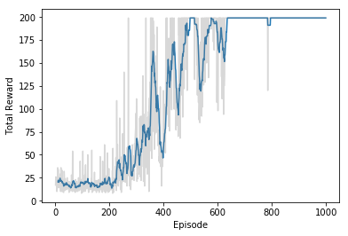

# Deep Q-learning

**Goal**: In this project, I'll build a neural network that can learn to play games through reinforcement learning. More specifically, I'll use Q-learning to train an agent to play a game called [Cart-Pole](https://gym.openai.com/envs/CartPole-v0). In this game, a freely swinging pole is attached to a cart. The cart can move to the left and right, and the goal is to keep the pole upright as long as possible.


We can simulate this game using [OpenAI Gym](https://gym.openai.com/). First, let's check out how OpenAI Gym works. Then, I'll get into training an agent to play the Cart-Pole game.


```python
import gym
import tensorflow as tf
import numpy as np
```


```python
# Create the Cart-Pole game environment
env = gym.make('CartPole-v0')
```

    [2017-04-13 12:20:53,011] Making new env: CartPole-v0


We interact with the simulation through `env`. To show the simulation running, I can use `env.render()` to render one frame. Passing in an action as an integer to `env.step` will generate the next step in the simulation.  You can see how many actions are possible from `env.action_space` and to get a random action you can use `env.action_space.sample()`. This is general to all Gym games. In the Cart-Pole game, there are two possible actions, moving the cart left or right. So there are two actions we can take, encoded as 0 and 1.

Run the code below to watch the simulation run.


```python
env.reset()
rewards = []
for _ in range(100):
    env.render()
    state, reward, done, info = env.step(env.action_space.sample()) # take a random action
    rewards.append(reward)
    if done:
        rewards = []
        env.reset()
```

To shut the window showing the simulation, use `env.close()`.

If you ran the simulation above, we can look at the rewards:


```python
print(rewards[-20:])
```

    [1.0, 1.0, 1.0, 1.0, 1.0, 1.0, 1.0, 1.0, 1.0, 1.0, 1.0, 1.0, 1.0, 1.0, 1.0, 1.0, 1.0, 1.0]
The game resets after the pole has fallen past a certain angle. For each frame while the simulation is running, it returns a reward of 1.0. The longer the game runs, the more reward we get. Then, our network's goal is to maximize the reward by keeping the pole vertical. It will do this by moving the cart to the left and the right.

## Q-Network

We train our Q-learning agent using the Bellman Equation:

$$
Q(s, a) = r + \gamma \max{Q(s', a')}
$$

where $s$ is a state, $a$ is an action, and $s'$ is the next state from state $s$ and action $a$.

Before we used this equation to learn values for a Q-_table_. However, for this game there are a huge number of states available. The state has four values: the position and velocity of the cart, and the position and velocity of the pole. These are all real-valued numbers, so ignoring floating point precisions, you practically have infinite states. Instead of using a table then, I'll replace it with a neural network that will approximate the Q-table lookup function.


Now, our Q value, $Q(s, a)$ is calculated by passing in a state to the network. The output will be Q-values for each available action, with fully connected hidden layers.


As I showed before, we can define our targets for training as $\hat{Q}(s,a) = r + \gamma \max{Q(s', a')}$. Then we update the weights by minimizing $(\hat{Q}(s,a) - Q(s,a))^2$.

For this Cart-Pole game, we have four inputs, one for each value in the state, and two outputs, one for each action. To get $\hat{Q}$, I'll first choose an action, then simulate the game using that action. This will get us the next state, $s'$, and the reward. With that, we can calculate $\hat{Q}$ then pass it back into the $Q$ network to run the optimizer and update the weights.

Below is my implementation of the Q-network. I used two fully connected layers with ReLU activations. Two seems to be good enough, three might be better. Feel free to try it out.


```python
class QNetwork:
    def __init__(self, learning_rate=0.01, state_size=4,
                 action_size=2, hidden_size=10,
                 name='QNetwork'):
        # state inputs to the Q-network
        with tf.variable_scope(name):
            self.inputs_ = tf.placeholder(tf.float32, [None, state_size], name='inputs')

            # One hot encode the actions to later choose the Q-value for the action
            self.actions_ = tf.placeholder(tf.int32, [None], name='actions')
            one_hot_actions = tf.one_hot(self.actions_, action_size)

            # Target Q values for training
            self.targetQs_ = tf.placeholder(tf.float32, [None], name='target')

            # ReLU hidden layers
            self.fc1 = tf.contrib.layers.fully_connected(self.inputs_, hidden_size)
            self.fc2 = tf.contrib.layers.fully_connected(self.fc1, hidden_size)

            # Linear output layer
            self.output = tf.contrib.layers.fully_connected(self.fc2, action_size,
                                                            activation_fn=None)

            ### Train with loss (targetQ - Q)^2
            # output has length 2, for two actions. This lext line chooses
            # one value from output (per row) according to the one-hot encoded actions.
            self.Q = tf.reduce_sum(tf.multiply(self.output, one_hot_actions), axis=1)

            self.loss = tf.reduce_mean(tf.square(self.targetQs_ - self.Q))
            self.opt = tf.train.AdamOptimizer(learning_rate).minimize(self.loss)
```

## Experience replay

Reinforcement learning algorithms can have stability issues due to correlations between states. To reduce correlations when training, we can store the agent's experiences and later draw a random mini-batch of those experiences to train on.

Here, I'll create a `Memory` object that will store our experiences, our transitions $<s, a, r, s'>$. This memory will have a maxmium capacity, so we can keep newer experiences in memory while getting rid of older experiences. Then, I'll sample a random mini-batch of transitions $<s, a, r, s'>$ and train on those.

Below, I've implemented a `Memory` object. If you're unfamiliar with `deque`, this is a double-ended queue. You can think of it like a tube open on both sides. You can put objects in either side of the tube. But if it's full, adding anything more will push an object out the other side. This is a great data structure to use for the memory buffer.


```python
from collections import deque
class Memory():
    def __init__(self, max_size = 1000):
        self.buffer = deque(maxlen=max_size)

    def add(self, experience):
        self.buffer.append(experience)

    def sample(self, batch_size):
        idx = np.random.choice(np.arange(len(self.buffer)),
                               size=batch_size,
                               replace=False)
        return [self.buffer[ii] for ii in idx]
```

## Exploration - Exploitation

To learn about the environment and rules of the game, the agent needs to explore by taking random actions. I'll do this by choosing a random action with some probability $\epsilon$ (epsilon).  That is, with some probability $\epsilon$ the agent will make a random action and with probability $1 - \epsilon$, the agent will choose an action from $Q(s,a)$. This is called an **$\epsilon$-greedy policy**.


At first, the agent needs to do a lot of exploring. Later when it has learned more, the agent can favor choosing actions based on what it has learned. This is called _exploitation_. I'll set it up so the agent is more likely to explore early in training, then more likely to exploit later in training.

## Q-Learning training algorithm

Putting all this together, we can list out the algorithm I'll use to train the network. I'll train the network in _episodes_. One *episode* is one simulation of the game. For this game, the goal is to keep the pole upright for 195 frames. So we can start a new episode once meeting that goal. The game ends if the pole tilts over too far, or if the cart moves too far the left or right. When a game ends, I'll start a new episode. Now, to train the agent:

* Initialize the memory $D$
* Initialize the action-value network $Q$ with random weights
* **For** episode = 1, $M$ **do**
  * **For** $t$, $T$ **do**
     * With probability $\epsilon$ select a random action $a_t$, otherwise select $a_t = \mathrm{argmax}_a Q(s,a)$
     * Execute action $a_t$ in simulator and observe reward $r_{t+1}$ and new state $s_{t+1}$
     * Store transition $<s_t, a_t, r_{t+1}, s_{t+1}>$ in memory $D$
     * Sample random mini-batch from $D$: $<s_j, a_j, r_j, s'_j>$
     * Set $\hat{Q}_j = r_j$ if the episode ends at $j+1$, otherwise set $\hat{Q}_j = r_j + \gamma \max_{a'}{Q(s'_j, a')}$
     * Make a gradient descent step with loss $(\hat{Q}_j - Q(s_j, a_j))^2$
  * **endfor**
* **endfor**

## Hyperparameters

One of the more difficult aspects of reinforcememt learning are the large number of hyperparameters. Not only are we tuning the network, but we're tuning the simulation.


```python
train_episodes = 1000          # max number of episodes to learn from
max_steps = 200                # max steps in an episode
gamma = 0.99                   # future reward discount

# Exploration parameters
explore_start = 1.0            # exploration probability at start
explore_stop = 0.01            # minimum exploration probability
decay_rate = 0.0001            # expotentional decay rate for exploration prob

# Network parameters
hidden_size = 64               # number of units in each Q-network hidden layer
learning_rate = 0.0001         # Q-network learning rate

# Memory parameters
memory_size = 10000            # memory capacity
batch_size = 20                # experience mini-batch size
pretrain_length = batch_size   # number experiences to pretrain the memory
```


```python
tf.reset_default_graph()
mainQN = QNetwork(name='main', hidden_size=hidden_size, learning_rate=learning_rate)
```

## Populate the experience memory

Here I'm re-initializing the simulation and pre-populating the memory. The agent is taking random actions and storing the transitions in memory. This will help the agent with exploring the game.


```python
# Initialize the simulation
env.reset()
# Take one random step to get the pole and cart moving
state, reward, done, _ = env.step(env.action_space.sample())

memory = Memory(max_size=memory_size)

# Make a bunch of random actions and store the experiences
for ii in range(pretrain_length):
    # Uncomment the line below to watch the simulation
    # env.render()

    # Make a random action
    action = env.action_space.sample()
    next_state, reward, done, _ = env.step(action)

    if done:
        # The simulation fails so no next state
        next_state = np.zeros(state.shape)
        # Add experience to memory
        memory.add((state, action, reward, next_state))

        # Start new episode
        env.reset()
        # Take one random step to get the pole and cart moving
        state, reward, done, _ = env.step(env.action_space.sample())
    else:
        # Add experience to memory
        memory.add((state, action, reward, next_state))
        state = next_state
```

## Training

Below I'll train our agent. If you want to watch it train, uncomment the `env.render()` line. This is slow because it's rendering the frames slower than the network can train. But, it's cool to watch the agent get better at the game.


```python
# Now train with experiences
saver = tf.train.Saver()
rewards_list = []
with tf.Session() as sess:
    # Initialize variables
    sess.run(tf.global_variables_initializer())

    step = 0
    for ep in range(1, train_episodes):
        total_reward = 0
        t = 0
        while t < max_steps:
            step += 1
            # Uncomment this next line to watch the training
            # env.render()

            # Explore or Exploit
            explore_p = explore_stop + (explore_start - explore_stop)*np.exp(-decay_rate*step)
            if explore_p > np.random.rand():
                # Make a random action
                action = env.action_space.sample()
            else:
                # Get action from Q-network
                feed = {mainQN.inputs_: state.reshape((1, *state.shape))}
                Qs = sess.run(mainQN.output, feed_dict=feed)
                action = np.argmax(Qs)

            # Take action, get new state and reward
            next_state, reward, done, _ = env.step(action)

            total_reward += reward

            if done:
                # the episode ends so no next state
                next_state = np.zeros(state.shape)
                t = max_steps

                print('Episode: {}'.format(ep),
                      'Total reward: {}'.format(total_reward),
                      'Training loss: {:.4f}'.format(loss),
                      'Explore P: {:.4f}'.format(explore_p))
                rewards_list.append((ep, total_reward))

                # Add experience to memory
                memory.add((state, action, reward, next_state))

                # Start new episode
                env.reset()
                # Take one random step to get the pole and cart moving
                state, reward, done, _ = env.step(env.action_space.sample())

            else:
                # Add experience to memory
                memory.add((state, action, reward, next_state))
                state = next_state
                t += 1

            # Sample mini-batch from memory
            batch = memory.sample(batch_size)
            states = np.array([each[0] for each in batch])
            actions = np.array([each[1] for each in batch])
            rewards = np.array([each[2] for each in batch])
            next_states = np.array([each[3] for each in batch])

            # Train network
            target_Qs = sess.run(mainQN.output, feed_dict={mainQN.inputs_: next_states})

            episode_ends = (next_states == np.zeros(states[0].shape)).all(axis=1)
            target_Qs[episode_ends] = (0, 0)

            targets = rewards + gamma * np.max(target_Qs, axis=1)

            loss, _ = sess.run([mainQN.loss, mainQN.opt],
                                feed_dict={mainQN.inputs_: states,
                                           mainQN.targetQs_: targets,
                                           mainQN.actions_: actions})

    saver.save(sess, "checkpoints/cartpole.ckpt")

```

    Episode: 1 Total reward: 17.0 Training loss: 1.1206 Explore P: 0.9983
    Episode: 2 Total reward: 26.0 Training loss: 1.0218 Explore P: 0.9958
    Episode: 3 Total reward: 25.0 Training loss: 1.0208 Explore P: 0.9933
    Episode: 4 Total reward: 20.0 Training loss: 1.0127 Explore P: 0.9913
    Episode: 5 Total reward: 14.0 Training loss: 0.9955 Explore P: 0.9900
    Episode: 6 Total reward: 10.0 Training loss: 0.9772 Explore P: 0.9890
    Episode: 7 Total reward: 15.0 Training loss: 1.0659 Explore P: 0.9875
    Episode: 8 Total reward: 17.0 Training loss: 1.0213 Explore P: 0.9858
    Episode: 9 Total reward: 36.0 Training loss: 0.9342 Explore P: 0.9823
    Episode: 10 Total reward: 25.0 Training loss: 1.1546 Explore P: 0.9799
    Episode: 11 Total reward: 34.0 Training loss: 1.0758 Explore P: 0.9766
    Episode: 12 Total reward: 14.0 Training loss: 1.2110 Explore P: 0.9753
    Episode: 13 Total reward: 15.0 Training loss: 1.1440 Explore P: 0.9738
    Episode: 14 Total reward: 23.0 Training loss: 1.2101 Explore P: 0.9716
    Episode: 15 Total reward: 25.0 Training loss: 1.1455 Explore P: 0.9692
    Episode: 16 Total reward: 22.0 Training loss: 1.3338 Explore P: 0.9671
    Episode: 17 Total reward: 22.0 Training loss: 1.4460 Explore P: 0.9650
    Episode: 18 Total reward: 29.0 Training loss: 1.2165 Explore P: 0.9622
    Episode: 19 Total reward: 17.0 Training loss: 1.3380 Explore P: 0.9606
    Episode: 20 Total reward: 10.0 Training loss: 1.8483 Explore P: 0.9597
    Episode: 21 Total reward: 36.0 Training loss: 1.5271 Explore P: 0.9562
    Episode: 22 Total reward: 13.0 Training loss: 1.5226 Explore P: 0.9550
    Episode: 23 Total reward: 23.0 Training loss: 2.0890 Explore P: 0.9528
    Episode: 24 Total reward: 14.0 Training loss: 1.9238 Explore P: 0.9515
    Episode: 25 Total reward: 10.0 Training loss: 2.4278 Explore P: 0.9506
    Episode: 26 Total reward: 33.0 Training loss: 4.0854 Explore P: 0.9475
    Episode: 27 Total reward: 15.0 Training loss: 2.5364 Explore P: 0.9461
    Episode: 28 Total reward: 23.0 Training loss: 1.9061 Explore P: 0.9439
    Episode: 29 Total reward: 10.0 Training loss: 2.1729 Explore P: 0.9430
    Episode: 30 Total reward: 9.0 Training loss: 3.2109 Explore P: 0.9422
    Episode: 31 Total reward: 9.0 Training loss: 2.1891 Explore P: 0.9413
    Episode: 32 Total reward: 16.0 Training loss: 3.3236 Explore P: 0.9398
    Episode: 33 Total reward: 32.0 Training loss: 3.2529 Explore P: 0.9369
    Episode: 34 Total reward: 26.0 Training loss: 11.6666 Explore P: 0.9345
    Episode: 35 Total reward: 11.0 Training loss: 2.8504 Explore P: 0.9334
    Episode: 36 Total reward: 21.0 Training loss: 6.6362 Explore P: 0.9315
    Episode: 37 Total reward: 24.0 Training loss: 5.3012 Explore P: 0.9293
    Episode: 38 Total reward: 12.0 Training loss: 8.3892 Explore P: 0.9282
    Episode: 39 Total reward: 18.0 Training loss: 4.8623 Explore P: 0.9265
    Episode: 40 Total reward: 20.0 Training loss: 7.2531 Explore P: 0.9247
    Episode: 41 Total reward: 16.0 Training loss: 12.5615 Explore P: 0.9232
    Episode: 42 Total reward: 12.0 Training loss: 14.6787 Explore P: 0.9222
    Episode: 43 Total reward: 15.0 Training loss: 13.1904 Explore P: 0.9208
    Episode: 44 Total reward: 25.0 Training loss: 5.1145 Explore P: 0.9185
    Episode: 45 Total reward: 16.0 Training loss: 13.5735 Explore P: 0.9171
    Episode: 46 Total reward: 14.0 Training loss: 3.7813 Explore P: 0.9158
    Episode: 47 Total reward: 21.0 Training loss: 2.7451 Explore P: 0.9139
    Episode: 48 Total reward: 13.0 Training loss: 16.0633 Explore P: 0.9127
    Episode: 49 Total reward: 17.0 Training loss: 5.5656 Explore P: 0.9112
    Episode: 50 Total reward: 12.0 Training loss: 10.4045 Explore P: 0.9101
    Episode: 51 Total reward: 9.0 Training loss: 3.8938 Explore P: 0.9093
    Episode: 52 Total reward: 21.0 Training loss: 3.3927 Explore P: 0.9074
    Episode: 53 Total reward: 18.0 Training loss: 8.4606 Explore P: 0.9058
    Episode: 54 Total reward: 11.0 Training loss: 5.5103 Explore P: 0.9048
    Episode: 55 Total reward: 13.0 Training loss: 8.2914 Explore P: 0.9036
    Episode: 56 Total reward: 14.0 Training loss: 10.9073 Explore P: 0.9024
    Episode: 57 Total reward: 11.0 Training loss: 46.1621 Explore P: 0.9014
    Episode: 58 Total reward: 20.0 Training loss: 20.2280 Explore P: 0.8996
    Episode: 59 Total reward: 17.0 Training loss: 27.6749 Explore P: 0.8981
    Episode: 60 Total reward: 28.0 Training loss: 13.9478 Explore P: 0.8956
    Episode: 61 Total reward: 23.0 Training loss: 7.4843 Explore P: 0.8936
    Episode: 62 Total reward: 16.0 Training loss: 22.5546 Explore P: 0.8922
    Episode: 63 Total reward: 10.0 Training loss: 3.4280 Explore P: 0.8913
    Episode: 64 Total reward: 54.0 Training loss: 3.8070 Explore P: 0.8866
    Episode: 65 Total reward: 16.0 Training loss: 24.4927 Explore P: 0.8852
    Episode: 66 Total reward: 15.0 Training loss: 15.5157 Explore P: 0.8838
    Episode: 67 Total reward: 19.0 Training loss: 4.2744 Explore P: 0.8822
    Episode: 68 Total reward: 15.0 Training loss: 4.2704 Explore P: 0.8809
    Episode: 69 Total reward: 11.0 Training loss: 43.5983 Explore P: 0.8799
    Episode: 70 Total reward: 10.0 Training loss: 12.5133 Explore P: 0.8791
    Episode: 71 Total reward: 17.0 Training loss: 21.0250 Explore P: 0.8776
    Episode: 72 Total reward: 19.0 Training loss: 45.7504 Explore P: 0.8759
    Episode: 73 Total reward: 14.0 Training loss: 3.6890 Explore P: 0.8747
    Episode: 74 Total reward: 9.0 Training loss: 54.0030 Explore P: 0.8739
    Episode: 75 Total reward: 23.0 Training loss: 18.6674 Explore P: 0.8720
    Episode: 76 Total reward: 12.0 Training loss: 5.0799 Explore P: 0.8709
    Episode: 77 Total reward: 10.0 Training loss: 36.8676 Explore P: 0.8701
    Episode: 78 Total reward: 17.0 Training loss: 3.4120 Explore P: 0.8686
    Episode: 79 Total reward: 21.0 Training loss: 3.9401 Explore P: 0.8668
    Episode: 80 Total reward: 14.0 Training loss: 3.8938 Explore P: 0.8656
    Episode: 81 Total reward: 16.0 Training loss: 4.6542 Explore P: 0.8642
    Episode: 82 Total reward: 19.0 Training loss: 4.1615 Explore P: 0.8626
    Episode: 83 Total reward: 10.0 Training loss: 3.5368 Explore P: 0.8618
    Episode: 84 Total reward: 16.0 Training loss: 4.1609 Explore P: 0.8604
    Episode: 85 Total reward: 16.0 Training loss: 4.2845 Explore P: 0.8590
    Episode: 86 Total reward: 25.0 Training loss: 13.5774 Explore P: 0.8569
    Episode: 87 Total reward: 12.0 Training loss: 45.5491 Explore P: 0.8559
    Episode: 88 Total reward: 20.0 Training loss: 14.9611 Explore P: 0.8542
    Episode: 89 Total reward: 11.0 Training loss: 54.5635 Explore P: 0.8533
    Episode: 90 Total reward: 16.0 Training loss: 2.8360 Explore P: 0.8519
    Episode: 91 Total reward: 12.0 Training loss: 27.1144 Explore P: 0.8509
    Episode: 92 Total reward: 43.0 Training loss: 20.1494 Explore P: 0.8473
    Episode: 93 Total reward: 21.0 Training loss: 3.7703 Explore P: 0.8456
    Episode: 94 Total reward: 22.0 Training loss: 40.4261 Explore P: 0.8437
    Episode: 95 Total reward: 23.0 Training loss: 36.6660 Explore P: 0.8418
    Episode: 96 Total reward: 17.0 Training loss: 3.6217 Explore P: 0.8404
    Episode: 97 Total reward: 8.0 Training loss: 53.6104 Explore P: 0.8397
    Episode: 98 Total reward: 18.0 Training loss: 2.6480 Explore P: 0.8382
    Episode: 99 Total reward: 17.0 Training loss: 17.7209 Explore P: 0.8368
    Episode: 100 Total reward: 13.0 Training loss: 5.1901 Explore P: 0.8358
    Episode: 101 Total reward: 9.0 Training loss: 18.6505 Explore P: 0.8350
    Episode: 102 Total reward: 54.0 Training loss: 3.5657 Explore P: 0.8306
    Episode: 103 Total reward: 18.0 Training loss: 27.4858 Explore P: 0.8291
    Episode: 104 Total reward: 10.0 Training loss: 3.5050 Explore P: 0.8283
    Episode: 105 Total reward: 14.0 Training loss: 32.5401 Explore P: 0.8271
    Episode: 106 Total reward: 17.0 Training loss: 60.3308 Explore P: 0.8257
    Episode: 107 Total reward: 19.0 Training loss: 71.2544 Explore P: 0.8242
    Episode: 108 Total reward: 12.0 Training loss: 3.7398 Explore P: 0.8232
    Episode: 109 Total reward: 28.0 Training loss: 2.6638 Explore P: 0.8209
    Episode: 110 Total reward: 10.0 Training loss: 3.3126 Explore P: 0.8201
    Episode: 111 Total reward: 29.0 Training loss: 3.2285 Explore P: 0.8178
    Episode: 112 Total reward: 39.0 Training loss: 3.8231 Explore P: 0.8146
    Episode: 113 Total reward: 18.0 Training loss: 18.1708 Explore P: 0.8132
    Episode: 114 Total reward: 21.0 Training loss: 3.3717 Explore P: 0.8115
    Episode: 115 Total reward: 16.0 Training loss: 63.7529 Explore P: 0.8102
    Episode: 116 Total reward: 13.0 Training loss: 91.4296 Explore P: 0.8092
    Episode: 117 Total reward: 18.0 Training loss: 19.4533 Explore P: 0.8078
    Episode: 118 Total reward: 20.0 Training loss: 87.0660 Explore P: 0.8062
    Episode: 119 Total reward: 17.0 Training loss: 2.4913 Explore P: 0.8048
    Episode: 120 Total reward: 50.0 Training loss: 2.2268 Explore P: 0.8008
    Episode: 121 Total reward: 16.0 Training loss: 34.5852 Explore P: 0.7996
    Episode: 122 Total reward: 13.0 Training loss: 1.9908 Explore P: 0.7986
    Episode: 123 Total reward: 9.0 Training loss: 85.5774 Explore P: 0.7978
    Episode: 124 Total reward: 14.0 Training loss: 1.6783 Explore P: 0.7967
    Episode: 125 Total reward: 19.0 Training loss: 1.9224 Explore P: 0.7953
    Episode: 126 Total reward: 18.0 Training loss: 51.5488 Explore P: 0.7938
    Episode: 127 Total reward: 18.0 Training loss: 45.5044 Explore P: 0.7924
    Episode: 128 Total reward: 18.0 Training loss: 22.1692 Explore P: 0.7910
    Episode: 129 Total reward: 12.0 Training loss: 1.6662 Explore P: 0.7901
    Episode: 130 Total reward: 15.0 Training loss: 51.3073 Explore P: 0.7889
    Episode: 131 Total reward: 13.0 Training loss: 25.1820 Explore P: 0.7879
    Episode: 132 Total reward: 14.0 Training loss: 1.2954 Explore P: 0.7868
    Episode: 133 Total reward: 24.0 Training loss: 49.3264 Explore P: 0.7850
    Episode: 134 Total reward: 13.0 Training loss: 37.0957 Explore P: 0.7839
    Episode: 135 Total reward: 55.0 Training loss: 1.5140 Explore P: 0.7797
    Episode: 136 Total reward: 9.0 Training loss: 1.0697 Explore P: 0.7790
    Episode: 137 Total reward: 11.0 Training loss: 19.1716 Explore P: 0.7782
    Episode: 138 Total reward: 15.0 Training loss: 21.7645 Explore P: 0.7770
    Episode: 139 Total reward: 19.0 Training loss: 34.5943 Explore P: 0.7756
    Episode: 140 Total reward: 11.0 Training loss: 80.8147 Explore P: 0.7747
    Episode: 141 Total reward: 16.0 Training loss: 1.2375 Explore P: 0.7735
    Episode: 142 Total reward: 12.0 Training loss: 16.9596 Explore P: 0.7726
    Episode: 143 Total reward: 11.0 Training loss: 1.0556 Explore P: 0.7717
    Episode: 144 Total reward: 19.0 Training loss: 1.5200 Explore P: 0.7703
    Episode: 145 Total reward: 31.0 Training loss: 1.7578 Explore P: 0.7679
    Episode: 146 Total reward: 13.0 Training loss: 17.2973 Explore P: 0.7670
    Episode: 147 Total reward: 22.0 Training loss: 20.3419 Explore P: 0.7653
    Episode: 148 Total reward: 16.0 Training loss: 17.1969 Explore P: 0.7641
    Episode: 149 Total reward: 14.0 Training loss: 18.0493 Explore P: 0.7630
    Episode: 150 Total reward: 11.0 Training loss: 1.4657 Explore P: 0.7622
    Episode: 151 Total reward: 14.0 Training loss: 77.1907 Explore P: 0.7611
    Episode: 152 Total reward: 9.0 Training loss: 1.1595 Explore P: 0.7605
    Episode: 153 Total reward: 22.0 Training loss: 1.6726 Explore P: 0.7588
    Episode: 154 Total reward: 12.0 Training loss: 31.5019 Explore P: 0.7579
    Episode: 155 Total reward: 12.0 Training loss: 17.4513 Explore P: 0.7570
    Episode: 156 Total reward: 17.0 Training loss: 61.1833 Explore P: 0.7558
    Episode: 157 Total reward: 19.0 Training loss: 28.9027 Explore P: 0.7543
    Episode: 158 Total reward: 22.0 Training loss: 1.7281 Explore P: 0.7527
    Episode: 159 Total reward: 11.0 Training loss: 0.8690 Explore P: 0.7519
    Episode: 160 Total reward: 11.0 Training loss: 14.6552 Explore P: 0.7511
    Episode: 161 Total reward: 23.0 Training loss: 0.9547 Explore P: 0.7494
    Episode: 162 Total reward: 9.0 Training loss: 32.5453 Explore P: 0.7487
    Episode: 163 Total reward: 13.0 Training loss: 0.9973 Explore P: 0.7477
    Episode: 164 Total reward: 17.0 Training loss: 15.8071 Explore P: 0.7465
    Episode: 165 Total reward: 14.0 Training loss: 16.6675 Explore P: 0.7455
    Episode: 166 Total reward: 48.0 Training loss: 1.5696 Explore P: 0.7419
    Episode: 167 Total reward: 22.0 Training loss: 27.5716 Explore P: 0.7403
    Episode: 168 Total reward: 12.0 Training loss: 13.4423 Explore P: 0.7395
    Episode: 169 Total reward: 12.0 Training loss: 29.9405 Explore P: 0.7386
    Episode: 170 Total reward: 14.0 Training loss: 16.5667 Explore P: 0.7376
    Episode: 171 Total reward: 13.0 Training loss: 1.3104 Explore P: 0.7366
    Episode: 172 Total reward: 21.0 Training loss: 14.5656 Explore P: 0.7351
    Episode: 173 Total reward: 11.0 Training loss: 20.1742 Explore P: 0.7343
    Episode: 174 Total reward: 9.0 Training loss: 43.2411 Explore P: 0.7336
    Episode: 175 Total reward: 43.0 Training loss: 26.1445 Explore P: 0.7305
    Episode: 176 Total reward: 20.0 Training loss: 29.3663 Explore P: 0.7291
    Episode: 177 Total reward: 28.0 Training loss: 1.2792 Explore P: 0.7271
    Episode: 178 Total reward: 18.0 Training loss: 15.6953 Explore P: 0.7258
    Episode: 179 Total reward: 13.0 Training loss: 0.9252 Explore P: 0.7249
    Episode: 180 Total reward: 15.0 Training loss: 14.0913 Explore P: 0.7238
    Episode: 181 Total reward: 10.0 Training loss: 11.9260 Explore P: 0.7231
    Episode: 182 Total reward: 61.0 Training loss: 43.5261 Explore P: 0.7188
    Episode: 183 Total reward: 23.0 Training loss: 14.8166 Explore P: 0.7171
    Episode: 184 Total reward: 12.0 Training loss: 27.7430 Explore P: 0.7163
    Episode: 185 Total reward: 9.0 Training loss: 1.1685 Explore P: 0.7156
    Episode: 186 Total reward: 13.0 Training loss: 1.0672 Explore P: 0.7147
    Episode: 187 Total reward: 9.0 Training loss: 1.0079 Explore P: 0.7141
    Episode: 188 Total reward: 19.0 Training loss: 23.3360 Explore P: 0.7128
    Episode: 189 Total reward: 27.0 Training loss: 14.8869 Explore P: 0.7109
    Episode: 190 Total reward: 14.0 Training loss: 1.1450 Explore P: 0.7099
    Episode: 191 Total reward: 11.0 Training loss: 24.4285 Explore P: 0.7091
    Episode: 192 Total reward: 48.0 Training loss: 0.8194 Explore P: 0.7058
    Episode: 193 Total reward: 52.0 Training loss: 0.7375 Explore P: 0.7022
    Episode: 194 Total reward: 11.0 Training loss: 1.3513 Explore P: 0.7014
    Episode: 195 Total reward: 9.0 Training loss: 28.9936 Explore P: 0.7008
    Episode: 196 Total reward: 29.0 Training loss: 8.6707 Explore P: 0.6988
    Episode: 197 Total reward: 21.0 Training loss: 1.0339 Explore P: 0.6973
    Episode: 198 Total reward: 35.0 Training loss: 1.1917 Explore P: 0.6949
    Episode: 199 Total reward: 20.0 Training loss: 1.8236 Explore P: 0.6936
    Episode: 200 Total reward: 10.0 Training loss: 9.6862 Explore P: 0.6929
    Episode: 201 Total reward: 12.0 Training loss: 23.2567 Explore P: 0.6921
    Episode: 202 Total reward: 14.0 Training loss: 11.7447 Explore P: 0.6911
    Episode: 203 Total reward: 12.0 Training loss: 31.3232 Explore P: 0.6903
    Episode: 204 Total reward: 19.0 Training loss: 1.8621 Explore P: 0.6890
    Episode: 205 Total reward: 15.0 Training loss: 25.3452 Explore P: 0.6880
    Episode: 206 Total reward: 12.0 Training loss: 19.1190 Explore P: 0.6872
    Episode: 207 Total reward: 12.0 Training loss: 1.5270 Explore P: 0.6863
    Episode: 208 Total reward: 16.0 Training loss: 27.1424 Explore P: 0.6853
    Episode: 209 Total reward: 14.0 Training loss: 17.0334 Explore P: 0.6843
    Episode: 210 Total reward: 16.0 Training loss: 13.6669 Explore P: 0.6832
    Episode: 211 Total reward: 33.0 Training loss: 15.1320 Explore P: 0.6810
    Episode: 212 Total reward: 8.0 Training loss: 14.3394 Explore P: 0.6805
    Episode: 213 Total reward: 57.0 Training loss: 22.5143 Explore P: 0.6767
    Episode: 214 Total reward: 15.0 Training loss: 1.6825 Explore P: 0.6757
    Episode: 215 Total reward: 9.0 Training loss: 15.6226 Explore P: 0.6751
    Episode: 216 Total reward: 15.0 Training loss: 0.8208 Explore P: 0.6741
    Episode: 217 Total reward: 19.0 Training loss: 25.8185 Explore P: 0.6728
    Episode: 218 Total reward: 16.0 Training loss: 28.2378 Explore P: 0.6718
    Episode: 219 Total reward: 21.0 Training loss: 33.2714 Explore P: 0.6704
    Episode: 220 Total reward: 25.0 Training loss: 1.6306 Explore P: 0.6687
    Episode: 221 Total reward: 20.0 Training loss: 27.6761 Explore P: 0.6674
    Episode: 222 Total reward: 37.0 Training loss: 12.6685 Explore P: 0.6650
    Episode: 223 Total reward: 16.0 Training loss: 0.6315 Explore P: 0.6639
    Episode: 224 Total reward: 47.0 Training loss: 29.7206 Explore P: 0.6609
    Episode: 225 Total reward: 24.0 Training loss: 1.2380 Explore P: 0.6593
    Episode: 226 Total reward: 11.0 Training loss: 0.9398 Explore P: 0.6586
    Episode: 227 Total reward: 109.0 Training loss: 19.1867 Explore P: 0.6516
    Episode: 228 Total reward: 43.0 Training loss: 1.0905 Explore P: 0.6488
    Episode: 229 Total reward: 56.0 Training loss: 1.1841 Explore P: 0.6452
    Episode: 230 Total reward: 61.0 Training loss: 0.8106 Explore P: 0.6414
    Episode: 231 Total reward: 21.0 Training loss: 1.2421 Explore P: 0.6401
    Episode: 232 Total reward: 21.0 Training loss: 35.6267 Explore P: 0.6387
    Episode: 233 Total reward: 16.0 Training loss: 24.2003 Explore P: 0.6377
    Episode: 234 Total reward: 43.0 Training loss: 43.3695 Explore P: 0.6350
    Episode: 235 Total reward: 39.0 Training loss: 9.6420 Explore P: 0.6326
    Episode: 236 Total reward: 37.0 Training loss: 0.8997 Explore P: 0.6303
    Episode: 237 Total reward: 22.0 Training loss: 12.0944 Explore P: 0.6289
    Episode: 238 Total reward: 90.0 Training loss: 1.5722 Explore P: 0.6234
    Episode: 239 Total reward: 31.0 Training loss: 10.4122 Explore P: 0.6215
    Episode: 240 Total reward: 21.0 Training loss: 1.1064 Explore P: 0.6202
    Episode: 241 Total reward: 12.0 Training loss: 1.7305 Explore P: 0.6195
    Episode: 242 Total reward: 14.0 Training loss: 1.5095 Explore P: 0.6186
    Episode: 243 Total reward: 21.0 Training loss: 38.0825 Explore P: 0.6173
    Episode: 244 Total reward: 9.0 Training loss: 1.0369 Explore P: 0.6168
    Episode: 245 Total reward: 18.0 Training loss: 14.9495 Explore P: 0.6157
    Episode: 246 Total reward: 48.0 Training loss: 19.2856 Explore P: 0.6128
    Episode: 247 Total reward: 20.0 Training loss: 1.0256 Explore P: 0.6116
    Episode: 248 Total reward: 33.0 Training loss: 9.9197 Explore P: 0.6096
    Episode: 249 Total reward: 73.0 Training loss: 9.3543 Explore P: 0.6053
    Episode: 250 Total reward: 50.0 Training loss: 16.1099 Explore P: 0.6023
    Episode: 251 Total reward: 31.0 Training loss: 43.6362 Explore P: 0.6005
    Episode: 252 Total reward: 57.0 Training loss: 9.9603 Explore P: 0.5971
    Episode: 253 Total reward: 21.0 Training loss: 1.4524 Explore P: 0.5959
    Episode: 254 Total reward: 140.0 Training loss: 18.0943 Explore P: 0.5877
    Episode: 255 Total reward: 27.0 Training loss: 10.9844 Explore P: 0.5862
    Episode: 256 Total reward: 30.0 Training loss: 1.1315 Explore P: 0.5844
    Episode: 257 Total reward: 27.0 Training loss: 2.8768 Explore P: 0.5829
    Episode: 258 Total reward: 34.0 Training loss: 34.8262 Explore P: 0.5810
    Episode: 259 Total reward: 20.0 Training loss: 16.5783 Explore P: 0.5798
    Episode: 260 Total reward: 37.0 Training loss: 18.8078 Explore P: 0.5777
    Episode: 261 Total reward: 23.0 Training loss: 1.1251 Explore P: 0.5764
    Episode: 262 Total reward: 41.0 Training loss: 14.8541 Explore P: 0.5741
    Episode: 263 Total reward: 31.0 Training loss: 21.0861 Explore P: 0.5723
    Episode: 264 Total reward: 37.0 Training loss: 22.5903 Explore P: 0.5703
    Episode: 265 Total reward: 16.0 Training loss: 19.8100 Explore P: 0.5694
    Episode: 266 Total reward: 58.0 Training loss: 1.7579 Explore P: 0.5661
    Episode: 267 Total reward: 43.0 Training loss: 26.5017 Explore P: 0.5637
    Episode: 268 Total reward: 45.0 Training loss: 16.9318 Explore P: 0.5613
    Episode: 269 Total reward: 61.0 Training loss: 58.1334 Explore P: 0.5579
    Episode: 270 Total reward: 199.0 Training loss: 25.5074 Explore P: 0.5471
    Episode: 271 Total reward: 57.0 Training loss: 9.2742 Explore P: 0.5441
    Episode: 272 Total reward: 27.0 Training loss: 1.4723 Explore P: 0.5426
    Episode: 273 Total reward: 41.0 Training loss: 2.2789 Explore P: 0.5404
    Episode: 274 Total reward: 49.0 Training loss: 2.1655 Explore P: 0.5378
    Episode: 275 Total reward: 16.0 Training loss: 28.9118 Explore P: 0.5370
    Episode: 276 Total reward: 22.0 Training loss: 74.8766 Explore P: 0.5358
    Episode: 277 Total reward: 36.0 Training loss: 1.6711 Explore P: 0.5340
    Episode: 278 Total reward: 14.0 Training loss: 1.9132 Explore P: 0.5332
    Episode: 279 Total reward: 12.0 Training loss: 15.4892 Explore P: 0.5326
    Episode: 280 Total reward: 25.0 Training loss: 1.8606 Explore P: 0.5313
    Episode: 281 Total reward: 32.0 Training loss: 1.1279 Explore P: 0.5296
    Episode: 282 Total reward: 38.0 Training loss: 25.1395 Explore P: 0.5277
    Episode: 283 Total reward: 52.0 Training loss: 1.7054 Explore P: 0.5250
    Episode: 284 Total reward: 23.0 Training loss: 22.4826 Explore P: 0.5238
    Episode: 285 Total reward: 61.0 Training loss: 61.2339 Explore P: 0.5207
    Episode: 286 Total reward: 24.0 Training loss: 2.1378 Explore P: 0.5194
    Episode: 287 Total reward: 41.0 Training loss: 0.8545 Explore P: 0.5174
    Episode: 288 Total reward: 49.0 Training loss: 68.7279 Explore P: 0.5149
    Episode: 289 Total reward: 30.0 Training loss: 14.0972 Explore P: 0.5134
    Episode: 290 Total reward: 40.0 Training loss: 36.3917 Explore P: 0.5114
    Episode: 291 Total reward: 22.0 Training loss: 1.6624 Explore P: 0.5102
    Episode: 292 Total reward: 24.0 Training loss: 55.8627 Explore P: 0.5090
    Episode: 293 Total reward: 62.0 Training loss: 21.5204 Explore P: 0.5060
    Episode: 294 Total reward: 49.0 Training loss: 30.3661 Explore P: 0.5035
    Episode: 295 Total reward: 68.0 Training loss: 32.2571 Explore P: 0.5002
    Episode: 296 Total reward: 74.0 Training loss: 33.9799 Explore P: 0.4966
    Episode: 297 Total reward: 81.0 Training loss: 17.8939 Explore P: 0.4927
    Episode: 298 Total reward: 95.0 Training loss: 27.2488 Explore P: 0.4881
    Episode: 299 Total reward: 39.0 Training loss: 31.0800 Explore P: 0.4862
    Episode: 300 Total reward: 111.0 Training loss: 31.5917 Explore P: 0.4810
    Episode: 301 Total reward: 76.0 Training loss: 26.1014 Explore P: 0.4774
    Episode: 302 Total reward: 21.0 Training loss: 1.2520 Explore P: 0.4764
    Episode: 303 Total reward: 30.0 Training loss: 2.3258 Explore P: 0.4750
    Episode: 304 Total reward: 24.0 Training loss: 25.2338 Explore P: 0.4739
    Episode: 305 Total reward: 64.0 Training loss: 2.1968 Explore P: 0.4710
    Episode: 306 Total reward: 35.0 Training loss: 1.3668 Explore P: 0.4693
    Episode: 307 Total reward: 52.0 Training loss: 1.6064 Explore P: 0.4670
    Episode: 308 Total reward: 43.0 Training loss: 1.2549 Explore P: 0.4650
    Episode: 309 Total reward: 42.0 Training loss: 2.0016 Explore P: 0.4631
    Episode: 310 Total reward: 29.0 Training loss: 2.5409 Explore P: 0.4618
    Episode: 311 Total reward: 47.0 Training loss: 26.7988 Explore P: 0.4597
    Episode: 312 Total reward: 90.0 Training loss: 2.6183 Explore P: 0.4556
    Episode: 313 Total reward: 63.0 Training loss: 13.4143 Explore P: 0.4528
    Episode: 314 Total reward: 26.0 Training loss: 1.2748 Explore P: 0.4517
    Episode: 315 Total reward: 92.0 Training loss: 29.4627 Explore P: 0.4476
    Episode: 316 Total reward: 76.0 Training loss: 55.6863 Explore P: 0.4443
    Episode: 317 Total reward: 22.0 Training loss: 1.5616 Explore P: 0.4434
    Episode: 318 Total reward: 80.0 Training loss: 31.1706 Explore P: 0.4399
    Episode: 319 Total reward: 37.0 Training loss: 24.4887 Explore P: 0.4383
    Episode: 320 Total reward: 92.0 Training loss: 30.5411 Explore P: 0.4344
    Episode: 321 Total reward: 83.0 Training loss: 2.8237 Explore P: 0.4309
    Episode: 322 Total reward: 66.0 Training loss: 2.0921 Explore P: 0.4281
    Episode: 323 Total reward: 131.0 Training loss: 1.9476 Explore P: 0.4227
    Episode: 324 Total reward: 136.0 Training loss: 13.6442 Explore P: 0.4171
    Episode: 325 Total reward: 91.0 Training loss: 2.5814 Explore P: 0.4134
    Episode: 326 Total reward: 21.0 Training loss: 1.2230 Explore P: 0.4126
    Episode: 327 Total reward: 78.0 Training loss: 3.0740 Explore P: 0.4095
    Episode: 328 Total reward: 94.0 Training loss: 27.0074 Explore P: 0.4057
    Episode: 329 Total reward: 29.0 Training loss: 55.2112 Explore P: 0.4046
    Episode: 330 Total reward: 16.0 Training loss: 39.2272 Explore P: 0.4039
    Episode: 331 Total reward: 74.0 Training loss: 2.4631 Explore P: 0.4010
    Episode: 332 Total reward: 75.0 Training loss: 1.8856 Explore P: 0.3981
    Episode: 333 Total reward: 74.0 Training loss: 2.2539 Explore P: 0.3953
    Episode: 334 Total reward: 46.0 Training loss: 81.3527 Explore P: 0.3935
    Episode: 335 Total reward: 199.0 Training loss: 2.3580 Explore P: 0.3859
    Episode: 336 Total reward: 36.0 Training loss: 51.8734 Explore P: 0.3846
    Episode: 337 Total reward: 69.0 Training loss: 85.6328 Explore P: 0.3820
    Episode: 338 Total reward: 78.0 Training loss: 2.5133 Explore P: 0.3791
    Episode: 339 Total reward: 78.0 Training loss: 29.1299 Explore P: 0.3762
    Episode: 340 Total reward: 29.0 Training loss: 2.9610 Explore P: 0.3752
    Episode: 341 Total reward: 65.0 Training loss: 23.1379 Explore P: 0.3728
    Episode: 342 Total reward: 91.0 Training loss: 2.2797 Explore P: 0.3695
    Episode: 343 Total reward: 80.0 Training loss: 9.5901 Explore P: 0.3667
    Episode: 344 Total reward: 68.0 Training loss: 2.5456 Explore P: 0.3643
    Episode: 345 Total reward: 97.0 Training loss: 24.8821 Explore P: 0.3608
    Episode: 346 Total reward: 10.0 Training loss: 1.9749 Explore P: 0.3605
    Episode: 347 Total reward: 101.0 Training loss: 39.8190 Explore P: 0.3570
    Episode: 348 Total reward: 112.0 Training loss: 38.0154 Explore P: 0.3531
    Episode: 349 Total reward: 54.0 Training loss: 1.9245 Explore P: 0.3512
    Episode: 350 Total reward: 129.0 Training loss: 47.6669 Explore P: 0.3469
    Episode: 351 Total reward: 73.0 Training loss: 37.4377 Explore P: 0.3444
    Episode: 352 Total reward: 199.0 Training loss: 39.4635 Explore P: 0.3378
    Episode: 353 Total reward: 199.0 Training loss: 3.2080 Explore P: 0.3314
    Episode: 354 Total reward: 199.0 Training loss: 43.3151 Explore P: 0.3250
    Episode: 355 Total reward: 199.0 Training loss: 54.4272 Explore P: 0.3188
    Episode: 356 Total reward: 199.0 Training loss: 1.0675 Explore P: 0.3127
    Episode: 357 Total reward: 46.0 Training loss: 2.9369 Explore P: 0.3114
    Episode: 358 Total reward: 178.0 Training loss: 2.8638 Explore P: 0.3060
    Episode: 359 Total reward: 75.0 Training loss: 96.8733 Explore P: 0.3038
    Episode: 360 Total reward: 199.0 Training loss: 4.0032 Explore P: 0.2980
    Episode: 361 Total reward: 134.0 Training loss: 1.7205 Explore P: 0.2942
    Episode: 362 Total reward: 196.0 Training loss: 27.0177 Explore P: 0.2887
    Episode: 363 Total reward: 178.0 Training loss: 1.4625 Explore P: 0.2838
    Episode: 364 Total reward: 114.0 Training loss: 256.4741 Explore P: 0.2807
    Episode: 365 Total reward: 181.0 Training loss: 2.1684 Explore P: 0.2758
    Episode: 366 Total reward: 56.0 Training loss: 2.2329 Explore P: 0.2743
    Episode: 367 Total reward: 78.0 Training loss: 1.7197 Explore P: 0.2723
    Episode: 368 Total reward: 72.0 Training loss: 2.8824 Explore P: 0.2704
    Episode: 369 Total reward: 99.0 Training loss: 2.0544 Explore P: 0.2678
    Episode: 370 Total reward: 144.0 Training loss: 0.6920 Explore P: 0.2641
    Episode: 371 Total reward: 115.0 Training loss: 81.5059 Explore P: 0.2612
    Episode: 372 Total reward: 74.0 Training loss: 2.1665 Explore P: 0.2594
    Episode: 373 Total reward: 81.0 Training loss: 1.7567 Explore P: 0.2574
    Episode: 374 Total reward: 158.0 Training loss: 48.9284 Explore P: 0.2535
    Episode: 375 Total reward: 93.0 Training loss: 74.1068 Explore P: 0.2512
    Episode: 376 Total reward: 189.0 Training loss: 1.6984 Explore P: 0.2467
    Episode: 377 Total reward: 102.0 Training loss: 1.7045 Explore P: 0.2443
    Episode: 378 Total reward: 94.0 Training loss: 1.5877 Explore P: 0.2421
    Episode: 379 Total reward: 60.0 Training loss: 1.5927 Explore P: 0.2407
    Episode: 380 Total reward: 77.0 Training loss: 83.0749 Explore P: 0.2390
    Episode: 381 Total reward: 71.0 Training loss: 36.4124 Explore P: 0.2374
    Episode: 382 Total reward: 75.0 Training loss: 2.2654 Explore P: 0.2357
    Episode: 383 Total reward: 43.0 Training loss: 3.6230 Explore P: 0.2347
    Episode: 384 Total reward: 48.0 Training loss: 3.7998 Explore P: 0.2336
    Episode: 385 Total reward: 42.0 Training loss: 63.1771 Explore P: 0.2327
    Episode: 386 Total reward: 41.0 Training loss: 3.8370 Explore P: 0.2318
    Episode: 387 Total reward: 61.0 Training loss: 3.0247 Explore P: 0.2304
    Episode: 388 Total reward: 124.0 Training loss: 2.2461 Explore P: 0.2277
    Episode: 389 Total reward: 56.0 Training loss: 2.7025 Explore P: 0.2265
    Episode: 390 Total reward: 37.0 Training loss: 2.1066 Explore P: 0.2257
    Episode: 391 Total reward: 53.0 Training loss: 2.6636 Explore P: 0.2245
    Episode: 392 Total reward: 49.0 Training loss: 3.5180 Explore P: 0.2235
    Episode: 393 Total reward: 16.0 Training loss: 2.0325 Explore P: 0.2232
    Episode: 394 Total reward: 50.0 Training loss: 2.9087 Explore P: 0.2221
    Episode: 395 Total reward: 53.0 Training loss: 3.0709 Explore P: 0.2210
    Episode: 396 Total reward: 37.0 Training loss: 2.5012 Explore P: 0.2202
    Episode: 397 Total reward: 43.0 Training loss: 2.0324 Explore P: 0.2193
    Episode: 398 Total reward: 71.0 Training loss: 3.4181 Explore P: 0.2178
    Episode: 399 Total reward: 120.0 Training loss: 2.0507 Explore P: 0.2153
    Episode: 400 Total reward: 115.0 Training loss: 269.0092 Explore P: 0.2130
    Episode: 401 Total reward: 82.0 Training loss: 2.9670 Explore P: 0.2113
    Episode: 402 Total reward: 53.0 Training loss: 3.1322 Explore P: 0.2103
    Episode: 403 Total reward: 53.0 Training loss: 2.5793 Explore P: 0.2092
    Episode: 404 Total reward: 105.0 Training loss: 266.5888 Explore P: 0.2071
    Episode: 405 Total reward: 58.0 Training loss: 1.9971 Explore P: 0.2060
    Episode: 406 Total reward: 76.0 Training loss: 273.8277 Explore P: 0.2045
    Episode: 407 Total reward: 52.0 Training loss: 1.8329 Explore P: 0.2035
    Episode: 408 Total reward: 144.0 Training loss: 2.1835 Explore P: 0.2007
    Episode: 409 Total reward: 196.0 Training loss: 1.6952 Explore P: 0.1970
    Episode: 410 Total reward: 199.0 Training loss: 186.5703 Explore P: 0.1933
    Episode: 411 Total reward: 97.0 Training loss: 2.1889 Explore P: 0.1916
    Episode: 412 Total reward: 162.0 Training loss: 1.8270 Explore P: 0.1886
    Episode: 413 Total reward: 199.0 Training loss: 1.5334 Explore P: 0.1851
    Episode: 414 Total reward: 94.0 Training loss: 89.0644 Explore P: 0.1835
    Episode: 415 Total reward: 172.0 Training loss: 177.3465 Explore P: 0.1805
    Episode: 416 Total reward: 156.0 Training loss: 24.8199 Explore P: 0.1779
    Episode: 417 Total reward: 120.0 Training loss: 203.1927 Explore P: 0.1759
    Episode: 418 Total reward: 81.0 Training loss: 1.0007 Explore P: 0.1745
    Episode: 419 Total reward: 177.0 Training loss: 1.1296 Explore P: 0.1717
    Episode: 420 Total reward: 127.0 Training loss: 1.4790 Explore P: 0.1696
    Episode: 421 Total reward: 123.0 Training loss: 148.7142 Explore P: 0.1677
    Episode: 422 Total reward: 76.0 Training loss: 1.5432 Explore P: 0.1665
    Episode: 423 Total reward: 109.0 Training loss: 0.9437 Explore P: 0.1648
    Episode: 424 Total reward: 156.0 Training loss: 1.4428 Explore P: 0.1624
    Episode: 425 Total reward: 183.0 Training loss: 1.0240 Explore P: 0.1596
    Episode: 426 Total reward: 199.0 Training loss: 101.1221 Explore P: 0.1567
    Episode: 427 Total reward: 189.0 Training loss: 0.6519 Explore P: 0.1539
    Episode: 428 Total reward: 185.0 Training loss: 0.9902 Explore P: 0.1513
    Episode: 429 Total reward: 112.0 Training loss: 346.1331 Explore P: 0.1497
    Episode: 430 Total reward: 99.0 Training loss: 0.8713 Explore P: 0.1483
    Episode: 431 Total reward: 199.0 Training loss: 1.9936 Explore P: 0.1456
    Episode: 432 Total reward: 174.0 Training loss: 153.9807 Explore P: 0.1433
    Episode: 433 Total reward: 199.0 Training loss: 150.5226 Explore P: 0.1406
    Episode: 434 Total reward: 166.0 Training loss: 0.6997 Explore P: 0.1385
    Episode: 435 Total reward: 150.0 Training loss: 1.1301 Explore P: 0.1366
    Episode: 436 Total reward: 194.0 Training loss: 131.2808 Explore P: 0.1342
    Episode: 437 Total reward: 194.0 Training loss: 0.9597 Explore P: 0.1318
    Episode: 438 Total reward: 100.0 Training loss: 0.3289 Explore P: 0.1306
    Episode: 439 Total reward: 199.0 Training loss: 0.5204 Explore P: 0.1282
    Episode: 440 Total reward: 156.0 Training loss: 1.1504 Explore P: 0.1264
    Episode: 441 Total reward: 100.0 Training loss: 0.4487 Explore P: 0.1252
    Episode: 442 Total reward: 140.0 Training loss: 48.6918 Explore P: 0.1236
    Episode: 443 Total reward: 105.0 Training loss: 1.0646 Explore P: 0.1224
    Episode: 444 Total reward: 99.0 Training loss: 0.4097 Explore P: 0.1213
    Episode: 445 Total reward: 133.0 Training loss: 0.5101 Explore P: 0.1198
    Episode: 446 Total reward: 77.0 Training loss: 0.6569 Explore P: 0.1190
    Episode: 447 Total reward: 119.0 Training loss: 0.4804 Explore P: 0.1177
    Episode: 448 Total reward: 93.0 Training loss: 0.5663 Explore P: 0.1167
    Episode: 449 Total reward: 122.0 Training loss: 0.4641 Explore P: 0.1154
    Episode: 450 Total reward: 82.0 Training loss: 0.4969 Explore P: 0.1145
    Episode: 451 Total reward: 83.0 Training loss: 0.3306 Explore P: 0.1137
    Episode: 452 Total reward: 97.0 Training loss: 131.7292 Explore P: 0.1127
    Episode: 453 Total reward: 98.0 Training loss: 0.2198 Explore P: 0.1117
    Episode: 454 Total reward: 70.0 Training loss: 0.5275 Explore P: 0.1110
    Episode: 455 Total reward: 93.0 Training loss: 0.7534 Explore P: 0.1100
    Episode: 456 Total reward: 199.0 Training loss: 0.6405 Explore P: 0.1081
    Episode: 457 Total reward: 180.0 Training loss: 15.9532 Explore P: 0.1063
    Episode: 458 Total reward: 199.0 Training loss: 7.7940 Explore P: 0.1044
    Episode: 459 Total reward: 99.0 Training loss: 0.2215 Explore P: 0.1035
    Episode: 460 Total reward: 146.0 Training loss: 1.3165 Explore P: 0.1021
    Episode: 461 Total reward: 68.0 Training loss: 0.7169 Explore P: 0.1015
    Episode: 462 Total reward: 130.0 Training loss: 124.4015 Explore P: 0.1003
    Episode: 463 Total reward: 154.0 Training loss: 0.3014 Explore P: 0.0989
    Episode: 464 Total reward: 199.0 Training loss: 1.0692 Explore P: 0.0972
    Episode: 465 Total reward: 115.0 Training loss: 0.8992 Explore P: 0.0962
    Episode: 466 Total reward: 128.0 Training loss: 0.3343 Explore P: 0.0951
    Episode: 467 Total reward: 199.0 Training loss: 0.3627 Explore P: 0.0934
    Episode: 468 Total reward: 183.0 Training loss: 0.5766 Explore P: 0.0919
    Episode: 469 Total reward: 199.0 Training loss: 1.0745 Explore P: 0.0903
    Episode: 470 Total reward: 199.0 Training loss: 0.1914 Explore P: 0.0887
    Episode: 471 Total reward: 91.0 Training loss: 0.9570 Explore P: 0.0880
    Episode: 472 Total reward: 109.0 Training loss: 0.4631 Explore P: 0.0872
    Episode: 473 Total reward: 199.0 Training loss: 0.4437 Explore P: 0.0856
    Episode: 474 Total reward: 199.0 Training loss: 0.2497 Explore P: 0.0841
    Episode: 475 Total reward: 199.0 Training loss: 0.1998 Explore P: 0.0827
    Episode: 476 Total reward: 122.0 Training loss: 0.5317 Explore P: 0.0818
    Episode: 477 Total reward: 199.0 Training loss: 0.2521 Explore P: 0.0804
    Episode: 478 Total reward: 199.0 Training loss: 2.0478 Explore P: 0.0790
    Episode: 479 Total reward: 199.0 Training loss: 0.5112 Explore P: 0.0776
    Episode: 480 Total reward: 199.0 Training loss: 1.5277 Explore P: 0.0763
    Episode: 481 Total reward: 199.0 Training loss: 0.5674 Explore P: 0.0750
    Episode: 482 Total reward: 199.0 Training loss: 442.6313 Explore P: 0.0737
    Episode: 483 Total reward: 143.0 Training loss: 0.3567 Explore P: 0.0728
    Episode: 484 Total reward: 199.0 Training loss: 0.1174 Explore P: 0.0716
    Episode: 485 Total reward: 199.0 Training loss: 0.2728 Explore P: 0.0704
    Episode: 486 Total reward: 199.0 Training loss: 0.1145 Explore P: 0.0692
    Episode: 487 Total reward: 120.0 Training loss: 0.3687 Explore P: 0.0685
    Episode: 488 Total reward: 144.0 Training loss: 0.2456 Explore P: 0.0676
    Episode: 489 Total reward: 199.0 Training loss: 0.2180 Explore P: 0.0665
    Episode: 490 Total reward: 199.0 Training loss: 0.5846 Explore P: 0.0654
    Episode: 491 Total reward: 199.0 Training loss: 0.2266 Explore P: 0.0643
    Episode: 492 Total reward: 199.0 Training loss: 0.3522 Explore P: 0.0632
    Episode: 493 Total reward: 199.0 Training loss: 0.5072 Explore P: 0.0622
    Episode: 494 Total reward: 199.0 Training loss: 1.6455 Explore P: 0.0611
    Episode: 495 Total reward: 199.0 Training loss: 0.3686 Explore P: 0.0601
    Episode: 496 Total reward: 199.0 Training loss: 0.3517 Explore P: 0.0592
    Episode: 497 Total reward: 199.0 Training loss: 3.3342 Explore P: 0.0582
    Episode: 498 Total reward: 199.0 Training loss: 0.3798 Explore P: 0.0572
    Episode: 499 Total reward: 199.0 Training loss: 0.3504 Explore P: 0.0563
    Episode: 500 Total reward: 199.0 Training loss: 0.9721 Explore P: 0.0554
    Episode: 501 Total reward: 199.0 Training loss: 0.4730 Explore P: 0.0545
    Episode: 502 Total reward: 199.0 Training loss: 0.7233 Explore P: 0.0536
    Episode: 503 Total reward: 199.0 Training loss: 0.5176 Explore P: 0.0528
    Episode: 504 Total reward: 199.0 Training loss: 0.3896 Explore P: 0.0519
    Episode: 505 Total reward: 199.0 Training loss: 0.2758 Explore P: 0.0511
    Episode: 506 Total reward: 199.0 Training loss: 0.5355 Explore P: 0.0503
    Episode: 507 Total reward: 199.0 Training loss: 0.6228 Explore P: 0.0495
    Episode: 508 Total reward: 199.0 Training loss: 0.7505 Explore P: 0.0487
    Episode: 509 Total reward: 199.0 Training loss: 0.3618 Explore P: 0.0479
    Episode: 510 Total reward: 199.0 Training loss: 0.5037 Explore P: 0.0472
    Episode: 511 Total reward: 199.0 Training loss: 0.3503 Explore P: 0.0465
    Episode: 512 Total reward: 199.0 Training loss: 0.4080 Explore P: 0.0457
    Episode: 513 Total reward: 199.0 Training loss: 0.3247 Explore P: 0.0450
    Episode: 514 Total reward: 199.0 Training loss: 0.4891 Explore P: 0.0444
    Episode: 515 Total reward: 132.0 Training loss: 0.2252 Explore P: 0.0439
    Episode: 516 Total reward: 199.0 Training loss: 0.5318 Explore P: 0.0432
    Episode: 517 Total reward: 199.0 Training loss: 0.4207 Explore P: 0.0426
    Episode: 518 Total reward: 199.0 Training loss: 0.3851 Explore P: 0.0419
    Episode: 519 Total reward: 199.0 Training loss: 0.3571 Explore P: 0.0413
    Episode: 520 Total reward: 199.0 Training loss: 0.3445 Explore P: 0.0407
    Episode: 521 Total reward: 191.0 Training loss: 0.3592 Explore P: 0.0401
    Episode: 522 Total reward: 199.0 Training loss: 161.0777 Explore P: 0.0395
    Episode: 523 Total reward: 148.0 Training loss: 0.2385 Explore P: 0.0391
    Episode: 524 Total reward: 197.0 Training loss: 0.4102 Explore P: 0.0385
    Episode: 525 Total reward: 115.0 Training loss: 0.5136 Explore P: 0.0382
    Episode: 526 Total reward: 144.0 Training loss: 0.1992 Explore P: 0.0378
    Episode: 527 Total reward: 199.0 Training loss: 0.5193 Explore P: 0.0372
    Episode: 528 Total reward: 123.0 Training loss: 0.3048 Explore P: 0.0369
    Episode: 529 Total reward: 107.0 Training loss: 265.0688 Explore P: 0.0366
    Episode: 530 Total reward: 142.0 Training loss: 0.3150 Explore P: 0.0362
    Episode: 531 Total reward: 88.0 Training loss: 0.3592 Explore P: 0.0360
    Episode: 532 Total reward: 101.0 Training loss: 0.2379 Explore P: 0.0358
    Episode: 533 Total reward: 109.0 Training loss: 0.2066 Explore P: 0.0355
    Episode: 534 Total reward: 85.0 Training loss: 0.3785 Explore P: 0.0353
    Episode: 535 Total reward: 170.0 Training loss: 0.3857 Explore P: 0.0348
    Episode: 536 Total reward: 100.0 Training loss: 0.2388 Explore P: 0.0346
    Episode: 537 Total reward: 173.0 Training loss: 0.3175 Explore P: 0.0342
    Episode: 538 Total reward: 119.0 Training loss: 0.8095 Explore P: 0.0339
    Episode: 539 Total reward: 149.0 Training loss: 0.4718 Explore P: 0.0335
    Episode: 540 Total reward: 199.0 Training loss: 0.2053 Explore P: 0.0331
    Episode: 541 Total reward: 92.0 Training loss: 0.2423 Explore P: 0.0329
    Episode: 542 Total reward: 118.0 Training loss: 0.1868 Explore P: 0.0326
    Episode: 543 Total reward: 102.0 Training loss: 0.2320 Explore P: 0.0324
    Episode: 544 Total reward: 166.0 Training loss: 0.2058 Explore P: 0.0320
    Episode: 545 Total reward: 199.0 Training loss: 0.2577 Explore P: 0.0316
    Episode: 546 Total reward: 199.0 Training loss: 0.5126 Explore P: 0.0311
    Episode: 547 Total reward: 197.0 Training loss: 0.4180 Explore P: 0.0307
    Episode: 548 Total reward: 126.0 Training loss: 0.2888 Explore P: 0.0305
    Episode: 549 Total reward: 140.0 Training loss: 0.1868 Explore P: 0.0302
    Episode: 550 Total reward: 193.0 Training loss: 0.2071 Explore P: 0.0298
    Episode: 551 Total reward: 199.0 Training loss: 0.1574 Explore P: 0.0294
    Episode: 552 Total reward: 199.0 Training loss: 0.3217 Explore P: 0.0290
    Episode: 553 Total reward: 129.0 Training loss: 66.6600 Explore P: 0.0288
    Episode: 554 Total reward: 198.0 Training loss: 0.2420 Explore P: 0.0284
    Episode: 555 Total reward: 199.0 Training loss: 0.2514 Explore P: 0.0280
    Episode: 556 Total reward: 153.0 Training loss: 0.2211 Explore P: 0.0278
    Episode: 557 Total reward: 169.0 Training loss: 0.2779 Explore P: 0.0275
    Episode: 558 Total reward: 199.0 Training loss: 0.1513 Explore P: 0.0271
    Episode: 559 Total reward: 150.0 Training loss: 0.1887 Explore P: 0.0269
    Episode: 560 Total reward: 199.0 Training loss: 0.3669 Explore P: 0.0265
    Episode: 561 Total reward: 199.0 Training loss: 0.1444 Explore P: 0.0262
    Episode: 562 Total reward: 199.0 Training loss: 0.2820 Explore P: 0.0259
    Episode: 563 Total reward: 199.0 Training loss: 0.1695 Explore P: 0.0256
    Episode: 564 Total reward: 199.0 Training loss: 0.1208 Explore P: 0.0253
    Episode: 565 Total reward: 181.0 Training loss: 0.3566 Explore P: 0.0250
    Episode: 566 Total reward: 134.0 Training loss: 19.3122 Explore P: 0.0248
    Episode: 567 Total reward: 199.0 Training loss: 0.4493 Explore P: 0.0245
    Episode: 568 Total reward: 199.0 Training loss: 0.1615 Explore P: 0.0242
    Episode: 569 Total reward: 199.0 Training loss: 0.2993 Explore P: 0.0239
    Episode: 570 Total reward: 199.0 Training loss: 0.2165 Explore P: 0.0237
    Episode: 571 Total reward: 199.0 Training loss: 0.1909 Explore P: 0.0234
    Episode: 572 Total reward: 199.0 Training loss: 0.1677 Explore P: 0.0231
    Episode: 573 Total reward: 199.0 Training loss: 0.2876 Explore P: 0.0229
    Episode: 574 Total reward: 199.0 Training loss: 0.1348 Explore P: 0.0226
    Episode: 575 Total reward: 199.0 Training loss: 0.2104 Explore P: 0.0224
    Episode: 576 Total reward: 199.0 Training loss: 0.1656 Explore P: 0.0221
    Episode: 577 Total reward: 187.0 Training loss: 0.0771 Explore P: 0.0219
    Episode: 578 Total reward: 199.0 Training loss: 0.0697 Explore P: 0.0217
    Episode: 579 Total reward: 199.0 Training loss: 0.1110 Explore P: 0.0214
    Episode: 580 Total reward: 199.0 Training loss: 0.2245 Explore P: 0.0212
    Episode: 581 Total reward: 199.0 Training loss: 0.1553 Explore P: 0.0210
    Episode: 582 Total reward: 199.0 Training loss: 0.1718 Explore P: 0.0208
    Episode: 583 Total reward: 199.0 Training loss: 0.1715 Explore P: 0.0206
    Episode: 584 Total reward: 173.0 Training loss: 0.1197 Explore P: 0.0204
    Episode: 585 Total reward: 199.0 Training loss: 0.1747 Explore P: 0.0202
    Episode: 586 Total reward: 199.0 Training loss: 0.1082 Explore P: 0.0200
    Episode: 587 Total reward: 164.0 Training loss: 0.1912 Explore P: 0.0198
    Episode: 588 Total reward: 199.0 Training loss: 0.1618 Explore P: 0.0196
    Episode: 589 Total reward: 199.0 Training loss: 0.2976 Explore P: 0.0194
    Episode: 590 Total reward: 199.0 Training loss: 0.1695 Explore P: 0.0192
    Episode: 591 Total reward: 199.0 Training loss: 0.2299 Explore P: 0.0191
    Episode: 592 Total reward: 199.0 Training loss: 0.2095 Explore P: 0.0189
    Episode: 593 Total reward: 199.0 Training loss: 0.2393 Explore P: 0.0187
    Episode: 594 Total reward: 199.0 Training loss: 0.1403 Explore P: 0.0185
    Episode: 595 Total reward: 187.0 Training loss: 0.3047 Explore P: 0.0184
    Episode: 596 Total reward: 193.0 Training loss: 0.2958 Explore P: 0.0182
    Episode: 597 Total reward: 107.0 Training loss: 0.2838 Explore P: 0.0181
    Episode: 598 Total reward: 156.0 Training loss: 264.9241 Explore P: 0.0180
    Episode: 599 Total reward: 199.0 Training loss: 121.2079 Explore P: 0.0178
    Episode: 600 Total reward: 163.0 Training loss: 0.1022 Explore P: 0.0177
    Episode: 601 Total reward: 98.0 Training loss: 268.8141 Explore P: 0.0176
    Episode: 602 Total reward: 154.0 Training loss: 0.2155 Explore P: 0.0175
    Episode: 603 Total reward: 199.0 Training loss: 0.1730 Explore P: 0.0174
    Episode: 604 Total reward: 175.0 Training loss: 0.3001 Explore P: 0.0173
    Episode: 605 Total reward: 199.0 Training loss: 0.2370 Explore P: 0.0171
    Episode: 606 Total reward: 164.0 Training loss: 0.2679 Explore P: 0.0170
    Episode: 607 Total reward: 199.0 Training loss: 0.1331 Explore P: 0.0169
    Episode: 608 Total reward: 175.0 Training loss: 0.1852 Explore P: 0.0167
    Episode: 609 Total reward: 199.0 Training loss: 0.1131 Explore P: 0.0166
    Episode: 610 Total reward: 199.0 Training loss: 0.2251 Explore P: 0.0165
    Episode: 611 Total reward: 175.0 Training loss: 0.2115 Explore P: 0.0164
    Episode: 612 Total reward: 199.0 Training loss: 0.1187 Explore P: 0.0162
    Episode: 613 Total reward: 199.0 Training loss: 0.2060 Explore P: 0.0161
    Episode: 614 Total reward: 135.0 Training loss: 0.0743 Explore P: 0.0160
    Episode: 615 Total reward: 169.0 Training loss: 0.2691 Explore P: 0.0159
    Episode: 616 Total reward: 111.0 Training loss: 0.1496 Explore P: 0.0159
    Episode: 617 Total reward: 199.0 Training loss: 0.3814 Explore P: 0.0158
    Episode: 618 Total reward: 125.0 Training loss: 0.3321 Explore P: 0.0157
    Episode: 619 Total reward: 127.0 Training loss: 276.1676 Explore P: 0.0156
    Episode: 620 Total reward: 199.0 Training loss: 279.7686 Explore P: 0.0155
    Episode: 621 Total reward: 199.0 Training loss: 0.1653 Explore P: 0.0154
    Episode: 622 Total reward: 94.0 Training loss: 0.2949 Explore P: 0.0153
    Episode: 623 Total reward: 199.0 Training loss: 0.2496 Explore P: 0.0152
    Episode: 624 Total reward: 125.0 Training loss: 0.2326 Explore P: 0.0152
    Episode: 625 Total reward: 137.0 Training loss: 0.1459 Explore P: 0.0151
    Episode: 626 Total reward: 182.0 Training loss: 0.1479 Explore P: 0.0150
    Episode: 627 Total reward: 199.0 Training loss: 0.2285 Explore P: 0.0149
    Episode: 628 Total reward: 199.0 Training loss: 0.1959 Explore P: 0.0148
    Episode: 629 Total reward: 199.0 Training loss: 0.1892 Explore P: 0.0147
    Episode: 630 Total reward: 199.0 Training loss: 0.2210 Explore P: 0.0146
    Episode: 631 Total reward: 199.0 Training loss: 0.1756 Explore P: 0.0145
    Episode: 632 Total reward: 199.0 Training loss: 0.2079 Explore P: 0.0144
    Episode: 633 Total reward: 199.0 Training loss: 0.2662 Explore P: 0.0144
    Episode: 634 Total reward: 199.0 Training loss: 0.1618 Explore P: 0.0143
    Episode: 635 Total reward: 199.0 Training loss: 0.0950 Explore P: 0.0142
    Episode: 636 Total reward: 199.0 Training loss: 0.3159 Explore P: 0.0141
    Episode: 637 Total reward: 199.0 Training loss: 0.1576 Explore P: 0.0140
    Episode: 638 Total reward: 199.0 Training loss: 0.2316 Explore P: 0.0139
    Episode: 639 Total reward: 199.0 Training loss: 0.1536 Explore P: 0.0139
    Episode: 640 Total reward: 199.0 Training loss: 0.1452 Explore P: 0.0138
    Episode: 641 Total reward: 199.0 Training loss: 0.1300 Explore P: 0.0137
    Episode: 642 Total reward: 199.0 Training loss: 0.1305 Explore P: 0.0136
    Episode: 643 Total reward: 199.0 Training loss: 0.1132 Explore P: 0.0136
    Episode: 644 Total reward: 199.0 Training loss: 0.1014 Explore P: 0.0135
    Episode: 645 Total reward: 199.0 Training loss: 0.2034 Explore P: 0.0134
    Episode: 646 Total reward: 199.0 Training loss: 0.1455 Explore P: 0.0134
    Episode: 647 Total reward: 199.0 Training loss: 0.2939 Explore P: 0.0133
    Episode: 648 Total reward: 199.0 Training loss: 0.1605 Explore P: 0.0132
    Episode: 649 Total reward: 199.0 Training loss: 0.2137 Explore P: 0.0132
    Episode: 650 Total reward: 199.0 Training loss: 0.1560 Explore P: 0.0131
    Episode: 651 Total reward: 199.0 Training loss: 0.1156 Explore P: 0.0130
    Episode: 652 Total reward: 199.0 Training loss: 302.5273 Explore P: 0.0130
    Episode: 653 Total reward: 199.0 Training loss: 0.1242 Explore P: 0.0129
    Episode: 654 Total reward: 199.0 Training loss: 0.1443 Explore P: 0.0129
    Episode: 655 Total reward: 199.0 Training loss: 0.1707 Explore P: 0.0128
    Episode: 656 Total reward: 199.0 Training loss: 0.1338 Explore P: 0.0128
    Episode: 657 Total reward: 199.0 Training loss: 0.2094 Explore P: 0.0127
    Episode: 658 Total reward: 199.0 Training loss: 0.1659 Explore P: 0.0126
    Episode: 659 Total reward: 199.0 Training loss: 0.1740 Explore P: 0.0126
    Episode: 660 Total reward: 199.0 Training loss: 0.0645 Explore P: 0.0125
    Episode: 661 Total reward: 199.0 Training loss: 0.2673 Explore P: 0.0125
    Episode: 662 Total reward: 199.0 Training loss: 276.5634 Explore P: 0.0124
    Episode: 663 Total reward: 199.0 Training loss: 0.2976 Explore P: 0.0124
    Episode: 664 Total reward: 199.0 Training loss: 0.3700 Explore P: 0.0123
    Episode: 665 Total reward: 199.0 Training loss: 0.1215 Explore P: 0.0123
    Episode: 666 Total reward: 199.0 Training loss: 0.2097 Explore P: 0.0123
    Episode: 667 Total reward: 199.0 Training loss: 0.1809 Explore P: 0.0122
    Episode: 668 Total reward: 199.0 Training loss: 0.2194 Explore P: 0.0122
    Episode: 669 Total reward: 199.0 Training loss: 0.1520 Explore P: 0.0121
    Episode: 670 Total reward: 199.0 Training loss: 0.2190 Explore P: 0.0121
    Episode: 671 Total reward: 199.0 Training loss: 0.3460 Explore P: 0.0120
    Episode: 672 Total reward: 199.0 Training loss: 0.4117 Explore P: 0.0120
    Episode: 673 Total reward: 199.0 Training loss: 0.3018 Explore P: 0.0120
    Episode: 674 Total reward: 199.0 Training loss: 0.1809 Explore P: 0.0119
    Episode: 675 Total reward: 199.0 Training loss: 0.3239 Explore P: 0.0119
    Episode: 676 Total reward: 199.0 Training loss: 0.2188 Explore P: 0.0119
    Episode: 677 Total reward: 199.0 Training loss: 251.4696 Explore P: 0.0118
    Episode: 678 Total reward: 199.0 Training loss: 276.1304 Explore P: 0.0118
    Episode: 679 Total reward: 199.0 Training loss: 274.9297 Explore P: 0.0117
    Episode: 680 Total reward: 199.0 Training loss: 0.1281 Explore P: 0.0117
    Episode: 681 Total reward: 199.0 Training loss: 0.2222 Explore P: 0.0117
    Episode: 682 Total reward: 199.0 Training loss: 0.2037 Explore P: 0.0116
    Episode: 683 Total reward: 199.0 Training loss: 0.2463 Explore P: 0.0116
    Episode: 684 Total reward: 199.0 Training loss: 0.2739 Explore P: 0.0116
    Episode: 685 Total reward: 199.0 Training loss: 0.3237 Explore P: 0.0115
    Episode: 686 Total reward: 199.0 Training loss: 0.2533 Explore P: 0.0115
    Episode: 687 Total reward: 199.0 Training loss: 0.1558 Explore P: 0.0115
    Episode: 688 Total reward: 199.0 Training loss: 0.1950 Explore P: 0.0115
    Episode: 689 Total reward: 199.0 Training loss: 0.1954 Explore P: 0.0114
    Episode: 690 Total reward: 199.0 Training loss: 0.2714 Explore P: 0.0114
    Episode: 691 Total reward: 199.0 Training loss: 0.2191 Explore P: 0.0114
    Episode: 692 Total reward: 199.0 Training loss: 0.4375 Explore P: 0.0113
    Episode: 693 Total reward: 199.0 Training loss: 0.2202 Explore P: 0.0113
    Episode: 694 Total reward: 199.0 Training loss: 0.2222 Explore P: 0.0113
    Episode: 695 Total reward: 199.0 Training loss: 0.2798 Explore P: 0.0113
    Episode: 696 Total reward: 199.0 Training loss: 0.6002 Explore P: 0.0112
    Episode: 697 Total reward: 199.0 Training loss: 0.2640 Explore P: 0.0112
    Episode: 698 Total reward: 199.0 Training loss: 0.1669 Explore P: 0.0112
    Episode: 699 Total reward: 199.0 Training loss: 252.0655 Explore P: 0.0112
    Episode: 700 Total reward: 199.0 Training loss: 0.1837 Explore P: 0.0111
    Episode: 701 Total reward: 199.0 Training loss: 0.1534 Explore P: 0.0111
    Episode: 702 Total reward: 199.0 Training loss: 0.1900 Explore P: 0.0111
    Episode: 703 Total reward: 199.0 Training loss: 0.2640 Explore P: 0.0111
    Episode: 704 Total reward: 199.0 Training loss: 0.1902 Explore P: 0.0111
    Episode: 705 Total reward: 199.0 Training loss: 0.2412 Explore P: 0.0110
    Episode: 706 Total reward: 199.0 Training loss: 0.1321 Explore P: 0.0110
    Episode: 707 Total reward: 199.0 Training loss: 0.1851 Explore P: 0.0110
    Episode: 708 Total reward: 199.0 Training loss: 0.2158 Explore P: 0.0110
    Episode: 709 Total reward: 199.0 Training loss: 0.1619 Explore P: 0.0110
    Episode: 710 Total reward: 199.0 Training loss: 0.2560 Explore P: 0.0109
    Episode: 711 Total reward: 199.0 Training loss: 0.1775 Explore P: 0.0109
    Episode: 712 Total reward: 199.0 Training loss: 0.1768 Explore P: 0.0109
    Episode: 713 Total reward: 199.0 Training loss: 232.6123 Explore P: 0.0109
    Episode: 714 Total reward: 199.0 Training loss: 0.1538 Explore P: 0.0109
    Episode: 715 Total reward: 199.0 Training loss: 0.1527 Explore P: 0.0109
    Episode: 716 Total reward: 199.0 Training loss: 0.1468 Explore P: 0.0108
    Episode: 717 Total reward: 199.0 Training loss: 0.1575 Explore P: 0.0108
    Episode: 718 Total reward: 199.0 Training loss: 0.1759 Explore P: 0.0108
    Episode: 719 Total reward: 199.0 Training loss: 0.2107 Explore P: 0.0108
    Episode: 720 Total reward: 199.0 Training loss: 0.2620 Explore P: 0.0108
    Episode: 721 Total reward: 199.0 Training loss: 0.4076 Explore P: 0.0108
    Episode: 722 Total reward: 199.0 Training loss: 219.6660 Explore P: 0.0107
    Episode: 723 Total reward: 199.0 Training loss: 0.2111 Explore P: 0.0107
    Episode: 724 Total reward: 199.0 Training loss: 0.2733 Explore P: 0.0107
    Episode: 725 Total reward: 199.0 Training loss: 0.2408 Explore P: 0.0107
    Episode: 726 Total reward: 199.0 Training loss: 0.2102 Explore P: 0.0107
    Episode: 727 Total reward: 199.0 Training loss: 0.1467 Explore P: 0.0107
    Episode: 728 Total reward: 199.0 Training loss: 0.2066 Explore P: 0.0107
    Episode: 729 Total reward: 199.0 Training loss: 216.0451 Explore P: 0.0106
    Episode: 730 Total reward: 199.0 Training loss: 0.2248 Explore P: 0.0106
    Episode: 731 Total reward: 199.0 Training loss: 0.2352 Explore P: 0.0106
    Episode: 732 Total reward: 199.0 Training loss: 0.2236 Explore P: 0.0106
    Episode: 733 Total reward: 199.0 Training loss: 219.8582 Explore P: 0.0106
    Episode: 734 Total reward: 199.0 Training loss: 0.2165 Explore P: 0.0106
    Episode: 735 Total reward: 199.0 Training loss: 0.3920 Explore P: 0.0106
    Episode: 736 Total reward: 199.0 Training loss: 0.2034 Explore P: 0.0106
    Episode: 737 Total reward: 199.0 Training loss: 0.1787 Explore P: 0.0105
    Episode: 738 Total reward: 199.0 Training loss: 0.1407 Explore P: 0.0105
    Episode: 739 Total reward: 199.0 Training loss: 0.2066 Explore P: 0.0105
    Episode: 740 Total reward: 199.0 Training loss: 0.3307 Explore P: 0.0105
    Episode: 741 Total reward: 199.0 Training loss: 0.5348 Explore P: 0.0105
    Episode: 742 Total reward: 199.0 Training loss: 202.3616 Explore P: 0.0105
    Episode: 743 Total reward: 199.0 Training loss: 0.2714 Explore P: 0.0105
    Episode: 744 Total reward: 199.0 Training loss: 0.2981 Explore P: 0.0105
    Episode: 745 Total reward: 199.0 Training loss: 0.4512 Explore P: 0.0105
    Episode: 746 Total reward: 199.0 Training loss: 0.2276 Explore P: 0.0105
    Episode: 747 Total reward: 199.0 Training loss: 0.2910 Explore P: 0.0105
    Episode: 748 Total reward: 199.0 Training loss: 0.3679 Explore P: 0.0104
    Episode: 749 Total reward: 199.0 Training loss: 0.2004 Explore P: 0.0104
    Episode: 750 Total reward: 199.0 Training loss: 0.1658 Explore P: 0.0104
    Episode: 751 Total reward: 199.0 Training loss: 0.3183 Explore P: 0.0104
    Episode: 752 Total reward: 199.0 Training loss: 0.2062 Explore P: 0.0104
    Episode: 753 Total reward: 199.0 Training loss: 0.1929 Explore P: 0.0104
    Episode: 754 Total reward: 199.0 Training loss: 0.2472 Explore P: 0.0104
    Episode: 755 Total reward: 199.0 Training loss: 0.1489 Explore P: 0.0104
    Episode: 756 Total reward: 199.0 Training loss: 0.4016 Explore P: 0.0104
    Episode: 757 Total reward: 199.0 Training loss: 0.1371 Explore P: 0.0104
    Episode: 758 Total reward: 199.0 Training loss: 0.4689 Explore P: 0.0104
    Episode: 759 Total reward: 199.0 Training loss: 224.6042 Explore P: 0.0104
    Episode: 760 Total reward: 199.0 Training loss: 0.2527 Explore P: 0.0103
    Episode: 761 Total reward: 199.0 Training loss: 0.1639 Explore P: 0.0103
    Episode: 762 Total reward: 199.0 Training loss: 0.1627 Explore P: 0.0103
    Episode: 763 Total reward: 199.0 Training loss: 252.3887 Explore P: 0.0103
    Episode: 764 Total reward: 199.0 Training loss: 0.1338 Explore P: 0.0103
    Episode: 765 Total reward: 199.0 Training loss: 0.1479 Explore P: 0.0103
    Episode: 766 Total reward: 199.0 Training loss: 0.2270 Explore P: 0.0103
    Episode: 767 Total reward: 199.0 Training loss: 0.1981 Explore P: 0.0103
    Episode: 768 Total reward: 199.0 Training loss: 0.2518 Explore P: 0.0103
    Episode: 769 Total reward: 199.0 Training loss: 0.2652 Explore P: 0.0103
    Episode: 770 Total reward: 199.0 Training loss: 0.2673 Explore P: 0.0103
    Episode: 771 Total reward: 199.0 Training loss: 0.1782 Explore P: 0.0103
    Episode: 772 Total reward: 199.0 Training loss: 0.2841 Explore P: 0.0103
    Episode: 773 Total reward: 199.0 Training loss: 0.1076 Explore P: 0.0103
    Episode: 774 Total reward: 199.0 Training loss: 236.1696 Explore P: 0.0103
    Episode: 775 Total reward: 199.0 Training loss: 0.2617 Explore P: 0.0103
    Episode: 776 Total reward: 199.0 Training loss: 0.2751 Explore P: 0.0103
    Episode: 777 Total reward: 199.0 Training loss: 0.5686 Explore P: 0.0102
    Episode: 778 Total reward: 199.0 Training loss: 221.1067 Explore P: 0.0102
    Episode: 779 Total reward: 199.0 Training loss: 0.2785 Explore P: 0.0102
    Episode: 780 Total reward: 199.0 Training loss: 0.3039 Explore P: 0.0102
    Episode: 781 Total reward: 199.0 Training loss: 0.2379 Explore P: 0.0102
    Episode: 782 Total reward: 199.0 Training loss: 0.2758 Explore P: 0.0102
    Episode: 783 Total reward: 199.0 Training loss: 230.4681 Explore P: 0.0102
    Episode: 784 Total reward: 199.0 Training loss: 0.3540 Explore P: 0.0102
    Episode: 785 Total reward: 120.0 Training loss: 0.3178 Explore P: 0.0102
    Episode: 786 Total reward: 199.0 Training loss: 0.3128 Explore P: 0.0102
    Episode: 787 Total reward: 199.0 Training loss: 0.2162 Explore P: 0.0102
    Episode: 788 Total reward: 199.0 Training loss: 0.4373 Explore P: 0.0102
    Episode: 789 Total reward: 199.0 Training loss: 0.3792 Explore P: 0.0102
    Episode: 790 Total reward: 199.0 Training loss: 0.4819 Explore P: 0.0102
    Episode: 791 Total reward: 199.0 Training loss: 0.4004 Explore P: 0.0102
    Episode: 792 Total reward: 199.0 Training loss: 257.7542 Explore P: 0.0102
    Episode: 793 Total reward: 199.0 Training loss: 0.2199 Explore P: 0.0102
    Episode: 794 Total reward: 199.0 Training loss: 0.2827 Explore P: 0.0102
    Episode: 795 Total reward: 199.0 Training loss: 0.3288 Explore P: 0.0102
    Episode: 796 Total reward: 199.0 Training loss: 0.1966 Explore P: 0.0102
    Episode: 797 Total reward: 199.0 Training loss: 0.2905 Explore P: 0.0102
    Episode: 798 Total reward: 199.0 Training loss: 0.3663 Explore P: 0.0102
    Episode: 799 Total reward: 199.0 Training loss: 0.3002 Explore P: 0.0102
    Episode: 800 Total reward: 199.0 Training loss: 248.7214 Explore P: 0.0102
    Episode: 801 Total reward: 199.0 Training loss: 0.2644 Explore P: 0.0102
    Episode: 802 Total reward: 199.0 Training loss: 0.1708 Explore P: 0.0102
    Episode: 803 Total reward: 199.0 Training loss: 0.3009 Explore P: 0.0101
    Episode: 804 Total reward: 199.0 Training loss: 0.2092 Explore P: 0.0101
    Episode: 805 Total reward: 199.0 Training loss: 0.1142 Explore P: 0.0101
    Episode: 806 Total reward: 199.0 Training loss: 0.2415 Explore P: 0.0101
    Episode: 807 Total reward: 199.0 Training loss: 0.3501 Explore P: 0.0101
    Episode: 808 Total reward: 199.0 Training loss: 0.9538 Explore P: 0.0101
    Episode: 809 Total reward: 199.0 Training loss: 277.5528 Explore P: 0.0101
    Episode: 810 Total reward: 199.0 Training loss: 0.2134 Explore P: 0.0101
    Episode: 811 Total reward: 199.0 Training loss: 207.1723 Explore P: 0.0101
    Episode: 812 Total reward: 199.0 Training loss: 0.3194 Explore P: 0.0101
    Episode: 813 Total reward: 199.0 Training loss: 0.2294 Explore P: 0.0101
    Episode: 814 Total reward: 199.0 Training loss: 0.3345 Explore P: 0.0101
    Episode: 815 Total reward: 199.0 Training loss: 210.0273 Explore P: 0.0101
    Episode: 816 Total reward: 199.0 Training loss: 0.2139 Explore P: 0.0101
    Episode: 817 Total reward: 199.0 Training loss: 0.2843 Explore P: 0.0101
    Episode: 818 Total reward: 199.0 Training loss: 0.2491 Explore P: 0.0101
    Episode: 819 Total reward: 199.0 Training loss: 0.1913 Explore P: 0.0101
    Episode: 820 Total reward: 199.0 Training loss: 0.1809 Explore P: 0.0101
    Episode: 821 Total reward: 199.0 Training loss: 0.2152 Explore P: 0.0101
    Episode: 822 Total reward: 199.0 Training loss: 0.2995 Explore P: 0.0101
    Episode: 823 Total reward: 199.0 Training loss: 0.1697 Explore P: 0.0101
    Episode: 824 Total reward: 199.0 Training loss: 0.2348 Explore P: 0.0101
    Episode: 825 Total reward: 199.0 Training loss: 0.3189 Explore P: 0.0101
    Episode: 826 Total reward: 199.0 Training loss: 0.1758 Explore P: 0.0101
    Episode: 827 Total reward: 199.0 Training loss: 253.9098 Explore P: 0.0101
    Episode: 828 Total reward: 199.0 Training loss: 0.2906 Explore P: 0.0101
    Episode: 829 Total reward: 199.0 Training loss: 0.1719 Explore P: 0.0101
    Episode: 830 Total reward: 199.0 Training loss: 0.2064 Explore P: 0.0101
    Episode: 831 Total reward: 199.0 Training loss: 0.2222 Explore P: 0.0101
    Episode: 832 Total reward: 199.0 Training loss: 259.6678 Explore P: 0.0101
    Episode: 833 Total reward: 199.0 Training loss: 0.2378 Explore P: 0.0101
    Episode: 834 Total reward: 199.0 Training loss: 0.1514 Explore P: 0.0101
    Episode: 835 Total reward: 199.0 Training loss: 0.1746 Explore P: 0.0101
    Episode: 836 Total reward: 199.0 Training loss: 248.9290 Explore P: 0.0101
    Episode: 837 Total reward: 199.0 Training loss: 0.1560 Explore P: 0.0101
    Episode: 838 Total reward: 199.0 Training loss: 0.4237 Explore P: 0.0101
    Episode: 839 Total reward: 199.0 Training loss: 0.2009 Explore P: 0.0101
    Episode: 840 Total reward: 199.0 Training loss: 184.5951 Explore P: 0.0101
    Episode: 841 Total reward: 199.0 Training loss: 0.1352 Explore P: 0.0101
    Episode: 842 Total reward: 199.0 Training loss: 0.1728 Explore P: 0.0101
    Episode: 843 Total reward: 199.0 Training loss: 0.2078 Explore P: 0.0101
    Episode: 844 Total reward: 199.0 Training loss: 0.2525 Explore P: 0.0101
    Episode: 845 Total reward: 199.0 Training loss: 0.1926 Explore P: 0.0101
    Episode: 846 Total reward: 199.0 Training loss: 0.1771 Explore P: 0.0101
    Episode: 847 Total reward: 199.0 Training loss: 0.1893 Explore P: 0.0101
    Episode: 848 Total reward: 199.0 Training loss: 0.2303 Explore P: 0.0101
    Episode: 849 Total reward: 199.0 Training loss: 0.3267 Explore P: 0.0101
    Episode: 850 Total reward: 199.0 Training loss: 0.4307 Explore P: 0.0101
    Episode: 851 Total reward: 199.0 Training loss: 0.2216 Explore P: 0.0101
    Episode: 852 Total reward: 199.0 Training loss: 0.2879 Explore P: 0.0101
    Episode: 853 Total reward: 199.0 Training loss: 0.2610 Explore P: 0.0101
    Episode: 854 Total reward: 199.0 Training loss: 0.2365 Explore P: 0.0101
    Episode: 855 Total reward: 199.0 Training loss: 0.1976 Explore P: 0.0101
    Episode: 856 Total reward: 199.0 Training loss: 0.2970 Explore P: 0.0101
    Episode: 857 Total reward: 199.0 Training loss: 0.2416 Explore P: 0.0101
    Episode: 858 Total reward: 199.0 Training loss: 0.1273 Explore P: 0.0100
    Episode: 859 Total reward: 199.0 Training loss: 0.2467 Explore P: 0.0100
    Episode: 860 Total reward: 199.0 Training loss: 0.1622 Explore P: 0.0100
    Episode: 861 Total reward: 199.0 Training loss: 0.1708 Explore P: 0.0100
    Episode: 862 Total reward: 199.0 Training loss: 0.2332 Explore P: 0.0100
    Episode: 863 Total reward: 199.0 Training loss: 214.5099 Explore P: 0.0100
    Episode: 864 Total reward: 199.0 Training loss: 0.2439 Explore P: 0.0100
    Episode: 865 Total reward: 199.0 Training loss: 0.2691 Explore P: 0.0100
    Episode: 866 Total reward: 199.0 Training loss: 0.1566 Explore P: 0.0100
    Episode: 867 Total reward: 199.0 Training loss: 0.2568 Explore P: 0.0100
    Episode: 868 Total reward: 199.0 Training loss: 0.1400 Explore P: 0.0100
    Episode: 869 Total reward: 199.0 Training loss: 0.2020 Explore P: 0.0100
    Episode: 870 Total reward: 199.0 Training loss: 0.2250 Explore P: 0.0100
    Episode: 871 Total reward: 199.0 Training loss: 0.2768 Explore P: 0.0100
    Episode: 872 Total reward: 199.0 Training loss: 0.4439 Explore P: 0.0100
    Episode: 873 Total reward: 199.0 Training loss: 0.3228 Explore P: 0.0100
    Episode: 874 Total reward: 199.0 Training loss: 0.2968 Explore P: 0.0100
    Episode: 875 Total reward: 199.0 Training loss: 0.3035 Explore P: 0.0100
    Episode: 876 Total reward: 199.0 Training loss: 0.2627 Explore P: 0.0100
    Episode: 877 Total reward: 199.0 Training loss: 0.1749 Explore P: 0.0100
    Episode: 878 Total reward: 199.0 Training loss: 0.1980 Explore P: 0.0100
    Episode: 879 Total reward: 199.0 Training loss: 0.1091 Explore P: 0.0100
    Episode: 880 Total reward: 199.0 Training loss: 0.1564 Explore P: 0.0100
    Episode: 881 Total reward: 199.0 Training loss: 221.0951 Explore P: 0.0100
    Episode: 882 Total reward: 199.0 Training loss: 0.2991 Explore P: 0.0100
    Episode: 883 Total reward: 199.0 Training loss: 0.2701 Explore P: 0.0100
    Episode: 884 Total reward: 199.0 Training loss: 0.2532 Explore P: 0.0100
    Episode: 885 Total reward: 199.0 Training loss: 0.1929 Explore P: 0.0100
    Episode: 886 Total reward: 199.0 Training loss: 0.2560 Explore P: 0.0100
    Episode: 887 Total reward: 199.0 Training loss: 0.3255 Explore P: 0.0100
    Episode: 888 Total reward: 199.0 Training loss: 0.2749 Explore P: 0.0100
    Episode: 889 Total reward: 199.0 Training loss: 0.3031 Explore P: 0.0100
    Episode: 890 Total reward: 199.0 Training loss: 0.1755 Explore P: 0.0100
    Episode: 891 Total reward: 199.0 Training loss: 0.2363 Explore P: 0.0100
    Episode: 892 Total reward: 199.0 Training loss: 0.2809 Explore P: 0.0100
    Episode: 893 Total reward: 199.0 Training loss: 0.3881 Explore P: 0.0100
    Episode: 894 Total reward: 199.0 Training loss: 0.2718 Explore P: 0.0100
    Episode: 895 Total reward: 199.0 Training loss: 0.2352 Explore P: 0.0100
    Episode: 896 Total reward: 199.0 Training loss: 0.3286 Explore P: 0.0100
    Episode: 897 Total reward: 199.0 Training loss: 0.2536 Explore P: 0.0100
    Episode: 898 Total reward: 199.0 Training loss: 0.3427 Explore P: 0.0100
    Episode: 899 Total reward: 199.0 Training loss: 0.2033 Explore P: 0.0100
    Episode: 900 Total reward: 199.0 Training loss: 0.1665 Explore P: 0.0100
    Episode: 901 Total reward: 199.0 Training loss: 0.2069 Explore P: 0.0100
    Episode: 902 Total reward: 199.0 Training loss: 0.2207 Explore P: 0.0100
    Episode: 903 Total reward: 199.0 Training loss: 0.2462 Explore P: 0.0100
    Episode: 904 Total reward: 199.0 Training loss: 0.4641 Explore P: 0.0100
    Episode: 905 Total reward: 199.0 Training loss: 0.2322 Explore P: 0.0100
    Episode: 906 Total reward: 199.0 Training loss: 0.2513 Explore P: 0.0100
    Episode: 907 Total reward: 199.0 Training loss: 0.3005 Explore P: 0.0100
    Episode: 908 Total reward: 199.0 Training loss: 0.1780 Explore P: 0.0100
    Episode: 909 Total reward: 199.0 Training loss: 0.2631 Explore P: 0.0100
    Episode: 910 Total reward: 199.0 Training loss: 0.1676 Explore P: 0.0100
    Episode: 911 Total reward: 199.0 Training loss: 0.2065 Explore P: 0.0100
    Episode: 912 Total reward: 199.0 Training loss: 0.2247 Explore P: 0.0100
    Episode: 913 Total reward: 199.0 Training loss: 0.2489 Explore P: 0.0100
    Episode: 914 Total reward: 199.0 Training loss: 0.2946 Explore P: 0.0100
    Episode: 915 Total reward: 199.0 Training loss: 0.1134 Explore P: 0.0100
    Episode: 916 Total reward: 199.0 Training loss: 164.2444 Explore P: 0.0100
    Episode: 917 Total reward: 199.0 Training loss: 0.2205 Explore P: 0.0100
    Episode: 918 Total reward: 199.0 Training loss: 0.2216 Explore P: 0.0100
    Episode: 919 Total reward: 199.0 Training loss: 0.2455 Explore P: 0.0100
    Episode: 920 Total reward: 199.0 Training loss: 0.1803 Explore P: 0.0100
    Episode: 921 Total reward: 199.0 Training loss: 0.3260 Explore P: 0.0100
    Episode: 922 Total reward: 199.0 Training loss: 0.2077 Explore P: 0.0100
    Episode: 923 Total reward: 199.0 Training loss: 0.3096 Explore P: 0.0100
    Episode: 924 Total reward: 199.0 Training loss: 0.2290 Explore P: 0.0100
    Episode: 925 Total reward: 199.0 Training loss: 0.5476 Explore P: 0.0100
    Episode: 926 Total reward: 199.0 Training loss: 0.2150 Explore P: 0.0100
    Episode: 927 Total reward: 199.0 Training loss: 0.1507 Explore P: 0.0100
    Episode: 928 Total reward: 199.0 Training loss: 0.1846 Explore P: 0.0100
    Episode: 929 Total reward: 199.0 Training loss: 0.2062 Explore P: 0.0100
    Episode: 930 Total reward: 199.0 Training loss: 0.2489 Explore P: 0.0100
    Episode: 931 Total reward: 199.0 Training loss: 265.6849 Explore P: 0.0100
    Episode: 932 Total reward: 199.0 Training loss: 0.1021 Explore P: 0.0100
    Episode: 933 Total reward: 199.0 Training loss: 0.1830 Explore P: 0.0100
    Episode: 934 Total reward: 199.0 Training loss: 0.2064 Explore P: 0.0100
    Episode: 935 Total reward: 199.0 Training loss: 124.9705 Explore P: 0.0100
    Episode: 936 Total reward: 199.0 Training loss: 0.2213 Explore P: 0.0100
    Episode: 937 Total reward: 199.0 Training loss: 0.1976 Explore P: 0.0100
    Episode: 938 Total reward: 199.0 Training loss: 0.1698 Explore P: 0.0100
    Episode: 939 Total reward: 199.0 Training loss: 0.1256 Explore P: 0.0100
    Episode: 940 Total reward: 199.0 Training loss: 0.2449 Explore P: 0.0100
    Episode: 941 Total reward: 199.0 Training loss: 0.2213 Explore P: 0.0100
    Episode: 942 Total reward: 199.0 Training loss: 0.1152 Explore P: 0.0100
    Episode: 943 Total reward: 199.0 Training loss: 203.7172 Explore P: 0.0100
    Episode: 944 Total reward: 199.0 Training loss: 0.2377 Explore P: 0.0100
    Episode: 945 Total reward: 199.0 Training loss: 0.1926 Explore P: 0.0100
    Episode: 946 Total reward: 199.0 Training loss: 0.1441 Explore P: 0.0100
    Episode: 947 Total reward: 199.0 Training loss: 0.1352 Explore P: 0.0100
    Episode: 948 Total reward: 199.0 Training loss: 0.1469 Explore P: 0.0100
    Episode: 949 Total reward: 199.0 Training loss: 0.2769 Explore P: 0.0100
    Episode: 950 Total reward: 199.0 Training loss: 0.1295 Explore P: 0.0100
    Episode: 951 Total reward: 199.0 Training loss: 0.0762 Explore P: 0.0100
    Episode: 952 Total reward: 199.0 Training loss: 0.3513 Explore P: 0.0100
    Episode: 953 Total reward: 199.0 Training loss: 0.1848 Explore P: 0.0100
    Episode: 954 Total reward: 199.0 Training loss: 0.1068 Explore P: 0.0100
    Episode: 955 Total reward: 199.0 Training loss: 0.1407 Explore P: 0.0100
    Episode: 956 Total reward: 199.0 Training loss: 0.0827 Explore P: 0.0100
    Episode: 957 Total reward: 199.0 Training loss: 0.1507 Explore P: 0.0100
    Episode: 958 Total reward: 199.0 Training loss: 0.1290 Explore P: 0.0100
    Episode: 959 Total reward: 199.0 Training loss: 0.1627 Explore P: 0.0100
    Episode: 960 Total reward: 199.0 Training loss: 0.3708 Explore P: 0.0100
    Episode: 961 Total reward: 199.0 Training loss: 0.5660 Explore P: 0.0100
    Episode: 962 Total reward: 199.0 Training loss: 0.3176 Explore P: 0.0100
    Episode: 963 Total reward: 199.0 Training loss: 0.2528 Explore P: 0.0100
    Episode: 964 Total reward: 199.0 Training loss: 0.1964 Explore P: 0.0100
    Episode: 965 Total reward: 199.0 Training loss: 0.2376 Explore P: 0.0100
    Episode: 966 Total reward: 199.0 Training loss: 0.3047 Explore P: 0.0100
    Episode: 967 Total reward: 199.0 Training loss: 0.1229 Explore P: 0.0100
    Episode: 968 Total reward: 199.0 Training loss: 0.1962 Explore P: 0.0100
    Episode: 969 Total reward: 199.0 Training loss: 0.1275 Explore P: 0.0100
    Episode: 970 Total reward: 199.0 Training loss: 0.1846 Explore P: 0.0100
    Episode: 971 Total reward: 199.0 Training loss: 0.0820 Explore P: 0.0100
    Episode: 972 Total reward: 199.0 Training loss: 0.3275 Explore P: 0.0100
    Episode: 973 Total reward: 199.0 Training loss: 0.2327 Explore P: 0.0100
    Episode: 974 Total reward: 199.0 Training loss: 0.2778 Explore P: 0.0100
    Episode: 975 Total reward: 199.0 Training loss: 0.1259 Explore P: 0.0100
    Episode: 976 Total reward: 199.0 Training loss: 0.4643 Explore P: 0.0100
    Episode: 977 Total reward: 199.0 Training loss: 0.3287 Explore P: 0.0100
    Episode: 978 Total reward: 199.0 Training loss: 0.5134 Explore P: 0.0100
    Episode: 979 Total reward: 199.0 Training loss: 0.1525 Explore P: 0.0100
    Episode: 980 Total reward: 199.0 Training loss: 0.1874 Explore P: 0.0100
    Episode: 981 Total reward: 199.0 Training loss: 0.1779 Explore P: 0.0100
    Episode: 982 Total reward: 199.0 Training loss: 0.5901 Explore P: 0.0100
    Episode: 983 Total reward: 199.0 Training loss: 0.2271 Explore P: 0.0100
    Episode: 984 Total reward: 199.0 Training loss: 0.1310 Explore P: 0.0100
    Episode: 985 Total reward: 199.0 Training loss: 0.5868 Explore P: 0.0100
    Episode: 986 Total reward: 199.0 Training loss: 0.0855 Explore P: 0.0100
    Episode: 987 Total reward: 199.0 Training loss: 0.1786 Explore P: 0.0100
    Episode: 988 Total reward: 199.0 Training loss: 0.1669 Explore P: 0.0100
    Episode: 989 Total reward: 199.0 Training loss: 0.1403 Explore P: 0.0100
    Episode: 990 Total reward: 199.0 Training loss: 223.3425 Explore P: 0.0100
    Episode: 991 Total reward: 199.0 Training loss: 0.1557 Explore P: 0.0100
    Episode: 992 Total reward: 199.0 Training loss: 0.1683 Explore P: 0.0100
    Episode: 993 Total reward: 199.0 Training loss: 0.1106 Explore P: 0.0100
    Episode: 994 Total reward: 199.0 Training loss: 0.1079 Explore P: 0.0100
    Episode: 995 Total reward: 199.0 Training loss: 0.1316 Explore P: 0.0100
    Episode: 996 Total reward: 199.0 Training loss: 261.9552 Explore P: 0.0100
    Episode: 997 Total reward: 199.0 Training loss: 0.1740 Explore P: 0.0100
    Episode: 998 Total reward: 199.0 Training loss: 0.1739 Explore P: 0.0100
    Episode: 999 Total reward: 199.0 Training loss: 0.1595 Explore P: 0.0100


## Visualizing training

Below I'll plot the total rewards for each episode. I took a rolling average too, in blue.


```python
%matplotlib inline
import matplotlib.pyplot as plt

def running_mean(x, N):
    cumsum = np.cumsum(np.insert(x, 0, 0))
    return (cumsum[N:] - cumsum[:-N]) / N
```


```python
eps, rews = np.array(rewards_list).T
smoothed_rews = running_mean(rews, 10)
plt.plot(eps[-len(smoothed_rews):], smoothed_rews)
plt.plot(eps, rews, color='grey', alpha=0.3)
plt.xlabel('Episode')
plt.ylabel('Total Reward')
```


    <matplotlib.text.Text at 0x125c136d8>





## Testing

Let's checkout how our trained agent plays the game.


```python
test_episodes = 10
test_max_steps = 400
env.reset()
with tf.Session() as sess:
    saver.restore(sess, tf.train.latest_checkpoint('checkpoints'))

    for ep in range(1, test_episodes):
        t = 0
        while t < test_max_steps:
            env.render()

            # Get action from Q-network
            feed = {mainQN.inputs_: state.reshape((1, *state.shape))}
            Qs = sess.run(mainQN.output, feed_dict=feed)
            action = np.argmax(Qs)

            # Take action, get new state and reward
            next_state, reward, done, _ = env.step(action)

            if done:
                t = test_max_steps
                env.reset()
                # Take one random step to get the pole and cart moving
                state, reward, done, _ = env.step(env.action_space.sample())

            else:
                state = next_state
                t += 1
```


```python
env.close()
```

## Extending this

So, Cart-Pole is a pretty simple game. However, the same model can be used to train an agent to play something much more complicated like Pong or Space Invaders. Instead of a state like we're using here though, you'd want to use convolutional layers to get the state from the screen images.


