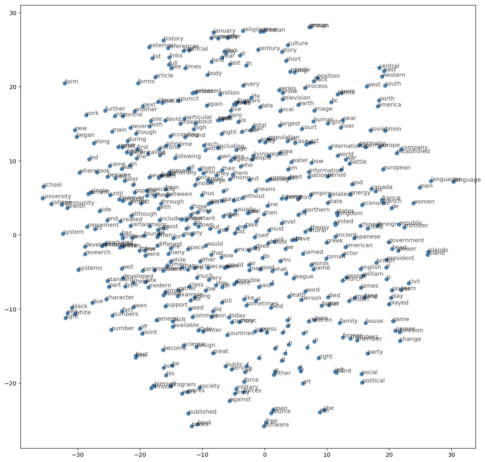

# Skip-gram word2vec

**Goal**: In this project, I'll use TensorFlow to implement the word2vec algorithm using the skip-gram architecture. By implementing this, I'll try embedding words for use in natural language processing. This will come in handy when dealing with things like translations.

## Readings

Here are the resources I used to build this project. 

* A really good [conceptual overview](http://mccormickml.com/2016/04/19/word2vec-tutorial-the-skip-gram-model/) of word2vec from Chris McCormick 
* [First word2vec paper](https://arxiv.org/pdf/1301.3781.pdf) from Mikolov et al.
* [NIPS paper](http://papers.nips.cc/paper/5021-distributed-representations-of-words-and-phrases-and-their-compositionality.pdf) with improvements for word2vec also from Mikolov et al.
* An [implementation of word2vec](http://www.thushv.com/natural_language_processing/word2vec-part-1-nlp-with-deep-learning-with-tensorflow-skip-gram/) from Thushan Ganegedara
* TensorFlow [word2vec tutorial](https://www.tensorflow.org/tutorials/word2vec)

## Word embeddings

When I'm dealing with language and words, I end up with tens of thousands of classes to predict, one for each word. Trying to one-hot encode these words is massively inefficient, I'll have one element set to 1 and the other 50,000 set to 0. The word2vec algorithm finds much more efficient representations by finding vectors that represent the words. These vectors also contain semantic information about the words. Words that show up in similar contexts, such as "black", "white", and "red" will have vectors near each other. There are two architectures for implementing word2vec, CBOW (Continuous Bag-Of-Words) and Skip-gram.


In this implementation, I'll be using the skip-gram architecture because it performs better than CBOW. Here, I pass in a word and try to predict the words surrounding it in the text. In this way, I can train the network to learn representations for words that show up in similar contexts.

First up, importing packages.


```python
import time
import numpy as np
import tensorflow as tf
import utils
```

Load the [text8 dataset](http://mattmahoney.net/dc/textdata.html), a file of cleaned up Wikipedia articles from Matt Mahoney. The next cell will download the data set to the `data` folder. Then I can extract it and delete the archive file to save storage space.


```python
from urllib.request import urlretrieve
from os.path import isfile, isdir
from tqdm import tqdm
import zipfile

dataset_folder_path = 'data'
dataset_filename = 'text8.zip'
dataset_name = 'Text8 Dataset'

class DLProgress(tqdm):
    last_block = 0

    def hook(self, block_num=1, block_size=1, total_size=None):
        self.total = total_size
        self.update((block_num - self.last_block) * block_size)
        self.last_block = block_num

if not isfile(dataset_filename):
    with DLProgress(unit='B', unit_scale=True, miniters=1, desc=dataset_name) as pbar:
        urlretrieve(
            'http://mattmahoney.net/dc/text8.zip',
            dataset_filename,
            pbar.hook)

if not isdir(dataset_folder_path):
    with zipfile.ZipFile(dataset_filename) as zip_ref:
        zip_ref.extractall(dataset_folder_path)
        
with open('data/text8') as f:
    text = f.read()
```

## Preprocessing

Here I'm fixing up the text to make training easier. This comes from the `utils` module I wrote. The `preprocess` function coverts any punctuation into tokens, so a period is changed to ` <PERIOD> `. In this data set, there aren't any periods, but it will help in other NLP problems. I'm also removing all words that show up five or fewer times in the dataset. This will greatly reduce issues due to noise in the data and improve the quality of the vector representations.


```python
words = utils.preprocess(text)
print(words[:30])
```

    ['anarchism', 'originated', 'as', 'a', 'term', 'of', 'abuse', 'first', 'used', 'against', 'early', 'working', 'class', 'radicals', 'including', 'the', 'diggers', 'of', 'the', 'english', 'revolution', 'and', 'the', 'sans', 'culottes', 'of', 'the', 'french', 'revolution', 'whilst']

```python
print("Total words: {}".format(len(words)))
print("Unique words: {}".format(len(set(words))))
```

    Total words: 16680599
    Unique words: 63641


And here I'm creating dictionaries to covert words to integers and backwards, integers to words. The integers are assigned in descending frequency order, so the most frequent word ("the") is given the integer 0 and the next most frequent is 1 and so on. The words are converted to integers and stored in the list `int_words`.


```python
vocab_to_int, int_to_vocab = utils.create_lookup_tables(words)
int_words = [vocab_to_int[word] for word in words]
```

## Subsampling

Words that show up often such as "the", "of", and "for" don't provide much context to the nearby words. If we discard some of them, we can remove some of the noise from our data and in return get faster training and better representations. This process is called subsampling by Mikolov. For each word $w_i$ in the training set, we'll discard it with probability given by 

$$ P(w_i) = 1 - \sqrt{\frac{t}{f(w_i)}} $$

where $t$ is a threshold parameter and $f(w_i)$ is the frequency of word $w_i$ in the total dataset.


```python
from collections import Counter
import random

threshold = 1e-5
word_counts = Counter(int_words)
total_count = len(int_words)
freqs = {word: count/total_count for word, count in word_counts.items()}
p_drop = {word: 1 - np.sqrt(threshold/freqs[word]) for word in word_counts}
train_words = [word for word in int_words if p_drop[word] < random.random()]
```

## Making batches

Now that our data is in good shape, we need to get it into the proper form to pass it into our network. With the skip-gram architecture, for each word in the text, we want to grab all the words in a window around that word, with size $C$. 

>  From [Mikolov et al.](https://arxiv.org/pdf/1301.3781.pdf): 
>
> "Since the more distant words are usually less related to the current word than those close to it, we give less weight to the distant words by sampling less from those words in our training examples... If we choose $C = 5$, for each training word we will select randomly a number $R$ in range $< 1; C >$, and then use $R$ words from history and $R$ words from the future of the current word as correct labels."


```python
def get_target(words, idx, window_size=5):
    ''' Get a list of words in a window around an index. '''
    
    R = np.random.randint(1, window_size+1)
    start = idx - R if (idx - R) > 0 else 0
    stop = idx + R
    target_words = set(words[start:idx] + words[idx+1:stop+1])
    
    return list(target_words)
```

Here's a function that returns batches for our network. The idea is that it grabs `batch_size` words from a words list. Then for each of those words, it gets the target words in the window. I haven't found a way to pass in a random number of target words and get it to work with the architecture, so I make one row per input-target pair. This is a generator function by the way, helps save memory.


```python
def get_batches(words, batch_size, window_size=5):
    ''' Create a generator of word batches as a tuple (inputs, targets) '''
    
    n_batches = len(words)//batch_size
    
    # only full batches
    words = words[:n_batches*batch_size]
    
    for idx in range(0, len(words), batch_size):
        x, y = [], []
        batch = words[idx:idx+batch_size]
        for ii in range(len(batch)):
            batch_x = batch[ii]
            batch_y = get_target(batch, ii, window_size)
            y.extend(batch_y)
            x.extend([batch_x]*len(batch_y))
        yield x, y
    
```

## Building the graph

From Chris McCormick's blog, we can see the general structure of our network.


The input words are passed in as one-hot encoded vectors. This will go into a hidden layer of linear units, then into a softmax layer. I'll use the softmax layer to make a prediction like normal.

The idea here is to train the hidden layer weight matrix to find efficient representations for our words. This weight matrix is usually called the embedding matrix or embedding look-up table. We can discard the softmax layer becuase we don't really care about making predictions with this network. I just want the embedding matrix so we can use it in other networks we build from the dataset.


```python
train_graph = tf.Graph()
with train_graph.as_default():
    inputs = tf.placeholder(tf.int32, [None], name='inputs')
    labels = tf.placeholder(tf.int32, [None, None], name='labels')
```

## Embedding

The embedding matrix has a size of the number of words by the number of neurons in the hidden layer. So, if I have 10,000 words and 300 hidden units, the matrix will have size $10,000 \times 300$. Remember that we're using one-hot encoded vectors for our inputs. When I do the matrix multiplication of the one-hot vector with the embedding matrix, I end up selecting only one row out of the entire matrix:


I don't actually need to do the matrix multiplication, I just need to select the row in the embedding matrix that corresponds to the input word. Then, the embedding matrix becomes a lookup table, I'm looking up a vector the size of the hidden layer that represents the input word.


```python
n_vocab = len(int_to_vocab)
n_embedding = 200 # Number of embedding features 
with train_graph.as_default():
    embedding = tf.Variable(tf.random_uniform((n_vocab, n_embedding), -1, 1))
    embed = tf.nn.embedding_lookup(embedding, inputs)
```

## Negative sampling

For every example we give the network, we train it using the output from the softmax layer. That means for each input, we're making very small changes to millions of weights even though we only have one true example. This makes training the network very inefficient. I can approximate the loss from the softmax layer by only updating a small subset of all the weights at once. I'll update the weights for the correct label, but only a small number of incorrect labels. This is called ["negative sampling"](http://papers.nips.cc/paper/5021-distributed-representations-of-words-and-phrases-and-their-compositionality.pdf). Tensorflow has a convenient function to do this, [`tf.nn.sampled_softmax_loss`](https://www.tensorflow.org/api_docs/python/tf/nn/sampled_softmax_loss).


```python
# Number of negative labels to sample
n_sampled = 100
with train_graph.as_default():
    softmax_w = tf.Variable(tf.truncated_normal((n_vocab, n_embedding), stddev=0.1))
    softmax_b = tf.Variable(tf.zeros(n_vocab))
    
    # Calculate the loss using negative sampling
    loss = tf.nn.sampled_softmax_loss(softmax_w, softmax_b, 
                                      labels, embed,
                                      n_sampled, n_vocab)
    
    cost = tf.reduce_mean(loss)
    optimizer = tf.train.AdamOptimizer().minimize(cost)
```

## Validation

This code is from Thushan Ganegedara's implementation. Here I'm going to choose a few common words and few uncommon words. Then, I'll print out the closest words to them. It's a nice way to check that our embedding table is grouping together words with similar semantic meanings.


```python
with train_graph.as_default():
    ## From Thushan Ganegedara's implementation
    valid_size = 16 # Random set of words to evaluate similarity on.
    valid_window = 100
    # pick 8 samples from (0,100) and (1000,1100) each ranges. lower id implies more frequent 
    valid_examples = np.array(random.sample(range(valid_window), valid_size//2))
    valid_examples = np.append(valid_examples, 
                               random.sample(range(1000,1000+valid_window), valid_size//2))

    valid_dataset = tf.constant(valid_examples, dtype=tf.int32)
    
    # We use the cosine distance:
    norm = tf.sqrt(tf.reduce_sum(tf.square(embedding), 1, keep_dims=True))
    normalized_embedding = embedding / norm
    valid_embedding = tf.nn.embedding_lookup(normalized_embedding, valid_dataset)
    similarity = tf.matmul(valid_embedding, tf.transpose(normalized_embedding))
```


```python
# If the checkpoints directory doesn't exist:
!mkdir checkpoints
```


```python
epochs = 10
batch_size = 1000
window_size = 10

with train_graph.as_default():
    saver = tf.train.Saver()

with tf.Session(graph=train_graph) as sess:
    iteration = 1
    loss = 0
    sess.run(tf.global_variables_initializer())

    for e in range(1, epochs+1):
        batches = get_batches(train_words, batch_size, window_size)
        start = time.time()
        for x, y in batches:
            
            feed = {inputs: x,
                    labels: np.array(y)[:, None]}
            train_loss, _ = sess.run([cost, optimizer], feed_dict=feed)
            
            loss += train_loss
            
            if iteration % 100 == 0: 
                end = time.time()
                print("Epoch {}/{}".format(e, epochs),
                      "Iteration: {}".format(iteration),
                      "Avg. Training loss: {:.4f}".format(loss/100),
                      "{:.4f} sec/batch".format((end-start)/100))
                loss = 0
                start = time.time()
            
            if iteration % 1000 == 0:
                # note that this is expensive (~20% slowdown if computed every 500 steps)
                sim = similarity.eval()
                for i in range(valid_size):
                    valid_word = int_to_vocab[valid_examples[i]]
                    top_k = 8 # number of nearest neighbors
                    nearest = (-sim[i, :]).argsort()[1:top_k+1]
                    log = 'Nearest to %s:' % valid_word
                    for k in range(top_k):
                        close_word = int_to_vocab[nearest[k]]
                        log = '%s %s,' % (log, close_word)
                    print(log)
            
            iteration += 1
    save_path = saver.save(sess, "checkpoints/text8.ckpt")
    embed_mat = sess.run(normalized_embedding)
```

    Epoch 1/10 Iteration: 100 Avg. Training loss: 5.6559 0.1018 sec/batch
    Epoch 1/10 Iteration: 200 Avg. Training loss: 5.6093 0.1028 sec/batch
    Epoch 1/10 Iteration: 300 Avg. Training loss: 5.5315 0.1023 sec/batch
    Epoch 1/10 Iteration: 400 Avg. Training loss: 5.5730 0.1030 sec/batch
    Epoch 1/10 Iteration: 500 Avg. Training loss: 5.5062 0.1014 sec/batch
    Epoch 1/10 Iteration: 600 Avg. Training loss: 5.5396 0.1025 sec/batch
    Epoch 1/10 Iteration: 700 Avg. Training loss: 5.5646 0.1033 sec/batch
    Epoch 1/10 Iteration: 800 Avg. Training loss: 5.5273 0.1035 sec/batch
    Epoch 1/10 Iteration: 900 Avg. Training loss: 5.5067 0.1030 sec/batch
    Epoch 1/10 Iteration: 1000 Avg. Training loss: 5.4201 0.0999 sec/batch
    Nearest to for: hoffman, rogue, jehoiakim, montinari, aldington, silos, explains, ilayaraja,
    Nearest to would: louisiane, lampoon, albertina, bottle, olin, allahabad, disobey, tcl,
    Nearest to known: homicide, intervening, tori, satrapies, mated, rtgs, lodbrok, assistants,
    Nearest to used: contributing, brazil, institutionalization, ceilings, breed, gilchrist, superstitious, hawat,
    Nearest to at: squaresoft, taya, buffalo, ferraris, poststructuralism, osiris, bathory, fina,
    Nearest to such: expellees, wanderer, monopolistic, seldom, nanda, imperii, portnoy, heseltine,
    Nearest to called: ramp, philology, lacklustre, stoner, purification, nuisances, implementing, vegetative,
    Nearest to when: benguela, edinburgh, sul, tze, konkani, fo, gigue, iranic,
    Nearest to taking: leopards, arlene, disembodied, maharishi, offal, krulak, sidgwick, rational,
    Nearest to consists: lippe, karaca, anthropic, gramophone, squids, cbd, buildup, detox,
    Nearest to scale: exposed, shrek, allude, chappell, foretells, childe, sheltered, escola,
    Nearest to units: experimenter, lawn, fortieth, jagdish, mileposts, summit, danse, decorations,
    Nearest to ice: pediment, witnessing, staining, plasmodium, habibie, riggs, detection, reconstruction,
    Nearest to instance: caesarean, healthy, wong, resize, corals, movers, attitudes, buena,
    Nearest to channel: creditors, tritium, bouchard, mastercard, gli, dray, stringy, frees,
    Nearest to report: conscious, hellas, candlestick, midwinter, presidents, girls, bathyscaphe, haryana,
    Epoch 1/10 Iteration: 1100 Avg. Training loss: 5.4772 0.1044 sec/batch
    Epoch 1/10 Iteration: 1200 Avg. Training loss: 5.4192 0.1002 sec/batch
    Epoch 1/10 Iteration: 1300 Avg. Training loss: 5.3636 0.1020 sec/batch
    Epoch 1/10 Iteration: 1400 Avg. Training loss: 5.2318 0.1000 sec/batch
    Epoch 1/10 Iteration: 1500 Avg. Training loss: 5.1699 0.0994 sec/batch
    Epoch 1/10 Iteration: 1600 Avg. Training loss: 5.1744 0.0986 sec/batch
    Epoch 1/10 Iteration: 1700 Avg. Training loss: 5.1248 0.1007 sec/batch
    Epoch 1/10 Iteration: 1800 Avg. Training loss: 5.0379 0.1045 sec/batch
    Epoch 1/10 Iteration: 1900 Avg. Training loss: 4.9862 0.0994 sec/batch
    Epoch 1/10 Iteration: 2000 Avg. Training loss: 4.9961 0.0995 sec/batch
    Nearest to for: hoffman, rogue, explains, cited, dod, listed, census, oxford,
    Nearest to would: louisiane, still, bottle, nyquist, lampoon, introduced, disobey, feet,
    Nearest to known: homicide, intervening, tori, assistants, lodbrok, mated, millions, justified,
    Nearest to used: contributing, ceilings, institutionalization, brazil, pre, question, superstitious, incorporates,
    Nearest to at: squaresoft, help, taya, good, degree, their, melody, ferraris,
    Nearest to such: school, seldom, noise, distances, desired, wanderer, heseltine, next,
    Nearest to called: purification, implementing, industry, ramp, stoner, philology, cost, vegetative,
    Nearest to when: edinburgh, tze, preservation, sul, five, order, benguela, fo,
    Nearest to taking: rational, death, disembodied, countless, krulak, quaternions, carpal, audited,
    Nearest to consists: gramophone, karaca, whigs, squids, brighton, anthropic, heterosexuals, increase,
    Nearest to scale: exposed, formation, shrek, full, childe, sheltered, aggregated, speciation,
    Nearest to units: summit, begins, independent, dod, asserted, appoint, lawn, experimenter,
    Nearest to ice: pediment, witnessing, reconstruction, habibie, aiding, riggs, inflammable, detection,
    Nearest to instance: healthy, wong, census, attitudes, believed, buena, corals, husband,
    Nearest to channel: creditors, tritium, mastercard, bouchard, frees, stringy, bypassing, nietzsche,
    Nearest to report: conscious, presidents, hellas, but, girls, cooper, lineage, publishing,
    Epoch 1/10 Iteration: 2100 Avg. Training loss: 4.9267 0.0995 sec/batch
    Epoch 1/10 Iteration: 2200 Avg. Training loss: 4.9097 0.1014 sec/batch
    Epoch 1/10 Iteration: 2300 Avg. Training loss: 4.8684 0.1004 sec/batch
    Epoch 1/10 Iteration: 2400 Avg. Training loss: 4.8427 0.1060 sec/batch
    Epoch 1/10 Iteration: 2500 Avg. Training loss: 4.8111 0.1087 sec/batch
    Epoch 1/10 Iteration: 2600 Avg. Training loss: 4.8307 0.1029 sec/batch
    Epoch 1/10 Iteration: 2700 Avg. Training loss: 4.7947 0.1068 sec/batch
    Epoch 1/10 Iteration: 2800 Avg. Training loss: 4.8068 0.1025 sec/batch
    Epoch 1/10 Iteration: 2900 Avg. Training loss: 4.7837 0.1026 sec/batch
    Epoch 1/10 Iteration: 3000 Avg. Training loss: 4.7842 0.1076 sec/batch
    Nearest to for: hoffman, rogue, searchable, housed, cited, explains, dod, silos,
    Nearest to would: louisiane, still, concentrate, lampoon, disobey, nyquist, bottle, kaiju,
    Nearest to known: homicide, intervening, tori, millions, justified, mated, lodbrok, satrapies,
    Nearest to used: contributing, ceilings, brazil, institutionalization, breed, superstitious, incorporates, tends,
    Nearest to at: squaresoft, melody, ferraris, buffalo, competed, emi, taya, kids,
    Nearest to such: seldom, desired, school, noise, distances, wanderer, rays, unions,
    Nearest to called: ramp, philology, implementing, purification, industry, lacklustre, stoner, strategic,
    Nearest to when: edinburgh, attractive, preservation, fo, sul, itv, tze, scotland,
    Nearest to taking: rational, disembodied, india, death, arlene, exercised, quaternions, countless,
    Nearest to consists: gramophone, karaca, anthropic, brighton, buildup, whigs, squids, fascist,
    Nearest to scale: exposed, formation, coral, curved, childe, chappell, unusable, shrek,
    Nearest to units: lawn, summit, appoint, begins, dod, laid, independent, experimenter,
    Nearest to ice: witnessing, reconstruction, detection, pediment, aiding, inflammable, drugs, habibie,
    Nearest to instance: healthy, wong, buena, census, attitudes, implementations, caesarean, corals,
    Nearest to channel: creditors, tritium, mastercard, bouchard, frees, bypassing, nietzsche, dray,
    Nearest to report: conscious, presidents, hellas, cooper, ts, girls, isomorphism, credibility,
    Epoch 1/10 Iteration: 3100 Avg. Training loss: 4.7704 0.1056 sec/batch
    Epoch 1/10 Iteration: 3200 Avg. Training loss: 4.7655 0.1045 sec/batch
    Epoch 1/10 Iteration: 3300 Avg. Training loss: 4.7184 0.1032 sec/batch
    Epoch 1/10 Iteration: 3400 Avg. Training loss: 4.7202 0.1049 sec/batch
    Epoch 1/10 Iteration: 3500 Avg. Training loss: 4.7368 0.1028 sec/batch
    Epoch 1/10 Iteration: 3600 Avg. Training loss: 4.7046 0.1022 sec/batch
    Epoch 1/10 Iteration: 3700 Avg. Training loss: 4.6942 0.1021 sec/batch
    Epoch 1/10 Iteration: 3800 Avg. Training loss: 4.7397 0.1023 sec/batch
    Epoch 1/10 Iteration: 3900 Avg. Training loss: 4.7120 0.1021 sec/batch
    Epoch 1/10 Iteration: 4000 Avg. Training loss: 4.6501 0.1022 sec/batch
    Nearest to for: hoffman, rogue, searchable, housed, silos, cited, dod, jehoiakim,
    Nearest to would: louisiane, lampoon, concentrate, disobey, nyquist, still, albertina, bottle,
    Nearest to known: homicide, mated, tori, intervening, justified, satrapies, millions, lodbrok,
    Nearest to used: ceilings, contributing, institutionalization, brazil, breed, gilchrist, hawat, superstitious,
    Nearest to at: squaresoft, emi, buffalo, melody, worded, polls, competed, lander,
    Nearest to such: desired, seldom, distances, wanderer, noise, license, expellees, heseltine,
    Nearest to called: ramp, philology, implementing, purification, lacklustre, vegetative, industry, intimidated,
    Nearest to when: edinburgh, sul, preservation, fo, attractive, tze, launchers, benguela,
    Nearest to taking: leopards, maharishi, india, rational, forge, concordat, arlene, disembodied,
    Nearest to consists: gramophone, buildup, karaca, coronets, brighton, terminals, efficiencies, anthropic,
    Nearest to scale: exposed, chappell, childe, formation, allude, sheltered, embroiled, unusable,
    Nearest to units: lawn, experimenter, summit, typewriter, fortieth, torsion, independent, jagdish,
    Nearest to ice: witnessing, reconstruction, detection, pediment, habibie, aiding, pyotr, inflammable,
    Nearest to instance: healthy, wong, attitudes, resize, buena, implementations, synapses, census,
    Nearest to channel: creditors, tritium, mastercard, odor, frees, bouchard, dray, speculators,
    Nearest to report: conscious, candlestick, hellas, presidents, haight, credibility, cooper, isomorphism,
    Epoch 1/10 Iteration: 4100 Avg. Training loss: 4.6614 0.1032 sec/batch
    Epoch 1/10 Iteration: 4200 Avg. Training loss: 4.6734 0.1022 sec/batch
    Epoch 1/10 Iteration: 4300 Avg. Training loss: 4.6329 0.1024 sec/batch
    Epoch 1/10 Iteration: 4400 Avg. Training loss: 4.6284 0.1037 sec/batch
    Epoch 1/10 Iteration: 4500 Avg. Training loss: 4.6296 0.1047 sec/batch
    Epoch 1/10 Iteration: 4600 Avg. Training loss: 4.6149 0.1042 sec/batch
    Epoch 2/10 Iteration: 4700 Avg. Training loss: 4.5956 0.0812 sec/batch
    Epoch 2/10 Iteration: 4800 Avg. Training loss: 4.5381 0.1114 sec/batch
    Epoch 2/10 Iteration: 4900 Avg. Training loss: 4.5008 0.1046 sec/batch
    Epoch 2/10 Iteration: 5000 Avg. Training loss: 4.5004 0.1017 sec/batch
    Nearest to for: hoffman, rogue, searchable, housed, cited, explains, appropriately, silos,
    Nearest to would: lampoon, concentrate, disobey, nyquist, louisiane, albertina, still, bottle,
    Nearest to known: homicide, mated, assistants, satrapies, justified, tori, uppercase, rtgs,
    Nearest to used: ceilings, contributing, institutionalization, gilchrist, mollusks, breed, hawat, tends,
    Nearest to at: squaresoft, taya, emi, melody, buffalo, lander, awarding, polls,
    Nearest to such: desired, noise, distances, seldom, license, heseltine, expellees, plosives,
    Nearest to called: ramp, philology, lacklustre, purification, implementing, vegetative, bakunin, intimidated,
    Nearest to when: edinburgh, attractive, preservation, fo, sul, tze, launchers, ragga,
    Nearest to taking: leopards, arlene, rational, sidgwick, concordat, india, maharishi, representational,
    Nearest to consists: gramophone, efficiencies, karaca, buildup, coronets, coasts, terminals, anthropic,
    Nearest to scale: exposed, chappell, allude, formation, childe, fuse, aggregated, curved,
    Nearest to units: torsion, lawn, fortieth, experimenter, typewriter, overlordship, jagdish, latest,
    Nearest to ice: reconstruction, witnessing, detection, plasmodium, pinstripes, habibie, pediment, pyotr,
    Nearest to instance: healthy, resize, synapses, attitudes, lenses, wong, implementations, corals,
    Nearest to channel: tritium, creditors, mastercard, speculators, gli, dray, bouchard, frees,
    Nearest to report: candlestick, conscious, haight, hellas, presidents, leaped, credibility, cooper,
    Epoch 2/10 Iteration: 5100 Avg. Training loss: 4.5328 0.1027 sec/batch
    Epoch 2/10 Iteration: 5200 Avg. Training loss: 4.4976 0.1024 sec/batch
    Epoch 2/10 Iteration: 5300 Avg. Training loss: 4.4784 0.1023 sec/batch
    Epoch 2/10 Iteration: 5400 Avg. Training loss: 4.5429 0.1024 sec/batch
    Epoch 2/10 Iteration: 5500 Avg. Training loss: 4.5072 0.1021 sec/batch
    Epoch 2/10 Iteration: 5600 Avg. Training loss: 4.4743 0.1062 sec/batch
    Epoch 2/10 Iteration: 5700 Avg. Training loss: 4.4699 0.1040 sec/batch
    Epoch 2/10 Iteration: 5800 Avg. Training loss: 4.3911 0.1088 sec/batch
    Epoch 2/10 Iteration: 5900 Avg. Training loss: 4.4513 0.1101 sec/batch
    Epoch 2/10 Iteration: 6000 Avg. Training loss: 4.4301 0.1096 sec/batch
    Nearest to for: rogue, hoffman, searchable, appropriately, cited, meats, silos, housed,
    Nearest to would: disobey, nyquist, concentrate, lampoon, louisiane, whyte, still, albertina,
    Nearest to known: homicide, mated, satrapies, rtgs, justified, tori, ctor, millions,
    Nearest to used: ceilings, contributing, mollusks, institutionalization, hawat, user, breed, weight,
    Nearest to at: squaresoft, taya, emi, awarding, buffalo, melody, lander, polls,
    Nearest to such: desired, license, seldom, distances, noise, heseltine, plosives, consumers,
    Nearest to called: ramp, vegetative, lacklustre, philology, implementing, bakunin, supersessionism, purification,
    Nearest to when: edinburgh, fo, attractive, ragga, preservation, tze, be, benguela,
    Nearest to taking: leopards, arlene, rational, sidgwick, concordat, bhagavan, vicar, applause,
    Nearest to consists: efficiencies, gramophone, karaca, buildup, coasts, coronets, cbd, terminals,
    Nearest to scale: exposed, chappell, formation, allude, childe, curved, fuse, coral,
    Nearest to units: torsion, typewriter, fortieth, lawn, latest, experimenter, torrens, arched,
    Nearest to ice: reconstruction, detection, plasmodium, witnessing, staining, soils, pediment, habibie,
    Nearest to instance: healthy, resize, synapses, implementations, lenses, attitudes, spreads, what,
    Nearest to channel: tritium, speculators, creditors, dray, restructured, mastercard, gli, frees,
    Nearest to report: candlestick, haight, conscious, leaped, credibility, presidents, hellas, standish,
    Epoch 2/10 Iteration: 6100 Avg. Training loss: 4.4451 0.1131 sec/batch
    Epoch 2/10 Iteration: 6200 Avg. Training loss: 4.4053 0.1095 sec/batch
    Epoch 2/10 Iteration: 6300 Avg. Training loss: 4.4466 0.1095 sec/batch
    Epoch 2/10 Iteration: 6400 Avg. Training loss: 4.4000 0.1088 sec/batch
    Epoch 2/10 Iteration: 6500 Avg. Training loss: 4.4273 0.1082 sec/batch
    Epoch 2/10 Iteration: 6600 Avg. Training loss: 4.4487 0.1098 sec/batch
    Epoch 2/10 Iteration: 6700 Avg. Training loss: 4.3700 0.1094 sec/batch
    Epoch 2/10 Iteration: 6800 Avg. Training loss: 4.3856 0.1091 sec/batch
    Epoch 2/10 Iteration: 6900 Avg. Training loss: 4.4200 0.1091 sec/batch
    Epoch 2/10 Iteration: 7000 Avg. Training loss: 4.3654 0.1083 sec/batch
    Nearest to for: hoffman, rogue, searchable, cited, appropriately, silos, caller, jehoiakim,
    Nearest to would: disobey, nyquist, lampoon, concentrate, louisiane, whyte, still, olin,
    Nearest to known: mated, homicide, satrapies, tori, rtgs, assistants, grady, oak,
    Nearest to used: ceilings, mollusks, institutionalization, contributing, user, breed, gilchrist, negating,
    Nearest to at: squaresoft, taya, emi, awarding, room, bathory, berke, melody,
    Nearest to such: desired, license, noise, seldom, plosives, distances, itself, techniques,
    Nearest to called: ramp, vegetative, bakunin, lacklustre, philology, supersessionism, intimidated, sealand,
    Nearest to when: edinburgh, ragga, attractive, benguela, be, fo, preservation, launchers,
    Nearest to taking: leopards, rational, arlene, concordat, sidgwick, bhagavan, vicar, tents,
    Nearest to consists: karaca, gramophone, coasts, efficiencies, cbd, buildup, anthropic, eee,
    Nearest to scale: exposed, chappell, formation, childe, speciation, allude, curved, coral,
    Nearest to units: torsion, typewriter, fortieth, force, experimenter, arched, latest, teletype,
    Nearest to ice: reconstruction, detection, plasmodium, staining, soils, witnessing, pediment, robotics,
    Nearest to instance: synapses, resize, healthy, implementations, lenses, attitudes, spreads, krugerrand,
    Nearest to channel: tritium, speculators, creditors, curler, mastercard, restructured, dray, almohades,
    Nearest to report: candlestick, presidents, haight, leaped, conscious, standish, credibility, tillman,
    Epoch 2/10 Iteration: 7100 Avg. Training loss: 4.3969 0.1102 sec/batch
    Epoch 2/10 Iteration: 7200 Avg. Training loss: 4.3768 0.1086 sec/batch
    Epoch 2/10 Iteration: 7300 Avg. Training loss: 4.3602 0.1087 sec/batch
    Epoch 2/10 Iteration: 7400 Avg. Training loss: 4.3689 0.1125 sec/batch
    Epoch 2/10 Iteration: 7500 Avg. Training loss: 4.4073 0.1099 sec/batch
    Epoch 2/10 Iteration: 7600 Avg. Training loss: 4.3354 0.1114 sec/batch
    Epoch 2/10 Iteration: 7700 Avg. Training loss: 4.3640 0.1068 sec/batch
    Epoch 2/10 Iteration: 7800 Avg. Training loss: 4.3759 0.1094 sec/batch
    Epoch 2/10 Iteration: 7900 Avg. Training loss: 4.3205 0.1064 sec/batch
    Epoch 2/10 Iteration: 8000 Avg. Training loss: 4.3363 0.1084 sec/batch
    Nearest to for: hoffman, rogue, silos, searchable, housed, entities, appropriately, jehoiakim,
    Nearest to would: disobey, nyquist, lampoon, louisiane, zubaydah, habilis, concentrate, despaired,
    Nearest to known: satrapies, mated, oak, homicide, demographically, justified, conglomerates, uppercase,
    Nearest to used: ceilings, mollusks, institutionalization, gilchrist, bp, negating, nazca, contributing,
    Nearest to at: emi, awarding, taya, bathory, squaresoft, sharps, motivates, room,
    Nearest to such: desired, license, seldom, plosives, noise, assumes, techniques, furtherance,
    Nearest to called: ramp, vegetative, bakunin, lacklustre, reintroduce, philology, purification, supersessionism,
    Nearest to when: edinburgh, ragga, refuse, attractive, be, benguela, tze, fo,
    Nearest to taking: leopards, rational, concordat, sidgwick, arlene, anoxic, bhagavan, vicar,
    Nearest to consists: karaca, cbd, coasts, gramophone, brighton, eee, circumcising, efficiencies,
    Nearest to scale: exposed, chappell, formation, speciation, curved, allude, childe, coral,
    Nearest to units: torsion, fortieth, typewriter, force, arched, experimenter, latest, torrens,
    Nearest to ice: soils, plasmodium, reconstruction, staining, detection, golem, hartsfield, witnessing,
    Nearest to instance: synapses, resize, healthy, lenses, implementations, illogical, krugerrand, attitudes,
    Nearest to channel: speculators, tritium, curler, creditors, mastercard, restructured, almohades, odor,
    Nearest to report: haight, candlestick, presidents, leaped, corte, conscious, tillman, standish,
    Epoch 2/10 Iteration: 8100 Avg. Training loss: 4.3422 0.1105 sec/batch
    Epoch 2/10 Iteration: 8200 Avg. Training loss: 4.2877 0.1093 sec/batch
    Epoch 2/10 Iteration: 8300 Avg. Training loss: 4.3619 0.1113 sec/batch
    Epoch 2/10 Iteration: 8400 Avg. Training loss: 4.3875 0.1123 sec/batch
    Epoch 2/10 Iteration: 8500 Avg. Training loss: 4.3750 0.1136 sec/batch
    Epoch 2/10 Iteration: 8600 Avg. Training loss: 4.2679 0.1082 sec/batch
    Epoch 2/10 Iteration: 8700 Avg. Training loss: 4.3009 0.1120 sec/batch
    Epoch 2/10 Iteration: 8800 Avg. Training loss: 4.3798 0.1139 sec/batch
    Epoch 2/10 Iteration: 8900 Avg. Training loss: 4.2172 0.1133 sec/batch
    Epoch 2/10 Iteration: 9000 Avg. Training loss: 4.2966 0.1099 sec/batch
    Nearest to for: hoffman, rogue, searchable, silos, serrated, appropriately, emeryville, jehoiakim,
    Nearest to would: disobey, nyquist, habilis, whyte, zubaydah, despaired, replied, concentrate,
    Nearest to known: mated, satrapies, rtgs, uppercase, oak, homicide, demographically, very,
    Nearest to used: ceilings, mollusks, bp, comprehensible, institutionalization, gilchrist, nazca, negating,
    Nearest to at: emi, taya, bathory, squaresoft, awarding, motivates, room, summer,
    Nearest to such: desired, license, heseltine, furtherance, seldom, techniques, monopolistic, plosives,
    Nearest to called: ramp, vegetative, lacklustre, bakunin, philology, purification, supersessionism, reintroduce,
    Nearest to when: edinburgh, ragga, be, refuse, benguela, attractive, tze, bursa,
    Nearest to taking: leopards, rational, concordat, sidgwick, bhagavan, go, arlene, garis,
    Nearest to consists: eee, karaca, cbd, efficiencies, coasts, brighton, coronets, circumcising,
    Nearest to scale: exposed, chappell, formation, allude, curved, speciation, fuse, coral,
    Nearest to units: torsion, fortieth, typewriter, force, torrens, arched, teletype, experimenter,
    Nearest to ice: soils, plasmodium, reconstruction, staining, golem, detection, hartsfield, pyotr,
    Nearest to instance: synapses, resize, healthy, lenses, krugerrand, illogical, implementations, spreads,
    Nearest to channel: tritium, speculators, curler, mastercard, restructured, creditors, almohades, dray,
    Nearest to report: haight, leaped, candlestick, presidents, standish, corte, conscious, credibility,
    Epoch 2/10 Iteration: 9100 Avg. Training loss: 4.3073 0.1099 sec/batch
    Epoch 2/10 Iteration: 9200 Avg. Training loss: 4.3067 0.1088 sec/batch
    Epoch 3/10 Iteration: 9300 Avg. Training loss: 4.3305 0.0503 sec/batch
    Epoch 3/10 Iteration: 9400 Avg. Training loss: 4.2538 0.1096 sec/batch
    Epoch 3/10 Iteration: 9500 Avg. Training loss: 4.2195 0.1093 sec/batch
    Epoch 3/10 Iteration: 9600 Avg. Training loss: 4.2297 0.1091 sec/batch
    Epoch 3/10 Iteration: 9700 Avg. Training loss: 4.2225 0.1116 sec/batch
    Epoch 3/10 Iteration: 9800 Avg. Training loss: 4.2412 0.1091 sec/batch
    Epoch 3/10 Iteration: 9900 Avg. Training loss: 4.2439 0.1091 sec/batch
    Epoch 3/10 Iteration: 10000 Avg. Training loss: 4.1912 0.1096 sec/batch
    Nearest to for: rogue, hoffman, searchable, silos, caller, converged, appropriately, pokey,
    Nearest to would: disobey, nyquist, whyte, habilis, zubaydah, concentrate, lampoon, weaponry,
    Nearest to known: mated, rtgs, conglomerates, demographically, oak, uppercase, satrapies, assistants,
    Nearest to used: ceilings, mollusks, bp, negating, comprehensible, institutionalization, cages, bleaches,
    Nearest to at: emi, taya, bathory, awarding, room, summer, squaresoft, sharps,
    Nearest to such: license, desired, heseltine, plosives, afips, furtherance, expellees, techniques,
    Nearest to called: ramp, bakunin, philology, vegetative, lacklustre, supersessionism, purification, reintroduce,
    Nearest to when: edinburgh, ragga, refuse, benguela, attractive, remove, be, falklands,
    Nearest to taking: leopards, rational, concordat, go, sidgwick, garis, bhagavan, applause,
    Nearest to consists: eee, cbd, coasts, efficiencies, karaca, brighton, coronets, located,
    Nearest to scale: exposed, chappell, coral, allude, curved, formation, fuse, speciation,
    Nearest to units: torsion, fortieth, force, typewriter, teletype, torrens, pucker, arched,
    Nearest to ice: soils, plasmodium, staining, reconstruction, detection, golem, pyotr, pinstripes,
    Nearest to instance: resize, synapses, healthy, lenses, krugerrand, illogical, attitudes, caesarean,
    Nearest to channel: speculators, tritium, curler, mastercard, restructured, creditors, bypassing, almohades,
    Nearest to report: candlestick, standish, credibility, haight, leaped, presidents, conscious, corte,
    Epoch 3/10 Iteration: 10100 Avg. Training loss: 4.2465 0.1103 sec/batch
    Epoch 3/10 Iteration: 10200 Avg. Training loss: 4.2411 0.1091 sec/batch
    Epoch 3/10 Iteration: 10300 Avg. Training loss: 4.2232 0.1098 sec/batch
    Epoch 3/10 Iteration: 10400 Avg. Training loss: 4.1565 0.1094 sec/batch
    Epoch 3/10 Iteration: 10500 Avg. Training loss: 4.1659 0.1097 sec/batch
    Epoch 3/10 Iteration: 10600 Avg. Training loss: 4.1560 0.1100 sec/batch
    Epoch 3/10 Iteration: 10700 Avg. Training loss: 4.1616 0.1101 sec/batch
    Epoch 3/10 Iteration: 10800 Avg. Training loss: 4.1829 0.1101 sec/batch
    Epoch 3/10 Iteration: 10900 Avg. Training loss: 4.1989 0.1096 sec/batch
    Epoch 3/10 Iteration: 11000 Avg. Training loss: 4.1676 0.1097 sec/batch
    Nearest to for: hoffman, rogue, searchable, caller, silos, appropriately, typeface, converged,
    Nearest to would: disobey, nyquist, whyte, weaponry, habilis, zubaydah, concentrate, despaired,
    Nearest to known: rtgs, demographically, mated, satrapies, very, conical, usability, uppercase,
    Nearest to used: ceilings, mollusks, negating, bp, institutionalization, grams, cages, painstaking,
    Nearest to at: emi, taya, awarding, room, squaresoft, sharps, bathory, italia,
    Nearest to such: license, desired, plosives, techniques, heseltine, undercurrent, imperii, procedure,
    Nearest to called: vegetative, ramp, supersessionism, bakunin, sealand, philology, purification, reintroduce,
    Nearest to when: ragga, edinburgh, attractive, refuse, be, benguela, remove, falklands,
    Nearest to taking: leopards, rational, go, concordat, garis, sidgwick, carpal, anoxic,
    Nearest to consists: eee, cbd, coasts, located, condorcet, circumcising, gramophone, brighton,
    Nearest to scale: exposed, chappell, fuse, childe, curved, allude, formation, speciation,
    Nearest to units: torsion, force, fortieth, typewriter, teletype, latest, unit, prefixes,
    Nearest to ice: soils, plasmodium, staining, detection, reconstruction, pinstripes, fracture, golem,
    Nearest to instance: resize, synapses, lenses, implementations, healthy, illogical, oscillators, krugerrand,
    Nearest to channel: curler, speculators, tritium, restructured, creditors, bypassing, mastercard, dray,
    Nearest to report: credibility, presidents, candlestick, standish, leaped, haight, corte, conscious,
    Epoch 3/10 Iteration: 11100 Avg. Training loss: 4.1830 0.1103 sec/batch
    Epoch 3/10 Iteration: 11200 Avg. Training loss: 4.2133 0.1089 sec/batch
    Epoch 3/10 Iteration: 11300 Avg. Training loss: 4.1865 0.1096 sec/batch
    Epoch 3/10 Iteration: 11400 Avg. Training loss: 4.1479 0.1090 sec/batch
    Epoch 3/10 Iteration: 11500 Avg. Training loss: 4.2011 0.1093 sec/batch
    Epoch 3/10 Iteration: 11600 Avg. Training loss: 4.1720 0.1095 sec/batch
    Epoch 3/10 Iteration: 11700 Avg. Training loss: 4.2111 0.1095 sec/batch
    Epoch 3/10 Iteration: 11800 Avg. Training loss: 4.1659 0.1095 sec/batch
    Epoch 3/10 Iteration: 11900 Avg. Training loss: 4.1315 0.1091 sec/batch
    Epoch 3/10 Iteration: 12000 Avg. Training loss: 4.1508 0.1092 sec/batch
    Nearest to for: hoffman, rogue, given, searchable, silos, census, converged, caller,
    Nearest to would: disobey, habilis, nyquist, zubaydah, whyte, despaired, weaponry, preeminence,
    Nearest to known: rtgs, mated, satrapies, uppercase, usability, conical, very, oak,
    Nearest to used: ceilings, mollusks, bp, negating, institutionalization, decorator, supplementation, cirth,
    Nearest to at: emi, taya, awarding, habr, squaresoft, sharps, coronets, dini,
    Nearest to such: desired, techniques, plosives, license, pollutant, procedure, unfair, lysenkoism,
    Nearest to called: ramp, vegetative, supersessionism, bakunin, philology, sealand, reintroduce, denunciations,
    Nearest to when: ragga, edinburgh, attractive, be, refuse, benguela, bush, remove,
    Nearest to taking: leopards, rational, concordat, sidgwick, arlene, garis, carpal, anoxic,
    Nearest to consists: eee, cbd, coasts, gramophone, located, morisot, condorcet, brighton,
    Nearest to scale: exposed, chappell, curved, allude, formation, fuse, speciation, childe,
    Nearest to units: force, torsion, fortieth, typewriter, teletype, unit, prefixes, pucker,
    Nearest to ice: soils, staining, plasmodium, fracture, pinstripes, reconstruction, pyotr, louth,
    Nearest to instance: resize, lenses, synapses, implementations, illogical, healthy, krugerrand, oscillators,
    Nearest to channel: curler, tritium, speculators, restructured, mastercard, creditors, bypassing, almohades,
    Nearest to report: credibility, presidents, standish, candlestick, leaped, annotated, haight, serviced,
    Epoch 3/10 Iteration: 12100 Avg. Training loss: 4.1912 0.1103 sec/batch
    Epoch 3/10 Iteration: 12200 Avg. Training loss: 4.1658 0.1091 sec/batch
    Epoch 3/10 Iteration: 12300 Avg. Training loss: 4.1775 0.1089 sec/batch
    Epoch 3/10 Iteration: 12400 Avg. Training loss: 4.1726 0.1093 sec/batch
    Epoch 3/10 Iteration: 12500 Avg. Training loss: 4.1599 0.1099 sec/batch
    Epoch 3/10 Iteration: 12600 Avg. Training loss: 4.1498 0.1099 sec/batch
    Epoch 3/10 Iteration: 12700 Avg. Training loss: 4.1615 0.1097 sec/batch
    Epoch 3/10 Iteration: 12800 Avg. Training loss: 4.1188 0.1095 sec/batch
    Epoch 3/10 Iteration: 12900 Avg. Training loss: 4.1679 0.1098 sec/batch
    Epoch 3/10 Iteration: 13000 Avg. Training loss: 4.2005 0.1100 sec/batch
    Nearest to for: hoffman, rogue, emeryville, census, given, scriptwriter, searchable, converged,
    Nearest to would: disobey, habilis, despaired, zubaydah, amontillado, preeminence, whyte, replied,
    Nearest to known: satrapies, mated, rtgs, oak, grady, tori, demographically, usability,
    Nearest to used: ceilings, bp, negating, cirth, decorator, supplementation, comprehensible, hyphen,
    Nearest to at: emi, taya, italia, habr, bathory, dini, nde, awarding,
    Nearest to such: desired, unfair, expellees, eudicots, actus, nanda, plosives, license,
    Nearest to called: supersessionism, bakunin, reintroduce, excommunicating, faithless, denunciations, ramp, vegetative,
    Nearest to when: edinburgh, ragga, refuse, attractive, bush, be, benguela, convinced,
    Nearest to taking: leopards, rational, sidgwick, concordat, go, garis, anoxic, arlene,
    Nearest to consists: eee, cbd, condorcet, located, coasts, brighton, morisot, circumcising,
    Nearest to scale: exposed, chappell, allude, curved, fuse, speciation, hashes, sheltered,
    Nearest to units: force, torsion, fortieth, typewriter, teletype, unit, pucker, prefixes,
    Nearest to ice: staining, plasmodium, soils, pinstripes, pyotr, fracture, louth, golem,
    Nearest to instance: resize, synapses, lenses, illogical, implementations, unappreciated, healthy, krugerrand,
    Nearest to channel: curler, tritium, restructured, speculators, creditors, mastercard, bypassing, dray,
    Nearest to report: presidents, credibility, leaped, standish, candlestick, focusing, haight, corte,
    Epoch 3/10 Iteration: 13100 Avg. Training loss: 4.2402 0.1103 sec/batch
    Epoch 3/10 Iteration: 13200 Avg. Training loss: 4.1416 0.1096 sec/batch
    Epoch 3/10 Iteration: 13300 Avg. Training loss: 4.1287 0.1098 sec/batch
    Epoch 3/10 Iteration: 13400 Avg. Training loss: 4.1439 0.1095 sec/batch
    Epoch 3/10 Iteration: 13500 Avg. Training loss: 4.0455 0.1098 sec/batch
    Epoch 3/10 Iteration: 13600 Avg. Training loss: 4.1497 0.1102 sec/batch
    Epoch 3/10 Iteration: 13700 Avg. Training loss: 4.1528 0.1098 sec/batch
    Epoch 3/10 Iteration: 13800 Avg. Training loss: 4.1375 0.1094 sec/batch
    Epoch 4/10 Iteration: 13900 Avg. Training loss: 4.1982 0.0209 sec/batch
    Epoch 4/10 Iteration: 14000 Avg. Training loss: 4.1256 0.1089 sec/batch
    Nearest to for: hoffman, rogue, given, converged, searchable, scriptwriter, typeface, emeryville,
    Nearest to would: disobey, habilis, nyquist, whyte, zubaydah, busting, amontillado, gimme,
    Nearest to known: rtgs, very, perihelion, uppercase, satrapies, usability, fervour, conglomerates,
    Nearest to used: ceilings, bp, bleaches, cirth, negating, supplementation, institutionalization, stds,
    Nearest to at: emi, taya, travelling, seated, bathory, coronets, breach, awarding,
    Nearest to such: license, pollutant, techniques, desired, conceals, actus, procedure, unfair,
    Nearest to called: ramp, vegetative, supersessionism, reintroduce, faithless, ripples, sealand, joliot,
    Nearest to when: edinburgh, ragga, attractive, bush, refuse, be, benguela, bursa,
    Nearest to taking: leopards, rational, sidgwick, garis, anoxic, go, concordat, carpal,
    Nearest to consists: eee, cbd, located, brighton, condorcet, chamber, appoints, coasts,
    Nearest to scale: exposed, allude, curved, fuse, chappell, mellin, capricornus, gears,
    Nearest to units: force, torsion, fortieth, unit, prefixes, typewriter, teletype, pucker,
    Nearest to ice: staining, plasmodium, soils, pinstripes, pyotr, louth, hawk, golem,
    Nearest to instance: resize, synapses, illogical, lenses, krugerrand, healthy, unappreciated, oscillators,
    Nearest to channel: curler, creditors, tritium, dray, restructured, bypassing, mastercard, speculators,
    Nearest to report: credibility, presidents, leaped, standish, candlestick, annotated, haight, targeted,
    Epoch 4/10 Iteration: 14100 Avg. Training loss: 4.0816 0.1103 sec/batch
    Epoch 4/10 Iteration: 14200 Avg. Training loss: 4.1231 0.1090 sec/batch
    Epoch 4/10 Iteration: 14300 Avg. Training loss: 4.0923 0.1093 sec/batch
    Epoch 4/10 Iteration: 14400 Avg. Training loss: 4.0457 0.1082 sec/batch
    Epoch 4/10 Iteration: 14500 Avg. Training loss: 4.0987 0.1090 sec/batch
    Epoch 4/10 Iteration: 14600 Avg. Training loss: 4.0307 0.1086 sec/batch
    Epoch 4/10 Iteration: 14700 Avg. Training loss: 4.0652 0.1095 sec/batch
    Epoch 4/10 Iteration: 14800 Avg. Training loss: 4.0900 0.1090 sec/batch
    Epoch 4/10 Iteration: 14900 Avg. Training loss: 4.1109 0.1091 sec/batch
    Epoch 4/10 Iteration: 15000 Avg. Training loss: 4.0441 0.1098 sec/batch
    Nearest to for: rogue, given, converged, census, autrefois, hoffman, silos, searchable,
    Nearest to would: disobey, nyquist, habilis, whyte, gimme, busting, preeminence, amontillado,
    Nearest to known: rtgs, oak, usability, very, perihelion, mated, satrapies, fervour,
    Nearest to used: ceilings, bp, grams, alliances, pacemakers, stds, epoxy, mollusks,
    Nearest to at: emi, seated, travelling, aviators, coronets, taya, italia, awarding,
    Nearest to such: desired, license, undercurrent, hinges, pollutant, unfair, techniques, heseltine,
    Nearest to called: ramp, vegetative, supersessionism, reintroduce, sealand, denunciations, faithless, purification,
    Nearest to when: ragga, edinburgh, attractive, bush, be, refuse, benguela, remove,
    Nearest to taking: leopards, rational, garis, sidgwick, concordat, go, nba, anoxic,
    Nearest to consists: eee, cbd, located, chamber, coasts, twos, consist, morisot,
    Nearest to scale: exposed, allude, curved, capricornus, mellin, fuse, chappell, sheltered,
    Nearest to units: force, unit, torsion, fortieth, prefixes, teletype, typewriter, pucker,
    Nearest to ice: plasmodium, soils, staining, pinstripes, pyotr, louth, golem, gskola,
    Nearest to instance: resize, lenses, illogical, synapses, krugerrand, healthy, unappreciated, caesarean,
    Nearest to channel: curler, restructured, bypassing, creditors, dray, tritium, speculators, mastercard,
    Nearest to report: credibility, presidents, spirituality, leaped, focusing, standish, annotated, targeted,
    Epoch 4/10 Iteration: 15100 Avg. Training loss: 4.0226 0.1103 sec/batch
    Epoch 4/10 Iteration: 15200 Avg. Training loss: 4.0229 0.1098 sec/batch
    Epoch 4/10 Iteration: 15300 Avg. Training loss: 4.0029 0.1098 sec/batch
    Epoch 4/10 Iteration: 15400 Avg. Training loss: 4.0458 0.1080 sec/batch
    Epoch 4/10 Iteration: 15500 Avg. Training loss: 4.0678 0.0983 sec/batch
    Epoch 4/10 Iteration: 15600 Avg. Training loss: 4.0606 0.1029 sec/batch
    Epoch 4/10 Iteration: 15700 Avg. Training loss: 4.0898 0.1005 sec/batch
    Epoch 4/10 Iteration: 15800 Avg. Training loss: 4.1047 0.0983 sec/batch
    Epoch 4/10 Iteration: 15900 Avg. Training loss: 4.0668 0.1013 sec/batch
    Epoch 4/10 Iteration: 16000 Avg. Training loss: 4.0396 0.1101 sec/batch
    Nearest to for: given, census, hoffman, rogue, converged, parliamentary, autrefois, tomo,
    Nearest to would: disobey, whyte, nyquist, habilis, gimme, despaired, busting, relegated,
    Nearest to known: rtgs, banach, pisin, perihelion, oak, satrapies, mated, usability,
    Nearest to used: bp, ceilings, grams, cirth, stds, bleaches, pacemakers, primary,
    Nearest to at: emi, travelling, degree, taya, dominants, aviators, habr, awarding,
    Nearest to such: desired, actus, plosives, lysenkoism, hinges, license, pollutant, conceals,
    Nearest to called: supersessionism, reintroduce, denunciations, vegetative, faithless, ramp, core, sealand,
    Nearest to when: ragga, edinburgh, attractive, be, refuse, bush, remove, painda,
    Nearest to taking: rational, leopards, garis, sidgwick, concordat, go, anoxic, carpal,
    Nearest to consists: eee, chamber, cbd, located, consist, morisot, condorcet, coasts,
    Nearest to scale: exposed, mellin, allude, capricornus, fuse, childe, visualizing, curved,
    Nearest to units: force, unit, fortieth, torsion, prefixes, teletype, typewriter, pucker,
    Nearest to ice: plasmodium, staining, soils, pinstripes, louth, fracture, pyotr, detection,
    Nearest to instance: resize, synapses, lenses, implementations, unappreciated, illogical, caesarean, oscillators,
    Nearest to channel: curler, creditors, bypassing, restructured, mbit, tritium, dray, speculators,
    Nearest to report: credibility, presidents, leaped, standish, spirituality, focusing, annotated, candlestick,
    Epoch 4/10 Iteration: 16100 Avg. Training loss: 4.0831 0.1100 sec/batch
    Epoch 4/10 Iteration: 16200 Avg. Training loss: 4.0817 0.1094 sec/batch
    Epoch 4/10 Iteration: 16300 Avg. Training loss: 4.0709 0.1093 sec/batch
    Epoch 4/10 Iteration: 16400 Avg. Training loss: 4.0693 0.1013 sec/batch
    Epoch 4/10 Iteration: 16500 Avg. Training loss: 4.0710 0.1000 sec/batch
    Epoch 4/10 Iteration: 16600 Avg. Training loss: 4.0771 0.1090 sec/batch
    Epoch 4/10 Iteration: 16700 Avg. Training loss: 4.0465 0.1083 sec/batch
    Epoch 4/10 Iteration: 16800 Avg. Training loss: 4.0753 0.1018 sec/batch
    Epoch 4/10 Iteration: 16900 Avg. Training loss: 4.1115 0.1103 sec/batch
    Epoch 4/10 Iteration: 17000 Avg. Training loss: 4.0615 0.1194 sec/batch
    Nearest to for: given, scriptwriter, census, rogue, emeryville, hoffman, autrefois, converged,
    Nearest to would: disobey, nyquist, habilis, whyte, busting, gimme, despaired, maecenas,
    Nearest to known: satrapies, fervour, pisin, sixteenth, banach, with, perihelion, oak,
    Nearest to used: ceilings, cirth, bp, alliances, stds, grams, machining, hyphen,
    Nearest to at: emi, travelling, breach, dominants, taya, dini, bathory, degree,
    Nearest to such: plosives, pollutant, desired, hinges, lysenkoism, undercurrent, actus, characterised,
    Nearest to called: supersessionism, reintroduce, vegetative, denunciations, faithless, ramp, sealand, purification,
    Nearest to when: ragga, edinburgh, attractive, refuse, be, painda, bush, manor,
    Nearest to taking: leopards, rational, sidgwick, garis, concordat, templar, anoxic, carpal,
    Nearest to consists: eee, chamber, cbd, morisot, consist, located, brighton, trending,
    Nearest to scale: exposed, mellin, capricornus, allude, curved, regolith, fuse, speciation,
    Nearest to units: force, unit, fortieth, torsion, prefixes, typewriter, teletype, pucker,
    Nearest to ice: plasmodium, pinstripes, soils, pyotr, staining, louth, gory, fracture,
    Nearest to instance: synapses, lenses, resize, unappreciated, implementations, illogical, placed, oscillators,
    Nearest to channel: curler, restructured, creditors, mbit, bypassing, dray, dts, tritium,
    Nearest to report: presidents, credibility, annotated, standish, spirituality, leaped, focusing, targeted,
    Epoch 4/10 Iteration: 17100 Avg. Training loss: 4.0576 0.1166 sec/batch
    Epoch 4/10 Iteration: 17200 Avg. Training loss: 4.0014 0.1178 sec/batch
    Epoch 4/10 Iteration: 17300 Avg. Training loss: 4.0085 0.1100 sec/batch
    Epoch 4/10 Iteration: 17400 Avg. Training loss: 4.0609 0.1082 sec/batch
    Epoch 4/10 Iteration: 17500 Avg. Training loss: 4.0888 0.1111 sec/batch
    Epoch 4/10 Iteration: 17600 Avg. Training loss: 4.1041 0.1124 sec/batch
    Epoch 4/10 Iteration: 17700 Avg. Training loss: 4.1330 0.1147 sec/batch
    Epoch 4/10 Iteration: 17800 Avg. Training loss: 4.0638 0.1094 sec/batch
    Epoch 4/10 Iteration: 17900 Avg. Training loss: 4.0446 0.1126 sec/batch
    Epoch 4/10 Iteration: 18000 Avg. Training loss: 4.0699 0.1122 sec/batch
    Nearest to for: given, scriptwriter, rogue, census, autrefois, emeryville, converged, first,
    Nearest to would: disobey, whyte, habilis, nyquist, busting, gimme, relegated, maecenas,
    Nearest to known: satrapies, banach, rtgs, perihelion, pisin, quetzal, fervour, with,
    Nearest to used: ceilings, cirth, machining, bp, stds, alliances, ido, okinawan,
    Nearest to at: emi, travelling, breach, bathory, italia, dominants, dini, taya,
    Nearest to such: hinges, cc, actus, plosives, desired, conceals, license, eudicots,
    Nearest to called: supersessionism, reintroduce, ramp, faithless, denunciations, sealand, excommunicating, vegetative,
    Nearest to when: edinburgh, ragga, attractive, refuse, be, bush, remove, painda,
    Nearest to taking: rational, leopards, sidgwick, garis, anoxic, concordat, go, nba,
    Nearest to consists: eee, chamber, cbd, appoints, consist, morisot, located, condorcet,
    Nearest to scale: exposed, mellin, capricornus, allude, curved, fuse, regolith, speciation,
    Nearest to units: unit, force, fortieth, prefixes, torsion, si, typewriter, teletype,
    Nearest to ice: pinstripes, soils, louth, pyotr, plasmodium, staining, gory, rink,
    Nearest to instance: illogical, resize, lenses, unappreciated, synapses, oscillators, implementations, krugerrand,
    Nearest to channel: curler, restructured, dray, creditors, mbit, bypassing, mastercard, tritium,
    Nearest to report: presidents, credibility, spirituality, leaped, annotated, standish, focusing, reports,
    Epoch 4/10 Iteration: 18100 Avg. Training loss: 3.9760 0.1089 sec/batch
    Epoch 4/10 Iteration: 18200 Avg. Training loss: 4.0450 0.1039 sec/batch
    Epoch 4/10 Iteration: 18300 Avg. Training loss: 4.0234 0.1026 sec/batch
    Epoch 4/10 Iteration: 18400 Avg. Training loss: 4.0367 0.1004 sec/batch
    Epoch 4/10 Iteration: 18500 Avg. Training loss: 4.0817 0.1018 sec/batch
    Epoch 5/10 Iteration: 18600 Avg. Training loss: 4.0321 0.0936 sec/batch
    Epoch 5/10 Iteration: 18700 Avg. Training loss: 4.0089 0.1002 sec/batch
    Epoch 5/10 Iteration: 18800 Avg. Training loss: 3.9820 0.1098 sec/batch
    Epoch 5/10 Iteration: 18900 Avg. Training loss: 4.0002 0.1016 sec/batch
    Epoch 5/10 Iteration: 19000 Avg. Training loss: 3.9676 0.1011 sec/batch
    Nearest to for: given, scriptwriter, rogue, census, autrefois, converged, to, emeryville,
    Nearest to would: disobey, whyte, habilis, nyquist, maecenas, busting, gimme, relegated,
    Nearest to known: perihelion, rtgs, banach, satrapies, pisin, fervour, oak, quetzal,
    Nearest to used: ceilings, stds, cirth, machining, bp, alliances, grams, common,
    Nearest to at: emi, travelling, dominants, breach, italia, taya, bathory, seated,
    Nearest to such: hinges, actus, undercurrent, pollutant, lysenkoism, desired, cc, license,
    Nearest to called: supersessionism, reintroduce, keno, faithless, bother, sealand, vegetative, denunciations,
    Nearest to when: edinburgh, refuse, attractive, ragga, bush, be, remove, painda,
    Nearest to taking: leopards, garis, rational, sidgwick, go, anoxic, nba, boosts,
    Nearest to consists: eee, chamber, cbd, consist, located, morisot, twos, appoints,
    Nearest to scale: exposed, capricornus, curved, allude, mellin, regolith, fuse, gears,
    Nearest to units: unit, fortieth, prefixes, force, torsion, typewriter, si, irl,
    Nearest to ice: soils, pinstripes, plasmodium, louth, rink, pyotr, staining, joaquin,
    Nearest to instance: illogical, synapses, lenses, resize, krugerrand, healthy, placed, caesarean,
    Nearest to channel: curler, restructured, dray, creditors, bypassing, mastercard, wb, mbit,
    Nearest to report: credibility, spirituality, presidents, reports, annotated, standish, focusing, leaped,
    Epoch 5/10 Iteration: 19100 Avg. Training loss: 3.9968 0.1027 sec/batch
    Epoch 5/10 Iteration: 19200 Avg. Training loss: 3.9635 0.1035 sec/batch
    Epoch 5/10 Iteration: 19300 Avg. Training loss: 4.0181 0.1107 sec/batch
    Epoch 5/10 Iteration: 19400 Avg. Training loss: 4.0267 0.1175 sec/batch
    Epoch 5/10 Iteration: 19500 Avg. Training loss: 4.0411 0.1127 sec/batch
    Epoch 5/10 Iteration: 19600 Avg. Training loss: 3.9779 0.1149 sec/batch
    Epoch 5/10 Iteration: 19700 Avg. Training loss: 3.9253 0.1095 sec/batch
    Epoch 5/10 Iteration: 19800 Avg. Training loss: 3.9642 0.1090 sec/batch
    Epoch 5/10 Iteration: 19900 Avg. Training loss: 3.9214 0.1154 sec/batch
    Epoch 5/10 Iteration: 20000 Avg. Training loss: 3.9692 0.1104 sec/batch
    Nearest to for: given, census, to, scriptwriter, first, converged, emeryville, autrefois,
    Nearest to would: disobey, relegated, whyte, habilis, nyquist, capitalistic, busting, maecenas,
    Nearest to known: rtgs, banach, oak, perihelion, satrapies, with, nbi, hoosiers,
    Nearest to used: ceilings, grams, cirth, machining, bp, stds, nazca, epoxy,
    Nearest to at: emi, dominants, travelling, the, italia, degree, breach, surrounding,
    Nearest to such: undercurrent, actus, cc, hinges, license, lysenkoism, group, techniques,
    Nearest to called: supersessionism, vegetative, the, reintroduce, core, bother, denunciations, sealand,
    Nearest to when: edinburgh, ragga, attractive, be, refuse, remove, down, itv,
    Nearest to taking: leopards, rational, garis, go, anoxic, sidgwick, nba, carpal,
    Nearest to consists: eee, chamber, consist, located, cbd, morisot, leblanc, appoints,
    Nearest to scale: exposed, mellin, capricornus, allude, fuse, curved, townes, gears,
    Nearest to units: unit, force, prefixes, fortieth, torsion, typewriter, si, teletype,
    Nearest to ice: plasmodium, pinstripes, louth, soils, pyotr, staining, cools, rink,
    Nearest to instance: lenses, resize, placed, synapses, bookstore, illogical, oscillators, unappreciated,
    Nearest to channel: curler, restructured, dray, creditors, wb, channels, hearsay, dts,
    Nearest to report: credibility, presidents, spirituality, reports, annotated, standish, leaped, timeline,
    Epoch 5/10 Iteration: 20100 Avg. Training loss: 3.9983 0.1107 sec/batch
    Epoch 5/10 Iteration: 20200 Avg. Training loss: 3.9932 0.1185 sec/batch
    Epoch 5/10 Iteration: 20300 Avg. Training loss: 3.9784 0.1098 sec/batch
    Epoch 5/10 Iteration: 20400 Avg. Training loss: 3.9886 0.1104 sec/batch
    Epoch 5/10 Iteration: 20500 Avg. Training loss: 4.0409 0.1045 sec/batch
    Epoch 5/10 Iteration: 20600 Avg. Training loss: 3.9733 0.1048 sec/batch
    Epoch 5/10 Iteration: 20700 Avg. Training loss: 3.9866 0.1072 sec/batch
    Epoch 5/10 Iteration: 20800 Avg. Training loss: 4.0136 0.1085 sec/batch
    Epoch 5/10 Iteration: 20900 Avg. Training loss: 3.9813 0.1100 sec/batch
    Epoch 5/10 Iteration: 21000 Avg. Training loss: 4.0106 0.1119 sec/batch
    Nearest to for: given, census, scriptwriter, first, to, cited, autrefois, awards,
    Nearest to would: disobey, whyte, relegated, nyquist, maecenas, habilis, lege, forbid,
    Nearest to known: banach, rtgs, pisin, satrapies, nbi, hoosiers, sixteenth, perihelion,
    Nearest to used: cirth, bjarne, ceilings, alliances, grams, bp, machining, stds,
    Nearest to at: emi, travelling, dominants, degree, breach, their, the, awarding,
    Nearest to such: lysenkoism, actus, hinges, desired, cc, unfair, plosives, license,
    Nearest to called: supersessionism, bother, reintroduce, the, screenname, denunciations, ripples, core,
    Nearest to when: edinburgh, be, ragga, attractive, refuse, itv, retrospect, remove,
    Nearest to taking: rational, garis, leopards, go, sidgwick, anoxic, salim, nba,
    Nearest to consists: chamber, eee, consist, morisot, leblanc, cbd, located, hydrohalic,
    Nearest to scale: mellin, exposed, capricornus, townes, speciation, allude, fuse, curved,
    Nearest to units: unit, force, prefixes, fortieth, torsion, typewriter, si, kilogram,
    Nearest to ice: louth, pinstripes, rink, pyotr, plasmodium, staining, joaquin, sweden,
    Nearest to instance: lenses, bookstore, unappreciated, resize, illogical, synapses, placed, caesarean,
    Nearest to channel: curler, restructured, wb, dray, creditors, bandwidth, bypassing, mbit,
    Nearest to report: reports, credibility, presidents, spirituality, annotated, standish, leaped, timeline,
    Epoch 5/10 Iteration: 21100 Avg. Training loss: 3.9997 0.1121 sec/batch
    Epoch 5/10 Iteration: 21200 Avg. Training loss: 3.9752 0.1114 sec/batch
    Epoch 5/10 Iteration: 21300 Avg. Training loss: 4.0002 0.1109 sec/batch
    Epoch 5/10 Iteration: 21400 Avg. Training loss: 3.9800 0.1107 sec/batch
    Epoch 5/10 Iteration: 21500 Avg. Training loss: 4.0198 0.1114 sec/batch
    Epoch 5/10 Iteration: 21600 Avg. Training loss: 4.0034 0.1111 sec/batch
    Epoch 5/10 Iteration: 21700 Avg. Training loss: 3.9504 0.1112 sec/batch
    Epoch 5/10 Iteration: 21800 Avg. Training loss: 3.9446 0.1112 sec/batch
    Epoch 5/10 Iteration: 21900 Avg. Training loss: 3.9754 0.1101 sec/batch
    Epoch 5/10 Iteration: 22000 Avg. Training loss: 4.0392 0.1137 sec/batch
    Nearest to for: given, census, scriptwriter, first, to, emeryville, unusually, from,
    Nearest to would: disobey, relegated, whyte, nyquist, maecenas, habilis, in, lege,
    Nearest to known: satrapies, banach, rtgs, pisin, with, oak, yemenite, aalborg,
    Nearest to used: cirth, grams, machining, common, bp, ceilings, other, alliances,
    Nearest to at: emi, travelling, degree, dominants, the, breach, italia, their,
    Nearest to such: lysenkoism, cc, actus, hinges, license, desired, baa, undercurrent,
    Nearest to called: supersessionism, bother, reintroduce, denunciations, sealand, vegetative, ripples, faithless,
    Nearest to when: attractive, edinburgh, refuse, ragga, be, remove, painda, itv,
    Nearest to taking: rational, leopards, garis, go, sidgwick, anoxic, salim, kessinger,
    Nearest to consists: chamber, eee, consist, cbd, located, morisot, leblanc, sint,
    Nearest to scale: exposed, mellin, capricornus, speciation, accede, allude, gears, fuse,
    Nearest to units: unit, prefixes, force, fortieth, typewriter, si, torsion, irl,
    Nearest to ice: louth, rink, pinstripes, plasmodium, cools, pyotr, soils, staining,
    Nearest to instance: lenses, placed, illogical, synapses, unappreciated, bookstore, krugerrand, oscillators,
    Nearest to channel: curler, bandwidth, restructured, dray, wb, channels, mbit, dts,
    Nearest to report: reports, credibility, presidents, annotated, spirituality, standish, focusing, lebanon,
    Epoch 5/10 Iteration: 22100 Avg. Training loss: 3.9926 0.1178 sec/batch
    Epoch 5/10 Iteration: 22200 Avg. Training loss: 4.1086 0.1140 sec/batch
    Epoch 5/10 Iteration: 22300 Avg. Training loss: 4.0173 0.1238 sec/batch
    Epoch 5/10 Iteration: 22400 Avg. Training loss: 4.0545 0.1200 sec/batch
    Epoch 5/10 Iteration: 22500 Avg. Training loss: 3.9600 0.1167 sec/batch
    Epoch 5/10 Iteration: 22600 Avg. Training loss: 3.9318 0.1150 sec/batch
    Epoch 5/10 Iteration: 22700 Avg. Training loss: 3.9985 0.1157 sec/batch
    Epoch 5/10 Iteration: 22800 Avg. Training loss: 3.9130 0.1197 sec/batch
    Epoch 5/10 Iteration: 22900 Avg. Training loss: 3.9757 0.1174 sec/batch
    Epoch 5/10 Iteration: 23000 Avg. Training loss: 3.9773 0.1208 sec/batch
    Nearest to for: given, to, first, scriptwriter, census, the, from, have,
    Nearest to would: disobey, whyte, relegated, nyquist, busting, gimme, habilis, in,
    Nearest to known: banach, rtgs, satrapies, pisin, with, perihelion, usability, oak,
    Nearest to used: cirth, common, grams, machining, use, bp, ceilings, phenol,
    Nearest to at: travelling, degree, emi, the, dominants, breach, italia, awarding,
    Nearest to such: cc, multinationals, lysenkoism, unfair, senegal, group, undercurrent, actus,
    Nearest to called: the, supersessionism, bother, core, ripples, sealand, reintroduce, macedonian,
    Nearest to when: attractive, ragga, edinburgh, remove, be, refuse, itv, retrospect,
    Nearest to taking: go, garis, rational, sidgwick, leopards, salim, anoxic, nba,
    Nearest to consists: chamber, eee, consist, leblanc, morisot, cbd, located, appoints,
    Nearest to scale: mellin, exposed, townes, fuse, gears, curved, capricornus, allude,
    Nearest to units: unit, prefixes, fortieth, force, si, typewriter, torsion, irl,
    Nearest to ice: louth, rink, pyotr, pinstripes, plasmodium, joaquin, soils, gory,
    Nearest to instance: lenses, illogical, placed, synapses, bookstore, unappreciated, healthy, resize,
    Nearest to channel: dray, curler, wb, channels, dts, bandwidth, hearsay, restructured,
    Nearest to report: reports, credibility, presidents, annotated, spirituality, binge, standish, leaped,
    Epoch 5/10 Iteration: 23100 Avg. Training loss: 3.9697 0.1115 sec/batch
    Epoch 6/10 Iteration: 23200 Avg. Training loss: 3.9797 0.0768 sec/batch
    Epoch 6/10 Iteration: 23300 Avg. Training loss: 3.9693 0.1202 sec/batch
    Epoch 6/10 Iteration: 23400 Avg. Training loss: 3.9590 0.1265 sec/batch
    Epoch 6/10 Iteration: 23500 Avg. Training loss: 3.9599 0.1224 sec/batch
    Epoch 6/10 Iteration: 23600 Avg. Training loss: 3.8895 0.1215 sec/batch
    Epoch 6/10 Iteration: 23700 Avg. Training loss: 3.9265 0.1228 sec/batch
    Epoch 6/10 Iteration: 23800 Avg. Training loss: 3.9374 0.1243 sec/batch
    Epoch 6/10 Iteration: 23900 Avg. Training loss: 3.9506 0.1151 sec/batch
    Epoch 6/10 Iteration: 24000 Avg. Training loss: 3.9664 0.1254 sec/batch
    Nearest to for: given, first, to, scriptwriter, the, census, from, converged,
    Nearest to would: whyte, relegated, disobey, busting, in, habilis, gimme, maecenas,
    Nearest to known: rtgs, banach, hoosiers, pisin, nbi, oak, which, perihelion,
    Nearest to used: grams, cirth, common, epoxy, bp, use, machining, commonly,
    Nearest to at: travelling, the, emi, degree, dominants, their, breach, italia,
    Nearest to such: lysenkoism, group, cc, undercurrent, multinationals, actus, hinges, baa,
    Nearest to called: supersessionism, the, bother, reintroduce, denunciations, ripples, systematized, keno,
    Nearest to when: attractive, edinburgh, remove, ragga, refuse, bursa, painda, be,
    Nearest to taking: go, rational, garis, leopards, salim, sidgwick, anoxic, nba,
    Nearest to consists: chamber, consist, eee, located, leblanc, cbd, sint, hydrohalic,
    Nearest to scale: mellin, townes, exposed, capricornus, gears, diatonic, curved, allude,
    Nearest to units: unit, prefixes, fortieth, si, typewriter, force, torsion, irl,
    Nearest to ice: louth, rink, soils, joaquin, pyotr, pinstripes, plasmodium, cools,
    Nearest to instance: lenses, bookstore, illogical, placed, synapses, unappreciated, caesarean, healthy,
    Nearest to channel: curler, wb, dray, creditors, dts, channels, mbit, restructured,
    Nearest to report: reports, credibility, spirituality, annotated, presidents, standish, lebanon, binge,
    Epoch 6/10 Iteration: 24100 Avg. Training loss: 3.9397 0.1236 sec/batch
    Epoch 6/10 Iteration: 24200 Avg. Training loss: 3.9810 0.1160 sec/batch
    Epoch 6/10 Iteration: 24300 Avg. Training loss: 3.8346 0.1265 sec/batch
    Epoch 6/10 Iteration: 24400 Avg. Training loss: 3.9313 0.1289 sec/batch
    Epoch 6/10 Iteration: 24500 Avg. Training loss: 3.8972 0.1195 sec/batch
    Epoch 6/10 Iteration: 24600 Avg. Training loss: 3.8997 0.1186 sec/batch
    Epoch 6/10 Iteration: 24700 Avg. Training loss: 3.9321 0.1139 sec/batch
    Epoch 6/10 Iteration: 24800 Avg. Training loss: 3.9608 0.1289 sec/batch
    Epoch 6/10 Iteration: 24900 Avg. Training loss: 3.9414 0.1107 sec/batch
    Epoch 6/10 Iteration: 25000 Avg. Training loss: 3.9407 0.1113 sec/batch
    Nearest to for: given, to, first, the, scriptwriter, have, from, census,
    Nearest to would: relegated, whyte, disobey, busting, nyquist, in, habilis, coastlands,
    Nearest to known: rtgs, banach, hoosiers, with, which, pisin, charcoal, oak,
    Nearest to used: cirth, grams, common, epoxy, is, use, invented, commonly,
    Nearest to at: the, degree, travelling, emi, dominants, of, awarding, their,
    Nearest to such: cc, group, lysenkoism, hinges, multinationals, undercurrent, actus, baa,
    Nearest to called: the, supersessionism, core, bother, denunciations, keno, reintroduce, systematized,
    Nearest to when: attractive, be, edinburgh, remove, ragga, refuse, retrospect, itv,
    Nearest to taking: go, rational, leopards, garis, salim, sidgwick, anoxic, carpal,
    Nearest to consists: chamber, consist, eee, located, leblanc, calderon, sint, cbd,
    Nearest to scale: mellin, gears, townes, exposed, capricornus, diatonic, fuse, effects,
    Nearest to units: unit, prefixes, fortieth, si, force, typewriter, torsion, hubei,
    Nearest to ice: louth, rink, joaquin, pyotr, plasmodium, soils, pinstripes, cools,
    Nearest to instance: lenses, placed, bookstore, resize, synapses, unappreciated, jimbo, illogical,
    Nearest to channel: dts, creditors, mbit, curler, wb, bandwidth, channels, hearsay,
    Nearest to report: reports, credibility, annotated, presidents, spirituality, binge, standish, focusing,
    Epoch 6/10 Iteration: 25100 Avg. Training loss: 4.0258 0.1102 sec/batch
    Epoch 6/10 Iteration: 25200 Avg. Training loss: 3.9340 0.1118 sec/batch
    Epoch 6/10 Iteration: 25300 Avg. Training loss: 3.9212 0.1136 sec/batch
    Epoch 6/10 Iteration: 25400 Avg. Training loss: 3.9460 0.1095 sec/batch
    Epoch 6/10 Iteration: 25500 Avg. Training loss: 3.9257 0.1138 sec/batch
    Epoch 6/10 Iteration: 25600 Avg. Training loss: 3.9545 0.1245 sec/batch
    Epoch 6/10 Iteration: 25700 Avg. Training loss: 3.9430 0.1241 sec/batch
    Epoch 6/10 Iteration: 25800 Avg. Training loss: 3.9479 0.1211 sec/batch
    Epoch 6/10 Iteration: 25900 Avg. Training loss: 3.9151 0.1171 sec/batch
    Epoch 6/10 Iteration: 26000 Avg. Training loss: 3.9370 0.1135 sec/batch
    Nearest to for: given, first, to, scriptwriter, by, from, have, the,
    Nearest to would: in, disobey, whyte, relegated, preeminence, lege, nyquist, that,
    Nearest to known: banach, pisin, rtgs, hoosiers, satrapies, which, named, oak,
    Nearest to used: cirth, alliances, invented, machining, is, common, use, grams,
    Nearest to at: the, travelling, degree, emi, dominants, of, their, awarding,
    Nearest to such: group, cc, lysenkoism, hinges, unfair, actus, baa, multinationals,
    Nearest to called: supersessionism, bother, the, denunciations, core, sealand, reintroduce, anakkale,
    Nearest to when: attractive, edinburgh, refuse, ragga, be, remove, painda, itv,
    Nearest to taking: go, rational, sidgwick, garis, salim, leopards, carpal, dedicates,
    Nearest to consists: chamber, consist, eee, leblanc, calderon, morisot, sint, located,
    Nearest to scale: mellin, townes, exposed, capricornus, effects, accede, allude, correlations,
    Nearest to units: unit, prefixes, fortieth, si, force, typewriter, torsion, hubei,
    Nearest to ice: louth, rink, plasmodium, pyotr, joaquin, soils, cools, pinstripes,
    Nearest to instance: lenses, placed, resize, bookstore, unappreciated, illogical, synapses, consented,
    Nearest to channel: curler, creditors, mbit, dts, bandwidth, wb, dray, restructured,
    Nearest to report: reports, credibility, presidents, annotated, santer, haight, standish, lebanon,
    Epoch 6/10 Iteration: 26100 Avg. Training loss: 3.9495 0.1184 sec/batch
    Epoch 6/10 Iteration: 26200 Avg. Training loss: 3.9339 0.1132 sec/batch
    Epoch 6/10 Iteration: 26300 Avg. Training loss: 3.9436 0.1120 sec/batch
    Epoch 6/10 Iteration: 26400 Avg. Training loss: 3.9021 0.1305 sec/batch
    Epoch 6/10 Iteration: 26500 Avg. Training loss: 3.9170 0.1217 sec/batch
    Epoch 6/10 Iteration: 26600 Avg. Training loss: 3.9391 0.1154 sec/batch
    Epoch 6/10 Iteration: 26700 Avg. Training loss: 3.9181 0.1176 sec/batch
    Epoch 6/10 Iteration: 26800 Avg. Training loss: 4.0194 0.1174 sec/batch
    Epoch 6/10 Iteration: 26900 Avg. Training loss: 4.0194 0.1122 sec/batch
    Epoch 6/10 Iteration: 27000 Avg. Training loss: 3.9875 0.1128 sec/batch
    Nearest to for: given, first, scriptwriter, from, to, the, have, census,
    Nearest to would: disobey, relegated, whyte, in, lege, that, maecenas, coastlands,
    Nearest to known: hoosiers, banach, pisin, oak, with, named, nbi, millions,
    Nearest to used: cirth, invented, use, bunyan, commonly, machining, common, paused,
    Nearest to at: travelling, the, emi, degree, dominants, of, breach, leadbelly,
    Nearest to such: actus, cc, lysenkoism, unfair, hinges, baa, musical, plosives,
    Nearest to called: bother, supersessionism, the, anakkale, keno, denunciations, reintroduce, distinctive,
    Nearest to when: edinburgh, attractive, refuse, painda, remove, scotland, trouble, ragga,
    Nearest to taking: go, sidgwick, rational, salim, garis, leopards, anoxic, dedicates,
    Nearest to consists: chamber, consist, eee, leblanc, sint, calderon, morisot, located,
    Nearest to scale: mellin, diatonic, exposed, accede, effects, gears, capricornus, townes,
    Nearest to units: unit, prefixes, fortieth, si, force, typewriter, hubei, trucial,
    Nearest to ice: rink, louth, pyotr, joaquin, plasmodium, pinstripes, gory, soils,
    Nearest to instance: lenses, placed, illogical, bookstore, consented, unappreciated, philos, contacts,
    Nearest to channel: creditors, curler, channels, dray, restructured, hearsay, mbit, dts,
    Nearest to report: reports, credibility, presidents, annotated, santer, lebanon, standish, haight,
    Epoch 6/10 Iteration: 27100 Avg. Training loss: 3.9083 0.1172 sec/batch
    Epoch 6/10 Iteration: 27200 Avg. Training loss: 3.9032 0.1138 sec/batch
    Epoch 6/10 Iteration: 27300 Avg. Training loss: 3.9424 0.1262 sec/batch
    Epoch 6/10 Iteration: 27400 Avg. Training loss: 3.8443 0.1288 sec/batch
    Epoch 6/10 Iteration: 27500 Avg. Training loss: 3.9509 0.1284 sec/batch
    Epoch 6/10 Iteration: 27600 Avg. Training loss: 3.9196 0.1230 sec/batch
    Epoch 6/10 Iteration: 27700 Avg. Training loss: 3.9078 0.1216 sec/batch
    Epoch 7/10 Iteration: 27800 Avg. Training loss: 3.9767 0.0466 sec/batch
    Epoch 7/10 Iteration: 27900 Avg. Training loss: 3.8898 0.1218 sec/batch
    Epoch 7/10 Iteration: 28000 Avg. Training loss: 3.9203 0.1215 sec/batch
    Nearest to for: given, scriptwriter, first, to, the, census, have, from,
    Nearest to would: disobey, whyte, relegated, coastlands, lege, that, busting, atomic,
    Nearest to known: with, hoosiers, banach, named, pisin, which, rtgs, oak,
    Nearest to used: cirth, commonly, use, machining, stds, invented, netbios, is,
    Nearest to at: travelling, the, degree, dominants, emi, of, breach, leadbelly,
    Nearest to such: lysenkoism, multinationals, actus, group, unfair, hinges, cc, baa,
    Nearest to called: the, bother, supersessionism, anakkale, systematized, keno, denunciations, core,
    Nearest to when: attractive, refuse, edinburgh, painda, remove, be, scotland, trouble,
    Nearest to taking: go, rational, chinguetti, garis, nba, anoxic, boosts, salim,
    Nearest to consists: chamber, eee, consist, leblanc, located, sint, calderon, cbd,
    Nearest to scale: diatonic, mellin, gears, townes, effects, accede, fretting, capricornus,
    Nearest to units: unit, prefixes, fortieth, si, force, typewriter, kilogram, sumo,
    Nearest to ice: rink, louth, pyotr, plasmodium, joaquin, pinstripes, gory, zubr,
    Nearest to instance: lenses, placed, illogical, bookstore, resize, attitudes, oscillators, unappreciated,
    Nearest to channel: channels, curler, wb, creditors, dray, mbit, dts, hearsay,
    Nearest to report: reports, credibility, annotated, presidents, spirituality, standish, haight, comprehensive,
    Epoch 7/10 Iteration: 28100 Avg. Training loss: 3.8978 0.1224 sec/batch
    Epoch 7/10 Iteration: 28200 Avg. Training loss: 3.9022 0.1212 sec/batch
    Epoch 7/10 Iteration: 28300 Avg. Training loss: 3.9255 0.1210 sec/batch
    Epoch 7/10 Iteration: 28400 Avg. Training loss: 3.9095 0.1189 sec/batch
    Epoch 7/10 Iteration: 28500 Avg. Training loss: 3.8764 0.1190 sec/batch
    Epoch 7/10 Iteration: 28600 Avg. Training loss: 3.9017 0.1203 sec/batch
    Epoch 7/10 Iteration: 28700 Avg. Training loss: 3.9144 0.1210 sec/batch
    Epoch 7/10 Iteration: 28800 Avg. Training loss: 3.9431 0.1213 sec/batch
    Epoch 7/10 Iteration: 28900 Avg. Training loss: 3.8440 0.1219 sec/batch
    Epoch 7/10 Iteration: 29000 Avg. Training loss: 3.9068 0.1244 sec/batch
    Nearest to for: to, given, the, first, have, from, and, scriptwriter,
    Nearest to would: relegated, coastlands, disobey, that, whyte, in, habilis, lege,
    Nearest to known: with, hoosiers, pisin, banach, which, oak, named, rtgs,
    Nearest to used: use, cirth, commonly, is, grams, machining, epoxy, invented,
    Nearest to at: the, travelling, dominants, emi, of, degree, two, meeting,
    Nearest to such: multinationals, unfair, lysenkoism, group, pashtuns, many, actus, hinges,
    Nearest to called: the, supersessionism, bother, anakkale, core, denunciations, systematized, keno,
    Nearest to when: attractive, remove, refuse, retrospect, edinburgh, be, painda, itv,
    Nearest to taking: go, rational, salim, nba, chinguetti, anoxic, garis, levees,
    Nearest to consists: chamber, consist, eee, located, leblanc, calderon, sint, cbd,
    Nearest to scale: diatonic, mellin, capricornus, townes, suggests, motherhood, accede, effects,
    Nearest to units: unit, prefixes, fortieth, si, force, typewriter, dera, sumo,
    Nearest to ice: rink, louth, pyotr, plasmodium, joaquin, pinstripes, zubr, cools,
    Nearest to instance: placed, lenses, bookstore, resize, unappreciated, contacts, illogical, envisage,
    Nearest to channel: channels, curler, creditors, wb, dray, bandwidth, mbit, restructured,
    Nearest to report: reports, credibility, annotated, spirituality, presidents, comprehensive, focusing, html,
    Epoch 7/10 Iteration: 29100 Avg. Training loss: 3.8945 0.1254 sec/batch
    Epoch 7/10 Iteration: 29200 Avg. Training loss: 3.8284 0.1224 sec/batch
    Epoch 7/10 Iteration: 29300 Avg. Training loss: 3.8781 0.1231 sec/batch
    Epoch 7/10 Iteration: 29400 Avg. Training loss: 3.9094 0.1229 sec/batch
    Epoch 7/10 Iteration: 29500 Avg. Training loss: 3.8962 0.1207 sec/batch
    Epoch 7/10 Iteration: 29600 Avg. Training loss: 3.8959 0.1095 sec/batch
    Epoch 7/10 Iteration: 29700 Avg. Training loss: 3.9419 0.1060 sec/batch
    Epoch 7/10 Iteration: 29800 Avg. Training loss: 3.9093 0.1057 sec/batch
    Epoch 7/10 Iteration: 29900 Avg. Training loss: 3.8714 0.1004 sec/batch
    Epoch 7/10 Iteration: 30000 Avg. Training loss: 3.8931 0.1013 sec/batch
    Nearest to for: given, first, scriptwriter, to, the, have, census, from,
    Nearest to would: relegated, that, disobey, lege, whyte, coastlands, in, nyquist,
    Nearest to known: banach, with, pisin, which, hoosiers, rtgs, nbi, first,
    Nearest to used: is, use, commonly, cirth, netbios, invented, grams, common,
    Nearest to at: the, travelling, dominants, emi, of, degree, surrounding, aviators,
    Nearest to such: lysenkoism, unfair, cc, other, actus, hinges, desired, group,
    Nearest to called: the, supersessionism, bother, core, systematized, denunciations, rearranged, eusocial,
    Nearest to when: be, attractive, remove, edinburgh, refuse, trouble, itv, retrospect,
    Nearest to taking: go, rational, salim, xo, anoxic, garis, chinguetti, nba,
    Nearest to consists: chamber, consist, eee, leblanc, calderon, conscience, hydrohalic, located,
    Nearest to scale: diatonic, mellin, capricornus, suggests, townes, correlations, accede, motherhood,
    Nearest to units: unit, prefixes, fortieth, si, force, typewriter, dera, hubei,
    Nearest to ice: rink, louth, pyotr, plasmodium, joaquin, pinstripes, zubr, gory,
    Nearest to instance: placed, lenses, bookstore, contacts, envisage, geometrically, consented, illogical,
    Nearest to channel: creditors, curler, wb, hearsay, channels, transmitters, dts, mbit,
    Nearest to report: reports, credibility, annotated, spirituality, santer, presidents, comprehensive, lebanon,
    Epoch 7/10 Iteration: 30100 Avg. Training loss: 3.9198 0.1057 sec/batch
    Epoch 7/10 Iteration: 30200 Avg. Training loss: 3.9272 0.1015 sec/batch
    Epoch 7/10 Iteration: 30300 Avg. Training loss: 3.9112 0.1014 sec/batch
    Epoch 7/10 Iteration: 30400 Avg. Training loss: 3.8940 0.1035 sec/batch
    Epoch 7/10 Iteration: 30500 Avg. Training loss: 3.9486 0.1055 sec/batch
    Epoch 7/10 Iteration: 30600 Avg. Training loss: 3.9379 0.1060 sec/batch
    Epoch 7/10 Iteration: 30700 Avg. Training loss: 3.8933 0.1067 sec/batch
    Epoch 7/10 Iteration: 30800 Avg. Training loss: 3.8929 0.1102 sec/batch
    Epoch 7/10 Iteration: 30900 Avg. Training loss: 3.9001 0.1094 sec/batch
    Epoch 7/10 Iteration: 31000 Avg. Training loss: 3.8601 0.1133 sec/batch
    Nearest to for: given, the, to, first, scriptwriter, by, in, of,
    Nearest to would: relegated, that, disobey, coastlands, lege, whyte, in, maecenas,
    Nearest to known: with, which, first, banach, hoosiers, pisin, aalborg, millions,
    Nearest to used: use, cirth, commonly, common, invented, is, netbios, grams,
    Nearest to at: the, travelling, of, dominants, degree, emi, as, to,
    Nearest to such: lysenkoism, unfair, cc, hinges, group, plosives, other, baa,
    Nearest to called: the, bother, supersessionism, denunciations, anakkale, keno, distinctive, eusocial,
    Nearest to when: attractive, be, edinburgh, remove, scotland, trouble, refuse, painda,
    Nearest to taking: go, rational, anoxic, salim, xo, sidgwick, boosts, regrettable,
    Nearest to consists: chamber, consist, leblanc, eee, calderon, morisot, conscience, sint,
    Nearest to scale: diatonic, mellin, effects, capricornus, suggests, correlations, agglomeration, motherhood,
    Nearest to units: unit, prefixes, fortieth, si, force, typewriter, dera, hubei,
    Nearest to ice: rink, louth, joaquin, pyotr, plasmodium, zubr, sweden, soils,
    Nearest to instance: placed, bookstore, husband, lenses, contacts, pasts, wong, envisage,
    Nearest to channel: creditors, curler, hearsay, channels, dray, restructured, wb, mbit,
    Nearest to report: reports, credibility, santer, annotated, standish, presidents, spirituality, comprehensive,
    Epoch 7/10 Iteration: 31100 Avg. Training loss: 3.9213 0.1056 sec/batch
    Epoch 7/10 Iteration: 31200 Avg. Training loss: 3.8905 0.1058 sec/batch
    Epoch 7/10 Iteration: 31300 Avg. Training loss: 3.8990 0.1132 sec/batch
    Epoch 7/10 Iteration: 31400 Avg. Training loss: 3.9640 0.1252 sec/batch
    Epoch 7/10 Iteration: 31500 Avg. Training loss: 3.9684 0.1159 sec/batch
    Epoch 7/10 Iteration: 31600 Avg. Training loss: 3.9861 0.1196 sec/batch
    Epoch 7/10 Iteration: 31700 Avg. Training loss: 3.9020 0.1109 sec/batch
    Epoch 7/10 Iteration: 31800 Avg. Training loss: 3.8697 0.1079 sec/batch
    Epoch 7/10 Iteration: 31900 Avg. Training loss: 3.9195 0.1062 sec/batch
    Epoch 7/10 Iteration: 32000 Avg. Training loss: 3.7972 0.1137 sec/batch
    Nearest to for: given, to, the, first, scriptwriter, by, and, have,
    Nearest to would: that, relegated, coastlands, disobey, to, lege, in, busting,
    Nearest to known: with, which, hoosiers, pisin, first, banach, millions, aalborg,
    Nearest to used: use, commonly, common, cirth, netbios, is, bunyan, invented,
    Nearest to at: the, travelling, emi, of, degree, dominants, to, s,
    Nearest to such: unfair, cc, other, lysenkoism, group, pashtuns, hinges, multinationals,
    Nearest to called: the, supersessionism, bother, denunciations, anakkale, is, keno, instituted,
    Nearest to when: be, remove, attractive, edinburgh, trouble, refuse, painda, scotland,
    Nearest to taking: go, rational, salim, boosts, xo, anoxic, sidgwick, regrettable,
    Nearest to consists: chamber, consist, eee, appoints, leblanc, calderon, conscience, couturat,
    Nearest to scale: diatonic, mellin, effects, motherhood, suggests, capricornus, correlations, townes,
    Nearest to units: unit, prefixes, fortieth, si, force, typewriter, dera, kilogram,
    Nearest to ice: rink, louth, pyotr, joaquin, plasmodium, sweden, indoor, zubr,
    Nearest to instance: placed, lenses, bookstore, contacts, philos, illogical, envisage, kruskal,
    Nearest to channel: creditors, hearsay, curler, wb, channels, dray, mbit, bandwidth,
    Nearest to report: reports, credibility, annotated, santer, presidents, spirituality, haight, focusing,
    Epoch 7/10 Iteration: 32100 Avg. Training loss: 3.9153 0.1189 sec/batch
    Epoch 7/10 Iteration: 32200 Avg. Training loss: 3.9433 0.1161 sec/batch
    Epoch 7/10 Iteration: 32300 Avg. Training loss: 3.9029 0.1209 sec/batch
    Epoch 8/10 Iteration: 32400 Avg. Training loss: 3.9170 0.0138 sec/batch
    Epoch 8/10 Iteration: 32500 Avg. Training loss: 3.8952 0.1250 sec/batch
    Epoch 8/10 Iteration: 32600 Avg. Training loss: 3.8827 0.1306 sec/batch
    Epoch 8/10 Iteration: 32700 Avg. Training loss: 3.8966 0.1219 sec/batch
    Epoch 8/10 Iteration: 32800 Avg. Training loss: 3.9122 0.1221 sec/batch
    Epoch 8/10 Iteration: 32900 Avg. Training loss: 3.8753 0.1216 sec/batch
    Epoch 8/10 Iteration: 33000 Avg. Training loss: 3.8522 0.1206 sec/batch
    Nearest to for: to, given, the, and, first, by, in, have,
    Nearest to would: that, in, relegated, coastlands, to, disobey, whyte, lege,
    Nearest to known: which, first, with, hoosiers, most, millions, pisin, many,
    Nearest to used: use, commonly, common, is, netbios, cirth, other, for,
    Nearest to at: the, travelling, of, to, dominants, later, as, s,
    Nearest to such: other, group, lysenkoism, multinationals, unfair, hinges, cc, actus,
    Nearest to called: bother, the, supersessionism, is, denunciations, instituted, keno, ripples,
    Nearest to when: remove, be, attractive, edinburgh, refuse, painda, trouble, retrospect,
    Nearest to taking: go, salim, levees, boosts, xo, nba, anoxic, nsaids,
    Nearest to consists: chamber, consist, eee, conscience, sint, couturat, leblanc, calderon,
    Nearest to scale: diatonic, mellin, capricornus, motherhood, gears, suggests, agglomeration, tuning,
    Nearest to units: unit, prefixes, fortieth, si, typewriter, hubei, force, dera,
    Nearest to ice: rink, louth, pyotr, joaquin, plasmodium, sweden, gory, zubr,
    Nearest to instance: placed, bookstore, husband, lenses, illogical, attitudes, pasts, herders,
    Nearest to channel: creditors, wb, mbit, curler, channels, bandwidth, hearsay, transmitters,
    Nearest to report: reports, credibility, annotated, standish, spirituality, presidents, santer, focusing,
    Epoch 8/10 Iteration: 33100 Avg. Training loss: 3.8330 0.1218 sec/batch
    Epoch 8/10 Iteration: 33200 Avg. Training loss: 3.8716 0.1212 sec/batch
    Epoch 8/10 Iteration: 33300 Avg. Training loss: 3.8915 0.1208 sec/batch
    Epoch 8/10 Iteration: 33400 Avg. Training loss: 3.9107 0.1212 sec/batch
    Epoch 8/10 Iteration: 33500 Avg. Training loss: 3.8661 0.1210 sec/batch
    Epoch 8/10 Iteration: 33600 Avg. Training loss: 3.8355 0.1189 sec/batch
    Epoch 8/10 Iteration: 33700 Avg. Training loss: 3.8342 0.1208 sec/batch
    Epoch 8/10 Iteration: 33800 Avg. Training loss: 3.7842 0.1212 sec/batch
    Epoch 8/10 Iteration: 33900 Avg. Training loss: 3.8311 0.1226 sec/batch
    Epoch 8/10 Iteration: 34000 Avg. Training loss: 3.8845 0.1218 sec/batch
    Nearest to for: to, the, given, and, in, have, first, by,
    Nearest to would: that, relegated, to, in, with, coastlands, yet, accelerations,
    Nearest to known: with, which, first, hoosiers, most, many, millions, banach,
    Nearest to used: is, commonly, use, common, grams, for, other, cirth,
    Nearest to at: the, of, travelling, dominants, to, as, degree, two,
    Nearest to such: other, and, as, group, can, cc, exotic, actus,
    Nearest to called: the, is, supersessionism, bother, of, denunciations, a, rearranged,
    Nearest to when: be, remove, attractive, refuse, tire, initial, painda, headers,
    Nearest to taking: go, rational, levees, xo, nsaids, salim, boosts, nba,
    Nearest to consists: consist, chamber, calderon, eee, conscience, located, couturat, leblanc,
    Nearest to scale: diatonic, mellin, suggests, capricornus, motherhood, gears, townes, effects,
    Nearest to units: unit, prefixes, fortieth, si, typewriter, force, hubei, dera,
    Nearest to ice: rink, louth, pyotr, plasmodium, joaquin, sweden, detection, ussr,
    Nearest to instance: placed, bookstore, lenses, oscillators, resize, xa, philos, barcodes,
    Nearest to channel: creditors, channels, mbit, wb, curler, dts, restructured, dray,
    Nearest to report: reports, credibility, annotated, santer, presidents, standish, spirituality, focusing,
    Epoch 8/10 Iteration: 34100 Avg. Training loss: 3.8751 0.1228 sec/batch
    Epoch 8/10 Iteration: 34200 Avg. Training loss: 3.8528 0.1223 sec/batch
    Epoch 8/10 Iteration: 34300 Avg. Training loss: 3.9067 0.1178 sec/batch
    Epoch 8/10 Iteration: 34400 Avg. Training loss: 3.8909 0.1161 sec/batch
    Epoch 8/10 Iteration: 34500 Avg. Training loss: 3.8444 0.1158 sec/batch
    Epoch 8/10 Iteration: 34600 Avg. Training loss: 3.8552 0.1208 sec/batch
    Epoch 8/10 Iteration: 34700 Avg. Training loss: 3.8861 0.1260 sec/batch
    Epoch 8/10 Iteration: 34800 Avg. Training loss: 3.8621 0.1159 sec/batch
    Epoch 8/10 Iteration: 34900 Avg. Training loss: 3.8820 0.1110 sec/batch
    Epoch 8/10 Iteration: 35000 Avg. Training loss: 3.9116 0.1115 sec/batch
    Nearest to for: to, given, the, and, by, have, in, first,
    Nearest to would: that, to, relegated, in, accelerations, yet, than, it,
    Nearest to known: which, with, first, pisin, most, hoosiers, banach, millions,
    Nearest to used: is, use, common, commonly, cirth, occasionally, for, invented,
    Nearest to at: the, travelling, of, dominants, to, as, degree, s,
    Nearest to such: other, as, and, can, group, lysenkoism, cc, hinges,
    Nearest to called: the, bother, supersessionism, is, denunciations, rearranged, anakkale, timbres,
    Nearest to when: be, remove, attractive, painda, refuse, trouble, edinburgh, initial,
    Nearest to taking: go, rational, salim, levees, nsaids, xo, pia, regrettable,
    Nearest to consists: consist, chamber, calderon, conscience, leblanc, couturat, eee, sint,
    Nearest to scale: diatonic, mellin, suggests, capricornus, motherhood, trillions, correlations, effects,
    Nearest to units: unit, prefixes, fortieth, si, force, typewriter, hubei, dera,
    Nearest to ice: rink, louth, pyotr, joaquin, plasmodium, sweden, ussr, pontine,
    Nearest to instance: placed, bookstore, lenses, contacts, geometrically, pasts, oscillators, robby,
    Nearest to channel: creditors, curler, mbit, wb, restructured, dts, dray, channels,
    Nearest to report: reports, credibility, santer, annotated, focusing, html, standish, comprehensive,
    Epoch 8/10 Iteration: 35100 Avg. Training loss: 3.8544 0.1112 sec/batch
    Epoch 8/10 Iteration: 35200 Avg. Training loss: 3.8741 0.1111 sec/batch
    Epoch 8/10 Iteration: 35300 Avg. Training loss: 3.8893 0.1121 sec/batch
    Epoch 8/10 Iteration: 35400 Avg. Training loss: 3.8901 0.1112 sec/batch
    Epoch 8/10 Iteration: 35500 Avg. Training loss: 3.8736 0.1117 sec/batch
    Epoch 8/10 Iteration: 35600 Avg. Training loss: 3.8698 0.1114 sec/batch
    Epoch 8/10 Iteration: 35700 Avg. Training loss: 3.8237 0.1114 sec/batch
    Epoch 8/10 Iteration: 35800 Avg. Training loss: 3.8605 0.1120 sec/batch
    Epoch 8/10 Iteration: 35900 Avg. Training loss: 3.9338 0.1116 sec/batch
    Epoch 8/10 Iteration: 36000 Avg. Training loss: 3.8586 0.1116 sec/batch
    Nearest to for: given, the, to, and, in, first, scriptwriter, by,
    Nearest to would: that, to, in, relegated, coastlands, yet, lege, with,
    Nearest to known: which, with, first, hoosiers, millions, seventeenth, banach, pisin,
    Nearest to used: is, common, commonly, use, cirth, netbios, often, invented,
    Nearest to at: the, of, travelling, as, s, to, later, in,
    Nearest to such: other, as, lysenkoism, actus, cc, group, hinges, types,
    Nearest to called: bother, the, supersessionism, denunciations, keno, is, timbres, anakkale,
    Nearest to when: be, the, painda, edinburgh, remove, scotland, refuse, trouble,
    Nearest to taking: go, salim, pia, nsaids, xo, rational, levees, diva,
    Nearest to consists: consist, chamber, calderon, eee, sint, conscience, couturat, leblanc,
    Nearest to scale: diatonic, motherhood, capricornus, mellin, suggests, effects, correlations, trillions,
    Nearest to units: unit, prefixes, fortieth, si, typewriter, force, dera, hubei,
    Nearest to ice: rink, joaquin, louth, pyotr, plasmodium, sweden, ussr, hockey,
    Nearest to instance: placed, geometrically, bookstore, philos, oscillators, kruskal, pasts, lenses,
    Nearest to channel: creditors, mbit, channels, curler, wb, bandwidth, restructured, hearsay,
    Nearest to report: reports, credibility, santer, focusing, annotated, comprehensive, standish, html,
    Epoch 8/10 Iteration: 36100 Avg. Training loss: 3.9513 0.1133 sec/batch
    Epoch 8/10 Iteration: 36200 Avg. Training loss: 3.9537 0.1111 sec/batch
    Epoch 8/10 Iteration: 36300 Avg. Training loss: 3.8965 0.1114 sec/batch
    Epoch 8/10 Iteration: 36400 Avg. Training loss: 3.8243 0.1119 sec/batch
    Epoch 8/10 Iteration: 36500 Avg. Training loss: 3.8824 0.1117 sec/batch
    Epoch 8/10 Iteration: 36600 Avg. Training loss: 3.8074 0.1114 sec/batch
    Epoch 8/10 Iteration: 36700 Avg. Training loss: 3.8481 0.1124 sec/batch
    Epoch 8/10 Iteration: 36800 Avg. Training loss: 3.8889 0.1118 sec/batch
    Epoch 8/10 Iteration: 36900 Avg. Training loss: 3.8722 0.1119 sec/batch
    Epoch 8/10 Iteration: 37000 Avg. Training loss: 3.8919 0.1121 sec/batch
    Nearest to for: to, given, the, and, by, in, scriptwriter, have,
    Nearest to would: that, to, with, relegated, coastlands, lege, yet, maecenas,
    Nearest to known: which, with, most, hoosiers, many, the, first, pisin,
    Nearest to used: commonly, use, is, netbios, common, other, cirth, for,
    Nearest to at: the, travelling, to, as, dominants, s, of, emi,
    Nearest to such: as, other, many, group, and, exotic, pashtuns, cc,
    Nearest to called: the, bother, supersessionism, of, denunciations, keno, philology, systematized,
    Nearest to when: be, remove, attractive, was, painda, marysville, edinburgh, the,
    Nearest to taking: go, levees, xo, nsaids, nba, boosts, salim, pia,
    Nearest to consists: chamber, calderon, consist, conscience, couturat, eee, appoints, leblanc,
    Nearest to scale: diatonic, mellin, accidentals, motherhood, capricornus, suggests, gears, scales,
    Nearest to units: unit, prefixes, fortieth, si, force, typewriter, dera, kilogram,
    Nearest to ice: rink, joaquin, pyotr, louth, sweden, hockey, plasmodium, ussr,
    Nearest to instance: placed, bookstore, pasts, geometrically, oscillators, philos, kruskal, husband,
    Nearest to channel: creditors, mbit, curler, channels, wb, hearsay, bandwidth, dts,
    Nearest to report: reports, credibility, annotated, santer, focusing, standish, html, comprehensive,
    Epoch 9/10 Iteration: 37100 Avg. Training loss: 3.8941 0.0937 sec/batch
    Epoch 9/10 Iteration: 37200 Avg. Training loss: 3.8418 0.1114 sec/batch
    Epoch 9/10 Iteration: 37300 Avg. Training loss: 3.8491 0.1207 sec/batch
    Epoch 9/10 Iteration: 37400 Avg. Training loss: 3.8795 0.1237 sec/batch
    Epoch 9/10 Iteration: 37500 Avg. Training loss: 3.8064 0.1177 sec/batch
    Epoch 9/10 Iteration: 37600 Avg. Training loss: 3.8517 0.1224 sec/batch
    Epoch 9/10 Iteration: 37700 Avg. Training loss: 3.8122 0.1167 sec/batch
    Epoch 9/10 Iteration: 37800 Avg. Training loss: 3.8771 0.1231 sec/batch
    Epoch 9/10 Iteration: 37900 Avg. Training loss: 3.8810 0.1157 sec/batch
    Epoch 9/10 Iteration: 38000 Avg. Training loss: 3.8750 0.1181 sec/batch
    Nearest to for: the, to, and, in, given, by, first, a,
    Nearest to would: that, to, with, relegated, in, than, coastlands, asians,
    Nearest to known: which, most, with, hoosiers, first, and, many, name,
    Nearest to used: commonly, use, is, common, netbios, cirth, as, other,
    Nearest to at: the, of, two, as, and, travelling, to, s,
    Nearest to such: other, as, can, group, lysenkoism, exotic, many, american,
    Nearest to called: the, bother, supersessionism, hardin, is, of, anakkale, eusocial,
    Nearest to when: be, was, painda, attractive, initial, trouble, remove, but,
    Nearest to taking: go, pia, salim, xo, levees, nba, boosts, fugees,
    Nearest to consists: chamber, calderon, consist, conscience, couturat, eee, sint, appoints,
    Nearest to scale: diatonic, motherhood, capricornus, correlations, mellin, chords, gears, trillions,
    Nearest to units: unit, prefixes, fortieth, si, force, typewriter, hubei, dera,
    Nearest to ice: rink, joaquin, pyotr, louth, hockey, sweden, ussr, plasmodium,
    Nearest to instance: placed, bookstore, pasts, philos, accepts, geometrically, oscillators, kruskal,
    Nearest to channel: creditors, curler, wb, restructured, channels, mbit, dts, bandwidth,
    Nearest to report: reports, credibility, annotated, focusing, santer, standish, html, spirituality,
    Epoch 9/10 Iteration: 38100 Avg. Training loss: 3.8705 0.1189 sec/batch
    Epoch 9/10 Iteration: 38200 Avg. Training loss: 3.7634 0.1132 sec/batch
    Epoch 9/10 Iteration: 38300 Avg. Training loss: 3.8207 0.1136 sec/batch
    Epoch 9/10 Iteration: 38400 Avg. Training loss: 3.7974 0.1140 sec/batch
    Epoch 9/10 Iteration: 38500 Avg. Training loss: 3.8033 0.1138 sec/batch
    Epoch 9/10 Iteration: 38600 Avg. Training loss: 3.8553 0.1134 sec/batch
    Epoch 9/10 Iteration: 38700 Avg. Training loss: 3.8482 0.1135 sec/batch
    Epoch 9/10 Iteration: 38800 Avg. Training loss: 3.8287 0.1131 sec/batch
    Epoch 9/10 Iteration: 38900 Avg. Training loss: 3.9033 0.1122 sec/batch
    Epoch 9/10 Iteration: 39000 Avg. Training loss: 3.8907 0.1133 sec/batch
    Nearest to for: the, to, and, in, given, have, by, a,
    Nearest to would: to, that, relegated, with, than, coastlands, in, it,
    Nearest to known: which, most, with, hoosiers, first, banach, the, in,
    Nearest to used: commonly, is, use, common, for, occasionally, as, invented,
    Nearest to at: the, of, to, two, travelling, as, dominants, and,
    Nearest to such: as, other, and, can, many, exotic, lysenkoism, types,
    Nearest to called: the, is, bother, supersessionism, eusocial, of, rearranged, a,
    Nearest to when: be, was, attractive, remove, initial, edinburgh, painda, time,
    Nearest to taking: go, levees, pia, xo, nba, fugees, nsaids, boosts,
    Nearest to consists: consist, chamber, calderon, conscience, couturat, located, leblanc, eee,
    Nearest to scale: diatonic, suggests, trillions, motherhood, mellin, correlations, capricornus, effects,
    Nearest to units: unit, prefixes, fortieth, si, typewriter, force, hubei, dera,
    Nearest to ice: rink, pyotr, joaquin, louth, sweden, hockey, plasmodium, frozen,
    Nearest to instance: placed, geometrically, philos, bookstore, pasts, accepts, oscillators, contacts,
    Nearest to channel: curler, creditors, wb, restructured, channels, mbit, bandwidth, hearsay,
    Nearest to report: reports, credibility, focusing, annotated, santer, standish, binge, html,
    Epoch 9/10 Iteration: 39100 Avg. Training loss: 3.8177 0.1132 sec/batch
    Epoch 9/10 Iteration: 39200 Avg. Training loss: 3.8758 0.1144 sec/batch
    Epoch 9/10 Iteration: 39300 Avg. Training loss: 3.8498 0.1183 sec/batch
    Epoch 9/10 Iteration: 39400 Avg. Training loss: 3.8540 0.1166 sec/batch
    Epoch 9/10 Iteration: 39500 Avg. Training loss: 3.8741 0.1142 sec/batch
    Epoch 9/10 Iteration: 39600 Avg. Training loss: 3.8607 0.1127 sec/batch
    Epoch 9/10 Iteration: 39700 Avg. Training loss: 3.8709 0.1122 sec/batch
    Epoch 9/10 Iteration: 39800 Avg. Training loss: 3.8405 0.1132 sec/batch
    Epoch 9/10 Iteration: 39900 Avg. Training loss: 3.8565 0.1126 sec/batch
    Epoch 9/10 Iteration: 40000 Avg. Training loss: 3.8557 0.1125 sec/batch
    Nearest to for: given, the, to, in, by, and, of, have,
    Nearest to would: that, to, than, with, manorialism, coastlands, relegated, lege,
    Nearest to known: which, with, most, first, name, this, by, pisin,
    Nearest to used: is, use, commonly, common, other, for, as, occasionally,
    Nearest to at: the, of, travelling, dominants, to, two, as, in,
    Nearest to such: as, other, types, and, lysenkoism, exotic, many, american,
    Nearest to called: the, is, bother, of, supersessionism, rearranged, a, eusocial,
    Nearest to when: be, initial, the, attractive, painda, time, was, scotland,
    Nearest to taking: pia, go, levees, novels, xo, fugees, salim, neustria,
    Nearest to consists: consist, chamber, calderon, leblanc, conscience, located, couturat, composed,
    Nearest to scale: diatonic, suggests, correlations, capricornus, motherhood, trillions, mellin, effects,
    Nearest to units: unit, prefixes, fortieth, si, typewriter, dera, force, hubei,
    Nearest to ice: rink, pyotr, joaquin, louth, plasmodium, ussr, sweden, hockey,
    Nearest to instance: placed, geometrically, philos, accepts, kruskal, pasts, bookstore, barcodes,
    Nearest to channel: creditors, curler, mbit, bandwidth, wb, restructured, channels, broadcasts,
    Nearest to report: reports, credibility, santer, annotated, focusing, zangger, html, standish,
    Epoch 9/10 Iteration: 40100 Avg. Training loss: 3.8686 0.1133 sec/batch
    Epoch 9/10 Iteration: 40200 Avg. Training loss: 3.8666 0.1148 sec/batch
    Epoch 9/10 Iteration: 40300 Avg. Training loss: 3.8254 0.1171 sec/batch
    Epoch 9/10 Iteration: 40400 Avg. Training loss: 3.8455 0.1171 sec/batch
    Epoch 9/10 Iteration: 40500 Avg. Training loss: 3.8998 0.1156 sec/batch
    Epoch 9/10 Iteration: 40600 Avg. Training loss: 3.8319 0.1151 sec/batch
    Epoch 9/10 Iteration: 40700 Avg. Training loss: 3.9923 0.1180 sec/batch
    Epoch 9/10 Iteration: 40800 Avg. Training loss: 3.8747 0.1179 sec/batch
    Epoch 9/10 Iteration: 40900 Avg. Training loss: 3.8889 0.1259 sec/batch
    Epoch 9/10 Iteration: 41000 Avg. Training loss: 3.8198 0.1099 sec/batch
    Nearest to for: the, given, to, in, of, have, and, by,
    Nearest to would: that, to, coastlands, with, manorialism, relegated, yet, asians,
    Nearest to known: with, most, which, this, name, first, by, hoosiers,
    Nearest to used: commonly, is, use, common, for, invented, netbios, or,
    Nearest to at: the, of, travelling, as, and, where, dominants, to,
    Nearest to such: as, other, many, types, can, american, lysenkoism, dodging,
    Nearest to called: the, is, bother, of, supersessionism, hardin, a, eusocial,
    Nearest to when: be, painda, was, initial, remove, refuse, edinburgh, scotland,
    Nearest to taking: go, pia, levees, xo, fugees, novels, reestablishing, boosts,
    Nearest to consists: chamber, calderon, consist, conscience, leblanc, judicial, couturat, mayors,
    Nearest to scale: diatonic, suggests, mellin, correlations, capricornus, motherhood, trillions, accidentals,
    Nearest to units: unit, prefixes, fortieth, si, dera, force, typewriter, kilogram,
    Nearest to ice: rink, pyotr, hockey, joaquin, ussr, plasmodium, louth, sweden,
    Nearest to instance: placed, geometrically, philos, pasts, accepts, bookstore, kruskal, oscillators,
    Nearest to channel: creditors, curler, channels, restructured, mbit, hearsay, wb, bandwidth,
    Nearest to report: reports, credibility, santer, commission, annotated, zangger, focusing, binge,
    Epoch 9/10 Iteration: 41100 Avg. Training loss: 3.7843 0.1144 sec/batch
    Epoch 9/10 Iteration: 41200 Avg. Training loss: 3.8725 0.1137 sec/batch
    Epoch 9/10 Iteration: 41300 Avg. Training loss: 3.8033 0.1140 sec/batch
    Epoch 9/10 Iteration: 41400 Avg. Training loss: 3.8783 0.1153 sec/batch
    Epoch 9/10 Iteration: 41500 Avg. Training loss: 3.8427 0.1154 sec/batch
    Epoch 9/10 Iteration: 41600 Avg. Training loss: 3.8499 0.1160 sec/batch
    Epoch 10/10 Iteration: 41700 Avg. Training loss: 3.8824 0.0667 sec/batch
    Epoch 10/10 Iteration: 41800 Avg. Training loss: 3.8163 0.1239 sec/batch
    Epoch 10/10 Iteration: 41900 Avg. Training loss: 3.8315 0.1177 sec/batch
    Epoch 10/10 Iteration: 42000 Avg. Training loss: 3.8348 0.1208 sec/batch
    Nearest to for: the, to, given, and, in, a, by, as,
    Nearest to would: that, to, coastlands, with, relegated, than, lege, in,
    Nearest to known: most, which, with, the, by, first, name, in,
    Nearest to used: commonly, use, is, common, or, as, invented, cirth,
    Nearest to at: the, of, as, travelling, to, in, where, and,
    Nearest to such: as, other, types, can, any, and, lysenkoism, musical,
    Nearest to called: the, is, bother, of, a, supersessionism, systematized, hardin,
    Nearest to when: was, be, initial, the, painda, then, in, remove,
    Nearest to taking: levees, boosts, go, fugees, xo, pia, ukrainians, salim,
    Nearest to consists: chamber, consist, calderon, conscience, leblanc, couturat, sint, judicial,
    Nearest to scale: diatonic, capricornus, suggests, accidentals, mellin, motherhood, specifying, scales,
    Nearest to units: unit, prefixes, fortieth, si, measurement, kilogram, dera, force,
    Nearest to ice: rink, pyotr, joaquin, ussr, louth, hockey, plasmodium, sweden,
    Nearest to instance: placed, pasts, geometrically, bookstore, philos, herders, kruskal, oscillators,
    Nearest to channel: creditors, curler, channels, mbit, wb, hearsay, bandwidth, restructured,
    Nearest to report: reports, credibility, annotated, commission, focusing, santer, binge, zangger,
    Epoch 10/10 Iteration: 42100 Avg. Training loss: 3.8185 0.1217 sec/batch
    Epoch 10/10 Iteration: 42200 Avg. Training loss: 3.8360 0.1214 sec/batch
    Epoch 10/10 Iteration: 42300 Avg. Training loss: 3.8103 0.1212 sec/batch
    Epoch 10/10 Iteration: 42400 Avg. Training loss: 3.8191 0.1210 sec/batch
    Epoch 10/10 Iteration: 42500 Avg. Training loss: 3.8747 0.1212 sec/batch
    Epoch 10/10 Iteration: 42600 Avg. Training loss: 3.8540 0.1210 sec/batch
    Epoch 10/10 Iteration: 42700 Avg. Training loss: 3.8766 0.1211 sec/batch
    Epoch 10/10 Iteration: 42800 Avg. Training loss: 3.7192 0.1214 sec/batch
    Epoch 10/10 Iteration: 42900 Avg. Training loss: 3.8094 0.1219 sec/batch
    Epoch 10/10 Iteration: 43000 Avg. Training loss: 3.7974 0.1225 sec/batch
    Nearest to for: the, to, and, given, a, in, of, by,
    Nearest to would: that, to, relegated, than, coastlands, in, because, with,
    Nearest to known: most, which, with, by, in, first, the, this,
    Nearest to used: is, commonly, use, common, as, for, or, occasionally,
    Nearest to at: the, and, two, as, of, degree, in, s,
    Nearest to such: as, other, can, and, types, many, any, american,
    Nearest to called: is, the, a, of, bother, and, supersessionism, systematized,
    Nearest to when: be, initial, was, then, remove, time, the, before,
    Nearest to taking: go, pia, fugees, levees, nsaids, boosts, xo, ukrainians,
    Nearest to consists: consist, chamber, conscience, calderon, couturat, composed, leblanc, the,
    Nearest to scale: diatonic, suggests, motherhood, capricornus, mellin, accidentals, specifying, trillions,
    Nearest to units: unit, prefixes, fortieth, si, measurement, hubei, dera, kilogram,
    Nearest to ice: rink, pyotr, joaquin, ussr, plasmodium, detection, jabir, louth,
    Nearest to instance: placed, philos, geometrically, kruskal, pasts, accepts, xa, oscillators,
    Nearest to channel: creditors, wb, channels, hearsay, curler, mbit, restructured, carnivores,
    Nearest to report: reports, credibility, annotated, santer, focusing, commission, binge, html,
    Epoch 10/10 Iteration: 43100 Avg. Training loss: 3.7622 0.1223 sec/batch
    Epoch 10/10 Iteration: 43200 Avg. Training loss: 3.8084 0.1211 sec/batch
    Epoch 10/10 Iteration: 43300 Avg. Training loss: 3.8268 0.1220 sec/batch
    Epoch 10/10 Iteration: 43400 Avg. Training loss: 3.8140 0.1209 sec/batch
    Epoch 10/10 Iteration: 43500 Avg. Training loss: 3.8296 0.1220 sec/batch
    Epoch 10/10 Iteration: 43600 Avg. Training loss: 3.8960 0.1191 sec/batch
    Epoch 10/10 Iteration: 43700 Avg. Training loss: 3.8529 0.1213 sec/batch
    Epoch 10/10 Iteration: 43800 Avg. Training loss: 3.8322 0.1238 sec/batch
    Epoch 10/10 Iteration: 43900 Avg. Training loss: 3.8167 0.1228 sec/batch
    Epoch 10/10 Iteration: 44000 Avg. Training loss: 3.8544 0.1259 sec/batch
    Nearest to for: the, to, and, given, in, a, of, by,
    Nearest to would: that, to, than, relegated, in, coastlands, asians, it,
    Nearest to known: most, which, with, this, in, first, the, by,
    Nearest to used: is, commonly, use, common, occasionally, other, often, for,
    Nearest to at: the, of, as, degree, and, travelling, in, dominants,
    Nearest to such: as, other, can, and, any, types, the, american,
    Nearest to called: is, the, bother, a, of, systematized, rearranged, supersessionism,
    Nearest to when: be, initial, attractive, was, painda, time, tire, somehow,
    Nearest to taking: pia, go, fugees, levees, nsaids, reestablishing, boosts, nba,
    Nearest to consists: consist, chamber, conscience, calderon, leblanc, couturat, composed, hydrohalic,
    Nearest to scale: diatonic, suggests, capricornus, correlations, mellin, motherhood, trillions, townes,
    Nearest to units: unit, prefixes, measurement, fortieth, si, force, moller, remembrance,
    Nearest to ice: rink, pyotr, joaquin, ussr, plasmodium, sweden, jabir, frozen,
    Nearest to instance: placed, pasts, geometrically, accepts, kruskal, philos, barcodes, bookstore,
    Nearest to channel: creditors, wb, curler, channels, mbit, hearsay, bandwidth, broadcasts,
    Nearest to report: reports, credibility, santer, annotated, zangger, commission, binge, focusing,
    Epoch 10/10 Iteration: 44100 Avg. Training loss: 3.8485 0.1220 sec/batch
    Epoch 10/10 Iteration: 44200 Avg. Training loss: 3.8296 0.1186 sec/batch
    Epoch 10/10 Iteration: 44300 Avg. Training loss: 3.8256 0.1181 sec/batch
    Epoch 10/10 Iteration: 44400 Avg. Training loss: 3.8264 0.1154 sec/batch
    Epoch 10/10 Iteration: 44500 Avg. Training loss: 3.8798 0.1159 sec/batch
    Epoch 10/10 Iteration: 44600 Avg. Training loss: 3.8181 0.1083 sec/batch
    Epoch 10/10 Iteration: 44700 Avg. Training loss: 3.8231 0.1113 sec/batch
    Epoch 10/10 Iteration: 44800 Avg. Training loss: 3.8373 0.1067 sec/batch
    Epoch 10/10 Iteration: 44900 Avg. Training loss: 3.7952 0.1103 sec/batch
    Epoch 10/10 Iteration: 45000 Avg. Training loss: 3.8190 0.1097 sec/batch
    Nearest to for: the, to, in, given, of, by, and, a,
    Nearest to would: that, to, than, with, in, it, relegated, coastlands,
    Nearest to known: most, with, which, first, in, by, the, this,
    Nearest to used: is, use, common, commonly, other, often, for, to,
    Nearest to at: the, of, in, as, two, three, degree, and,
    Nearest to such: as, other, and, types, any, can, many, american,
    Nearest to called: is, the, bother, a, of, eusocial, identical, rearranged,
    Nearest to when: be, initial, the, attractive, remove, time, before, was,
    Nearest to taking: pia, go, nsaids, fugees, boosts, neustria, reestablishing, xo,
    Nearest to consists: consist, chamber, calderon, leblanc, conscience, composed, couturat, located,
    Nearest to scale: diatonic, suggests, capricornus, motherhood, correlations, mellin, trillions, accede,
    Nearest to units: unit, prefixes, fortieth, measurement, remembrance, force, si, dera,
    Nearest to ice: rink, pyotr, ussr, joaquin, sweden, hockey, plasmodium, louth,
    Nearest to instance: placed, pasts, geometrically, kruskal, philos, accepts, barcodes, xa,
    Nearest to channel: creditors, channels, curler, mbit, wb, bandwidth, hearsay, restructured,
    Nearest to report: reports, credibility, santer, annotated, zangger, commission, focusing, lists,
    Epoch 10/10 Iteration: 45100 Avg. Training loss: 3.8512 0.1079 sec/batch
    Epoch 10/10 Iteration: 45200 Avg. Training loss: 3.8194 0.1076 sec/batch
    Epoch 10/10 Iteration: 45300 Avg. Training loss: 3.9229 0.1111 sec/batch
    Epoch 10/10 Iteration: 45400 Avg. Training loss: 3.9125 0.1113 sec/batch
    Epoch 10/10 Iteration: 45500 Avg. Training loss: 3.8759 0.1216 sec/batch
    Epoch 10/10 Iteration: 45600 Avg. Training loss: 3.8293 0.1217 sec/batch
    Epoch 10/10 Iteration: 45700 Avg. Training loss: 3.8020 0.1224 sec/batch
    Epoch 10/10 Iteration: 45800 Avg. Training loss: 3.8479 0.1217 sec/batch
    Epoch 10/10 Iteration: 45900 Avg. Training loss: 3.7367 0.1218 sec/batch
    Epoch 10/10 Iteration: 46000 Avg. Training loss: 3.8804 0.1215 sec/batch
    Nearest to for: the, and, to, a, given, of, in, from,
    Nearest to would: that, to, than, coastlands, asians, relegated, with, because,
    Nearest to known: most, with, which, the, first, by, in, this,
    Nearest to used: commonly, is, use, common, or, often, other, as,
    Nearest to at: the, in, of, as, degree, s, to, two,
    Nearest to such: as, other, and, types, many, can, any, exotic,
    Nearest to called: the, is, of, a, bother, identical, rearranged, hardin,
    Nearest to when: be, the, was, initial, remove, laga, then, painda,
    Nearest to taking: pia, go, fugees, ukrainians, reestablishing, xo, malm, boosts,
    Nearest to consists: chamber, consist, calderon, leblanc, conscience, judicial, composed, couturat,
    Nearest to scale: diatonic, suggests, capricornus, accidentals, mellin, motherhood, trillions, accede,
    Nearest to units: unit, prefixes, measurement, fortieth, si, remembrance, force, dera,
    Nearest to ice: rink, pyotr, ussr, joaquin, hockey, sweden, louth, plasmodium,
    Nearest to instance: placed, pasts, geometrically, kruskal, philos, lenses, barcodes, oscillators,
    Nearest to channel: creditors, channels, curler, hearsay, mbit, wb, carnivores, bandwidth,
    Nearest to report: reports, credibility, annotated, commission, zangger, santer, focusing, lists,
    Epoch 10/10 Iteration: 46100 Avg. Training loss: 3.8255 0.1184 sec/batch
    Epoch 10/10 Iteration: 46200 Avg. Training loss: 3.8518 0.1119 sec/batch


Restore the trained network if you need to:


```python
with train_graph.as_default():
    saver = tf.train.Saver()

with tf.Session(graph=train_graph) as sess:
    saver.restore(sess, tf.train.latest_checkpoint('checkpoints'))
    embed_mat = sess.run(embedding)
```

## Visualizing the word vectors

Below I'll use T-SNE to visualize how our high-dimensional word vectors cluster together. T-SNE is used to project these vectors into two dimensions while preserving local stucture. Check out [this post from Christopher Olah](http://colah.github.io/posts/2014-10-Visualizing-MNIST/) to learn more about T-SNE and other ways to visualize high-dimensional data.


```python
%matplotlib inline
%config InlineBackend.figure_format = 'retina'

import matplotlib.pyplot as plt
from sklearn.manifold import TSNE
```


```python
viz_words = 500
tsne = TSNE()
embed_tsne = tsne.fit_transform(embed_mat[:viz_words, :])
```


```python
fig, ax = plt.subplots(figsize=(14, 14))
for idx in range(viz_words):
    plt.scatter(*embed_tsne[idx, :], color='steelblue')
    plt.annotate(int_to_vocab[idx], (embed_tsne[idx, 0], embed_tsne[idx, 1]), alpha=0.7)
```




